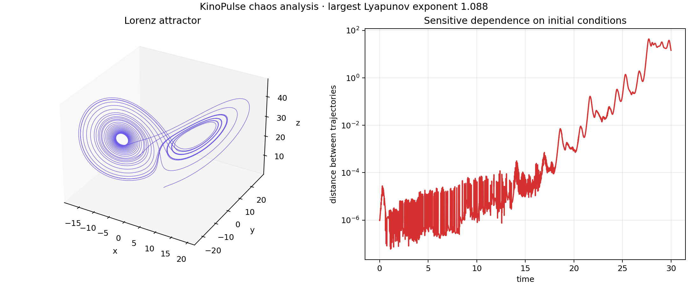

# Lorenz Chaos and Sensitive Dependence

## Objective

Evaluate KinoPulse's adaptive ODE integration and chaos-analysis path on the
canonical Lorenz system, then make sensitive dependence directly visible by
comparing nearby initial conditions.

The system was

```text
x' = sigma (y - x)
y' = x (rho - z) - y
z' = x y - beta z
```

with `sigma=10`, `rho=28`, `beta=8/3`, and initial state `(1,1,1)`.

## Method

`lorenz_lab.py` integrates a 30-unit trajectory with KinoPulse `solve_ivp`. A
second trajectory begins `1e-6` away in the x coordinate. Both integrations
request 6,001 uniform output times through `t_eval`; the released solver now
returns states directly on that grid. Their Euclidean separation is then
computed sample by sample without laboratory-side interpolation.

KinoPulse `ChaosDetector` independently analyzed the system over a 15-unit
horizon with a nominal `0.01` step. The experiment requested the full Lyapunov
spectrum and sensitive-dependence check.

## Results

- Classification: chaotic
- Largest Lyapunov exponent: `1.0878`
- Estimated spectrum: `[1.0878, -0.1001, -14.9610]`
- Sensitive dependence: detected
- Maximum observed nearby-trajectory separation: `43.80`
- Analyzer convergence flag: true

The positive largest exponent and rapid growth from a microscopic perturbation
support the same conclusion through independent evidence paths.



## Interpretation and limitations

The estimated exponent is finite-horizon and depends on numerical settings. It
should not be treated as a high-precision literature value. The returned
samples use interpolation over adaptive internal steps, so requesting a dense
grid does not increase the underlying integration accuracy.

KinoPulse `0.1.0.dev2026071508` fixes the earlier behavior where `t_eval` was
accepted but ignored. A focused dtype probe found one remaining edge: float64
`t_eval` values are downcast to float32 even when the state is float64. The
requested shape and ordering are honored, but decimal times can shift by up to
`1.91e-8` in the probe. The same cast can reject a requested decimal endpoint:
`t_span=(0,0.2)` with a grid ending at `0.2` becomes `0.20000000298` internally
and raises the out-of-bounds error. The lab's production horizon is unaffected.

## Reproduce

```powershell
.\.venv\Scripts\python.exe lorenz_lab.py
.\.venv\Scripts\python.exe -m unittest tests.test_lorenz_lab -v
```
