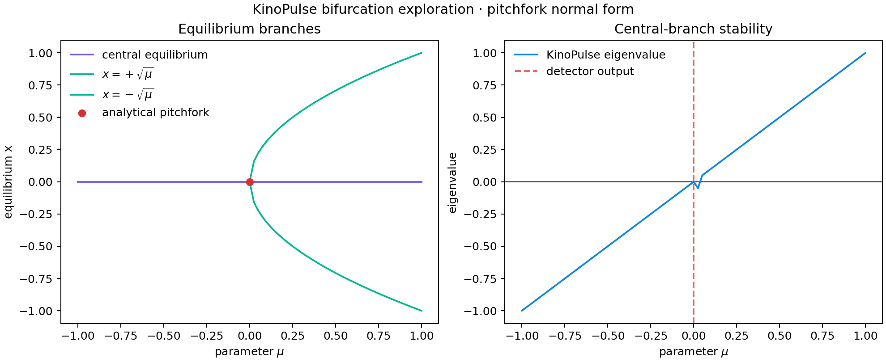

# Supercritical Pitchfork Bifurcation

## Objective

Test equilibrium continuation, Jacobian eigenvalue tracking, and bifurcation
detection on a normal form whose analytical structure is known:

```text
x' = mu*x - x^3
```

The system has a central equilibrium `x=0` for every `mu`; two additional
equilibria `x=±sqrt(mu)` appear for `mu>=0`. The central eigenvalue is `lambda=mu`,
so the pitchfork occurs at `mu=0`.

## Method

The callable was wrapped in KinoPulse `NumericSystem`, then
`ParameterSweeper.sweep_parameter` tracked the central equilibrium across 81
uniform values from `-1` to `1`. Continuation was disabled so every parameter
point was solved independently from the same initial guess. The canonical
`BifurcationDetector` then classified crossings from the sweep result.

Analytical side branches were plotted separately to provide an independent
reference rather than implying that the single-branch sweep discovered them.

## Results

- Sweep completed successfully at all 81 parameter values.
- The tracked eigenvalue matched `lambda=mu` within test tolerance.
- The zero crossing occurred at the analytical pitchfork location.
- The detector emitted one merged candidate at exactly `mu=0`.
- The reported type was the deliberately neutral `zero_eigenvalue`, with
  confidence `0.5`.



## Interpretation and limitations

The equilibrium and eigenvalue machinery performed well. KinoPulse now merges
adjacent detections around an exact-zero grid point and avoids claiming a type
that the available evidence cannot support. A zero eigenvalue alone remains
insufficient to distinguish saddle-node, transcritical, and pitchfork cases;
that requires branch geometry or higher-order structure.

A second usability observation was that `ParameterSweeper` advertised callable
input, but a raw callable failed the analysis bridge and produced an all-NaN
result with `continuation_successful=False`. Explicit `NumericSystem` wrapping
resolved the problem.

## Reproduce

```powershell
.\.venv\Scripts\python.exe pitchfork_lab.py
.\.venv\Scripts\python.exe -m unittest tests.test_pitchfork_lab -v
```
