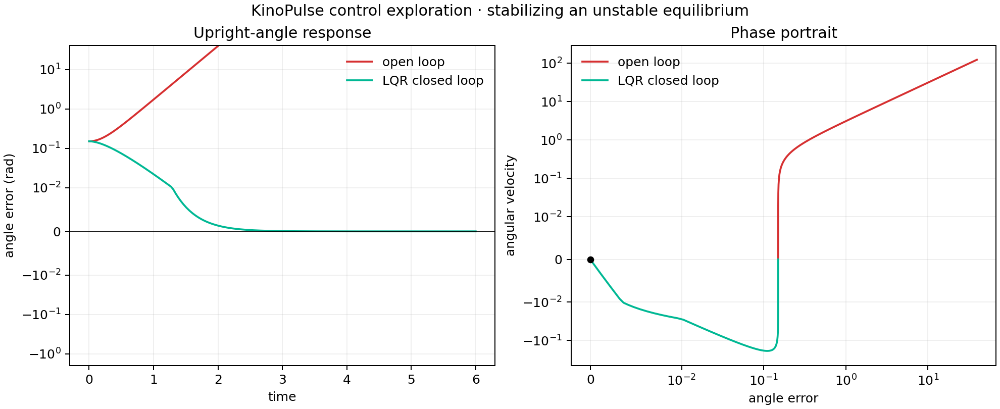

# LQR Stabilization of an Upright Pendulum

## Objective

Exercise KinoPulse's linear-control utilities on an unstable equilibrium and
verify the result through controllability, Riccati, pole, and trajectory checks.

The linearized unit pendulum was represented by

```text
A = [[0, 1], [9.81, 0]]
B = [[0], [1]]
Q = diag(20, 2)
R = [[0.5]]
```

The open-loop matrix has a positive eigenvalue and therefore an unstable upright
equilibrium.

## Method

`synthesize_lqr_from_matrices` solved the continuous algebraic Riccati equation
and returned a state-feedback controller. KinoPulse utilities independently
checked controllability, the CARE solution, and closed-loop poles. Open- and
closed-loop matrices were simulated from an initial angle error of `0.15 rad`.

## Results

- Controllability rank: `2` of `2`
- LQR gain: `[21.4820, 6.8530]`
- Closed-loop poles: `-3.1639`, `-3.6892`
- Closed-loop stability check: passed
- Riccati verification: passed
- CARE residual: `4.08e-14`

The open loop diverges rapidly, while feedback returns both angle and angular
velocity to the origin.



## Interpretation and limitations

This is a linearized, unconstrained, full-state-feedback study. It does not
establish stability of a nonlinear pendulum under actuator limits, sensor noise,
delay, or large initial angles. The open-loop trace also quickly leaves the
physical region where an upright linearization is meaningful; it is shown to
illustrate mathematical instability, not realistic pendulum motion.

The control subsystem composed cleanly in this experiment. Scalar tensor values
returned by some verification helpers required conversion before JSON export,
but this was handled at the report boundary and was not treated as a numerical
defect.

## Reproduce

```powershell
.\.venv\Scripts\python.exe control_lab.py
.\.venv\Scripts\python.exe -m unittest tests.test_control_lab -v
```
