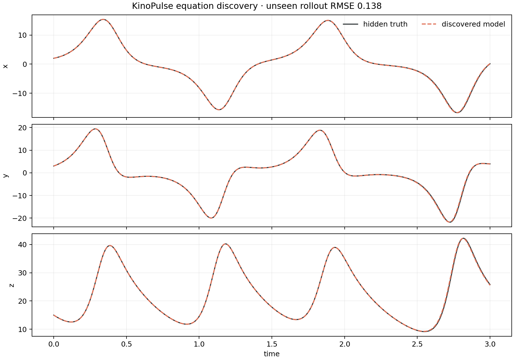

# Rediscovering the Lorenz Equations from Data

## Objective

Determine whether KinoPulse sparse identification can reconstruct a known
nonlinear law from trajectories without receiving the governing equations.

## Method

Three eight-unit Lorenz trajectories were generated from distinct initial
conditions and uniformly resampled at 4,001 times each. `SparseIdentifier` used
a degree-two polynomial library with ten candidate features per output, smoothed
numerical derivatives, normalized regression, and a sparsity threshold of `0.1`.

The learned system was then rolled forward for three time units from a fourth,
unseen initial condition `(2,3,15)`. Its trajectory was compared with the hidden
ground-truth Lorenz system.

## Results

KinoPulse recovered exactly seven active terms—the correct Lorenz sparsity:

```text
dx/dt = -9.9967*x0 + 9.9981*x1
dy/dt = 27.986*x0 - 0.99715*x1 - 0.99967*x0*x2
dz/dt = -2.6663*x2 + 0.99888*x0*x1
```

All fitted coefficients were within `0.03` of their true values. The unseen
three-unit rollout RMSE was `0.1383`, and the learned and reference traces were
visually nearly coincident over the validation horizon.



## Interpretation and limitations

This is an unusually favorable identification problem: clean simulated data,
correct state variables, a candidate library containing the exact law, and no
measurement noise. It validates the sparse-discovery pipeline but does not imply
similar recovery from partial or noisy real observations.

KinoPulse `0.1.0.dev2026071508` formats sparse equations as decimals by default.
The laboratory now uses `system.get_equations(...)` directly; explicit
`rationalize=True` still provides exact-looking fractional output when that is
actually desired.

Because Lorenz dynamics are chaotic, small coefficient errors eventually cause
trajectory divergence. Long-horizon pointwise error is not the only meaningful
validation target; attractor geometry and statistical properties should be
evaluated in a future extension.

## Reproduce

```powershell
.\.venv\Scripts\python.exe discovery_lab.py
.\.venv\Scripts\python.exe -m unittest tests.test_discovery_lab -v
```
