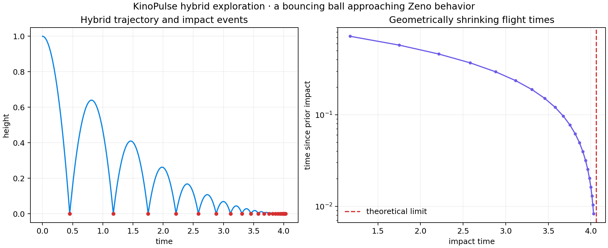

# Hybrid Bouncing Ball and Event Accumulation

## Objective

Test continuous integration, guard localization, reset maps, repeated impacts,
and finite-time event accumulation on an inelastic bouncing ball.

The state is height and vertical velocity. Between impacts, acceleration is
`-9.81`; at the ground guard, height is reset to zero and velocity is multiplied
by `-0.8`.

## Method

A KinoPulse `NumericSystem` supplied the flight dynamics. `hybrid_system`
defined a self-transition on the falling ground crossing, and `hybrid_solve`
integrated with a `0.002` nominal step. The exhibit requests a `4.2 s` horizon,
uses a `0.01 s` Zeno observation window, and selects `zeno_action="stop"`.
This asks the solver to recognize geometric contraction and stop before the
analytical accumulation time rather than integrating through an ill-defined
post-Zeno regime.

Impact times, pre/post velocities, and kinetic-energy ratios were compared with
closed-form ballistic predictions.

## Results

- Impacts before `4.0 s`: `19`
- First numerical impact: `0.45152344 s`
- First analytical impact: `0.45152364 s`
- Mean post-impact velocity ratio: `0.79983` (expected `0.8`)
- Mean energy ratio: `0.63972` (expected `0.64`)
- Analytical accumulation time: `4.06371 s`
- Geometric Zeno detection: true
- Detection time: `4.03691 s`, after 22 impacts
- Detection reason: mean dwell-time ratio `0.800`, latest dwell `8.31e-3 s`



## Zeno regression

The previous release missed accumulation in a `4.2 s` run, ceased detecting
impacts, and allowed the height to reach approximately `-0.102 m`. The new
geometric dwell-time detector closes that failure when its observation window
is set to the event scale. With `zeno_action="stop"`, the trajectory terminates
about `0.0268 s` before the theoretical limit and never materially penetrates
the ground.

## Interpretation and limitations

Before accumulation, the solver's event and reset semantics agree closely with
theory. Beyond accumulation, the physical model itself requires a completion
rule—normally resting contact—because infinitely many idealized impacts cannot
be explicitly simulated. A production hybrid solver should terminate, report
Zeno behavior, or invoke such a policy rather than silently continue through the
guard. Detection sensitivity depends on `zeno_time_window`: the default
`0.001 s` window is shorter than the smallest dwell resolved by this lab's
`0.002 s` integrator step, so the experiment deliberately uses `0.01 s`.

## Reproduce

```powershell
.\.venv\Scripts\python.exe hybrid_lab.py
.\.venv\Scripts\python.exe -m unittest tests.test_hybrid_lab -v
```
