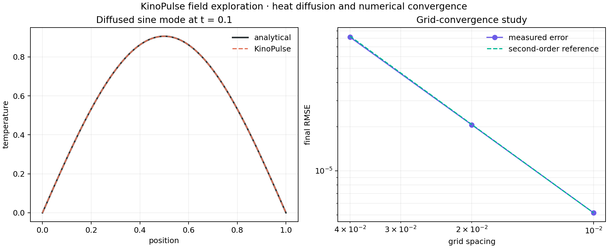

# Heat Diffusion and Grid Convergence

## Objective

Validate KinoPulse's one-dimensional method-of-lines PDE path against an
analytical solution and measure spatial convergence rather than relying on a
single plausible-looking field.

The problem was `u_t = 0.1 u_xx` on `[0,1]`, with zero Dirichlet boundaries and
initial condition `sin(pi*x)`. The analytical solution is
`exp(-0.1*pi^2*t) sin(pi*x)`.

## Method

`HeatEquation`, structured `Grid`, `Field`, boundary objects, and `solve_pde`
were used at 26, 51, and 101 grid points. The RK4 timestep scaled as
`0.2*dx^2/alpha` to stay safely inside the explicit diffusion stability region.
Final error was measured at `t=0.1`.

## Results

| Grid points | Final RMSE |
|---:|---:|
| 26 | `8.155e-5` |
| 51 | `2.059e-5` |
| 101 | `5.174e-6` |

Observed convergence orders were `1.9855` and `1.9928`, closely matching the
expected second-order spatial discretization. Field variance decreased
monotonically at every stored time.



## Stability probe

An additional run used 51 points, `alpha=0.1`, and `dt=0.01`. KinoPulse now
emits one `RuntimeWarning` before integration:

```text
Explicit rk4 timestep dt=0.01 exceeds the estimated diffusion stability limit
0.00279 (ratio=3.59).
```

The warning closes the earlier silent-instability finding while leaving policy
to the caller: the solve is not automatically rejected or timestep-limited.

## Interpretation and limitations

The convergence study validates this smooth one-dimensional Dirichlet case. It
does not cover nonsmooth initial data, variable coefficients, multiple spatial
dimensions, other boundary types, or spectral methods. The time step was chosen
small enough that spatial error dominated; the measured order should not be
generalized to arbitrary time-step policies.

## Reproduce

```powershell
.\.venv\Scripts\python.exe diffusion_lab.py
.\.venv\Scripts\python.exe -m unittest tests.test_diffusion_lab -v
```
