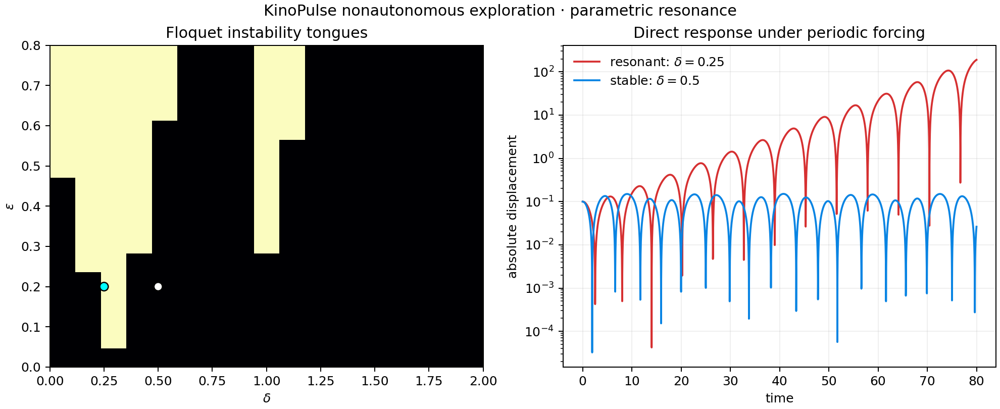

# Mathieu Parametric Resonance

## Objective

Test KinoPulse's nonautonomous and Floquet-analysis capabilities on a periodically
forced oscillator whose stability depends on parameter combinations rather than
instantaneous eigenvalues:

```text
x'' + (delta + epsilon*cos(t))*x = 0
```

## Method

`MathieuAnalyzer` computed a 17-by-17 stability chart over
`delta in [0,2]` and `epsilon in [0,0.8]` using a `0.05` fundamental-matrix step.
Two points were then integrated directly for 80 time units:

- principal resonance: `(delta,epsilon)=(0.25,0.2)`;
- nearby comparison: `(0.5,0.2)`.

This paired a local Floquet classification with an independent time-domain
consequence.

## Results

- Principal point classified unstable, resonance order `1`.
- Comparison point classified stable.
- Resonant final absolute displacement: `190.01`.
- Stable final absolute displacement: `0.0263` and bounded throughout.
- Fraction of chart grid classified unstable: `0.228`.

The coarse chart visibly resolves the first instability tongue and portions of
higher-order structure.



## Interpretation and limitations

The 17-by-17 diagram is intentionally exploratory; boundary localization is
limited by grid resolution and numerical fundamental-matrix accuracy. The final
amplitude at one time is not itself a stability proof, which is why the Floquet
classification is primary and direct simulation is supporting evidence.

This subsystem produced no gap report. It was the cleanest specialized analysis
path in the initial playground.

## Reproduce

```powershell
.\.venv\Scripts\python.exe resonance_lab.py
.\.venv\Scripts\python.exe -m unittest tests.test_resonance_lab -v
```
