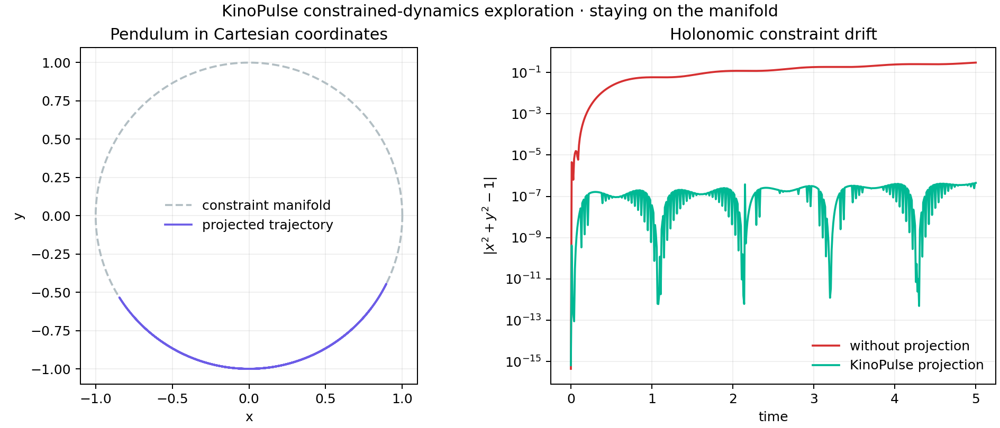

# Constrained Cartesian Pendulum

## Objective

Evaluate KinoPulse's consistent-initialization and manifold-projection tools on
a pendulum represented in redundant Cartesian coordinates.

The state `(x,y,vx,vy)` obeys two constraints:

```text
x^2 + y^2 = 1
x*vx + y*vy = 0
```

The first keeps the bob on the unit circle; the second keeps velocity tangent to
that circle.

## Method

A deliberately inconsistent initial guess `(0.7,-0.7,0.2,0.1)` was supplied to
`analyze_consistent_initialization`. Dynamics included the analytical Lagrange
multiplier required for constrained acceleration. An ordinary explicit Euler
step was then run with and without KinoPulse `ConstraintProjector` after every
step for five seconds at `dt=0.01`.

The simple integrator was selected to isolate the projector's contribution;
KinoPulse's implicit trapezoidal step preserved this particular constraint so
well that projected and unprojected curves were indistinguishable.

## Results

- Initial Newton projection iterations: `3`
- Initial correction norm: `0.06988`
- Projected maximum circle error: `4.46e-7`
- Projected maximum tangency error: `7.41e-8`
- Unprojected maximum circle error: `0.2985`
- Unprojected maximum tangency error: `0.0326`
- Projected trajectory energy range: `3.392`



## Interpretation and limitations

Projection controls geometry but does not guarantee energy preservation. The
large energy range is evidence of the crude explicit step and repeated
projection, not a physically faithful long-term integrator. A structure-
preserving DAE or variational scheme is preferable for accurate mechanics.

KinoPulse `0.1.0.dev2026071508` adds plural `constraints` discovery to
consistent initialization: the same inconsistent guess now converges in three
Newton iterations through that hook. A focused regression found that
`ConstraintProjector` still checks only singular `constraint`; with a plural-
only system it returns the input unchanged and leaves a `0.07` violation. This
remaining boundary inconsistency is documented in `kinopulse_gaps/` and kept as
an expected-failure regression test.

## Reproduce

```powershell
.\.venv\Scripts\python.exe constraint_lab.py
.\.venv\Scripts\python.exe -m unittest tests.test_constraint_lab -v
```
