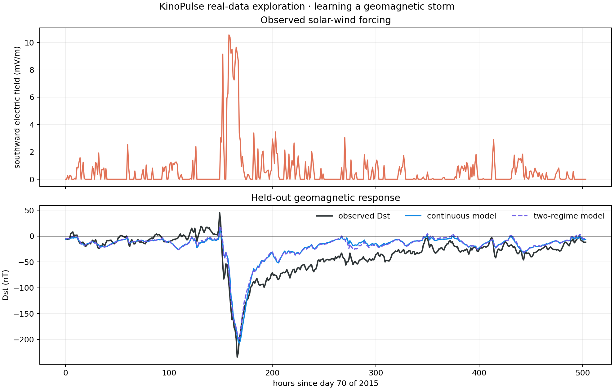

# Learning the 2015 St. Patrick's Day Geomagnetic Storm

## Objective

Move beyond canonical simulations and test whether a compact KinoPulse-fitted
model can reproduce a real, held-out geomagnetic storm from observed solar-wind
forcing.

## Data and provenance

The experiment uses NASA/SPDF's public hourly OMNI2 file for 2015:

<https://spdf.gsfc.nasa.gov/pub/data/omni/low_res_omni/omni2_2015.dat>

The reproduced local file had SHA-256
`aaa291634e011715066ddcf59028e4db16d92495ebca88e4ac034edd1f0f4b19`.
NASA fill codes were removed according to the accompanying `omni2.text`
specification. Days 70 through 90, containing the March storm, were excluded
from training.

## Method

The target is the next-hour Dst change. Four standardized features were used:

- bias;
- current Dst;
- positive southward solar-wind electric field;
- next-hour pressure change.

KinoPulse `RidgeSolver(lambda=0.01)` fit a continuous linear recurrence on the
remainder of 2015. A second model fit separate quiet and driven coefficients,
switching when electric forcing exceeded `0.5 mV/m`. Both models were freely
rolled through the 21-day holdout using observed forcing but their own predicted
Dst state.

## Results

| Metric | Result |
|---|---:|
| Observed minimum Dst | `-234.0 nT` |
| Continuous-model minimum | `-207.0 nT` |
| Two-regime minimum | `-198.9 nT` |
| Continuous rollout RMSE | `21.47 nT` |
| Two-regime rollout RMSE | `20.86 nT` |
| Constant-initial-state baseline RMSE | `45.51 nT` |
| Continuous held-out one-step RMSE | `4.99 nT` |
| One-step persistence RMSE | `6.32 nT` |

Both learned models capture onset and the main storm shape, substantially
beating the constant baseline. They recover too quickly after the peak.



## Follow-up hypothesis test

A third explicit recovery mode was fit for low-forcing, strongly negative Dst
states. Thresholds from `-20` to `-100 nT` did not materially improve holdout
error. The added regime was therefore rejected rather than retained for visual
plausibility. The missing recovery memory may require a latent state, delayed
forcing, or pressure-corrected index—not merely another threshold.

## Interpretation and limitations

This is a single-year, single-storm demonstration. The holdout is temporal, but
model selection and scientific interpretation still benefit from seeing its
results; future work needs multiple event-level train/validation/test splits.
The model uses observed solar-wind forcing throughout the rollout, so it is a
response model rather than an autonomous storm forecast.

Dst is an aggregate index, hourly sampling hides faster physics, and coefficients
should not be interpreted causally without stronger physical and statistical
analysis. Nevertheless, the experiment demonstrates an end-to-end public-data
path with source hashing, fill-value auditing, held-out evaluation, baselines,
and a rejected complexity hypothesis.

## Reproduce

```powershell
.\.venv\Scripts\python.exe fetch_omni.py
.\.venv\Scripts\python.exe space_weather_lab.py
.\.venv\Scripts\python.exe -m unittest tests.test_space_weather_lab -v
```
