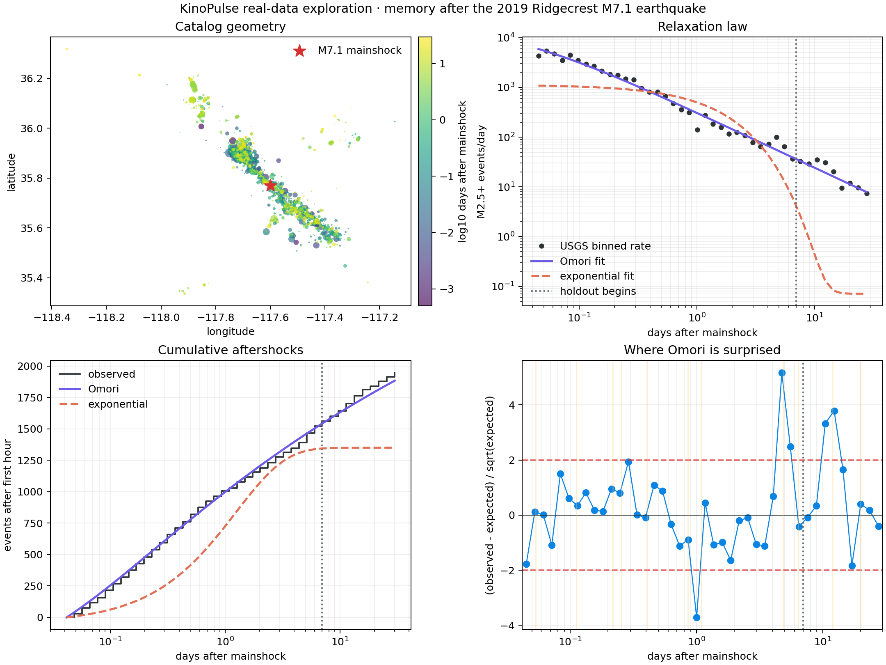

# Memory After a Shock: The 2019 Ridgecrest Aftershock Sequence

## Objective

Ask whether the decay of observed seismicity after a large earthquake behaves
like a scale-free memory process or like ordinary exponential relaxation. The
experiment fits only the first seven days after the M7.1 Ridgecrest mainshock,
then judges both models on days 7–30.

This is a model-comparison exercise, not an operational earthquake forecast.

## Data and provenance

The catalog comes from the public [USGS FDSN Event Web
Service](https://earthquake.usgs.gov/fdsnws/event/1/). The mainshock is USGS
event [`ci38457511`](https://earthquake.usgs.gov/earthquakes/eventpage/ci38457511/executive),
the M7.1 event at 2019-07-06 03:19:53 UTC. USGS describes it as occurring about
34 hours after a nearby M6.4 event and as generating a robust aftershock
sequence.

The reproducible query requests earthquakes of magnitude 2.5 or greater within
100 km of the mainshock, from 30 days before through 30 days after it. The CSV
contained 2,487 rows including the mainshock and had SHA256:

```text
3d11398500ea972afc70f5694fadc87f9d0228ed30d769ceec4bef9ff920bafe
```

There were 2,183 post-mainshock catalog events. The analysis excludes the first
hour, where catalog saturation and rapidly changing completeness are most
concerning, leaving 1,947 events.

## Method

The event times were divided into 42 logarithmic bins with an exact boundary at
day 7. The fit interval was hour 1 through day 7; days 7–30 were untouched
holdout data.

Two rate laws were compared:

```text
modified Omori: r(t) = K / (t + c)^p + background
exponential:    r(t) = R0 exp(-t / tau) + background
```

The background was not learned from post-shock data. It was fixed at `0.0714`
events/day from the control window 30 to 2 days before the M7.1 event. The last
two pre-mainshock days were excluded because they contain the M6.4 event and its
sequence. Only two M2.5+ events occurred in the 28-day control window.

KinoPulse `LevenbergMarquardt` performed deterministic multistart fits against
variance-stabilized count residuals. Model comparison used Poisson deviance and
count RMSE. KinoPulse `solve_ivp` separately integrated the fitted Omori rate as
a cumulative-event ODE; its maximum disagreement with the closed-form integral
was `0.0713` event over a roughly 1,900-event trajectory.

## Results

The fitted modified Omori parameters were:

- `K = 315.86`
- `c = 0.02678 days`, about 38.6 minutes
- `p = 1.1130`

| Model | Training deviance | Holdout events, observed/predicted | Holdout deviance | Holdout count RMSE |
|---|---:|---:|---:|---:|
| Modified Omori | `69.94` | `387 / 341.1` | `28.34` | `11.70` |
| Exponential | `974.47` | `387 / 6.61` | `2821.80` | `43.74` |

The exponential model can mimic the early drop only by selecting a `1.24 day`
timescale, after which its rate collapses toward the small fixed background.
The power law retains a long tail and reduces holdout Poisson deviance by about
99% relative to the exponential baseline.

The conclusion is insensitive to moderate binning changes. Across 32, 42, and
52 bins, fitted `p` ranged from `1.105` to `1.113`, `c` from `0.0242` to
`0.0268 days`, and holdout predictions from 341 to 347 events. Omori holdout
deviance remained between 22.8 and 30.2; exponential deviance stayed above
2,800.



## Where the compact law fails

The residual view treats the Omori curve as a baseline and asks when the
catalog is unexpectedly active or quiet. The largest positive deviation was
days `4.39–5.13`: 74 events observed versus 40.9 expected, a standardized
residual of `+5.17`. A M4.52 aftershock occurred at day 4.87. Another excess
spanned roughly days 9.7–13.4, around a M4.64 event at day 12.03. The strongest
negative deviation was near day 1, with 22 observed versus 47.6 expected.

These alignments do not establish causation. They identify intervals where a
self-exciting model, magnitude-dependent productivity law, spatially separated
branches, or time-varying catalog completeness could explain more than one
global decay curve.

## Limitations

The circular query includes nearby earthquakes without proving they were
triggered by the M7.1 event. The catalog was not declustered, spatial fault
geometry was not modeled, and magnitude completeness may change through time.
Counts in adjacent bins are not independent under secondary triggering. The
background estimate is based on only two control events, so it is highly
uncertain even though its absolute contribution is small.

Poisson deviance is used as a transparent comparison score, not as a complete
point-process likelihood. Parameter intervals, alternative mainshock windows,
and out-of-sequence validation are required before making broader seismological
claims.

## Next experiment

The next model should preserve the successful Omori tail while adding explicit
event excitation and spatial state. The key test is not whether a more complex
model fits better—it will—but whether it predicts the held-out residual bursts
from the timing, magnitude, and location of preceding events.

## Reproduce

```powershell
.\.venv\Scripts\python.exe fetch_ridgecrest.py
.\.venv\Scripts\python.exe aftershock_lab.py
.\.venv\Scripts\python.exe -m unittest tests.test_aftershock_lab -v
```
