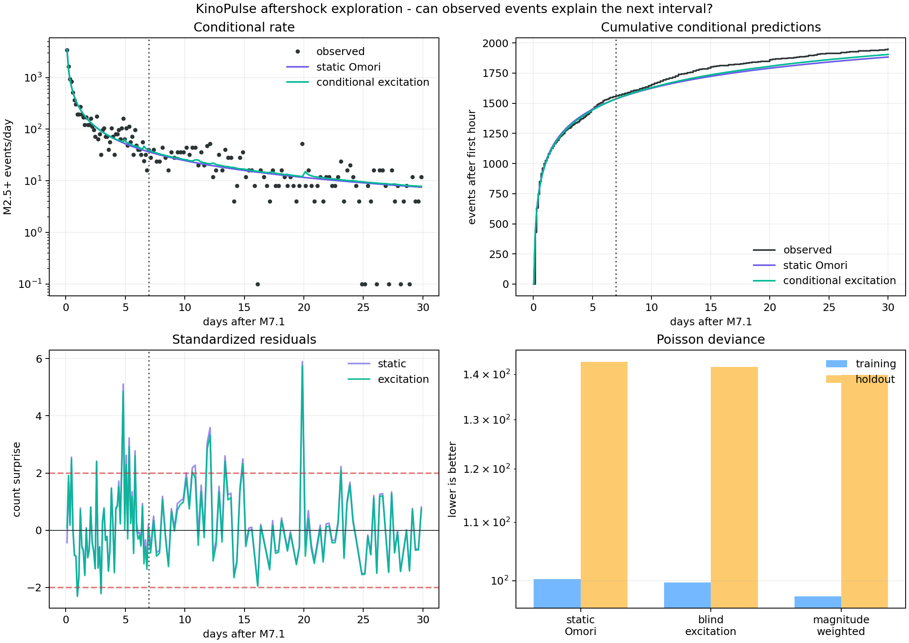

# A Small Conditional Gain: Aftershock Self-Excitation

## Objective

The first Ridgecrest experiment found that a modified Omori power law predicts
the long aftershock tail far better than exponential relaxation. This follow-up
asks a harder question: after learning that smooth decay, does the timing and
magnitude of each newly observed earthquake improve the prediction of the next
time interval?

This is an exploratory conditional model comparison, not an operational
earthquake forecast.

## Scientific motivation

The USGS [aftershock-forecast background](https://earthquake.usgs.gov/data/oaf/background.php)
notes that a large aftershock can initiate its own sequence, a situation where
a single Reasenberg-Jones decay curve may fail. The epidemic-type aftershock
sequence model (ETAS) is a natural extension: every observed event can produce
its own decaying contribution to future rate, as described in this
[USGS publication](https://pubs.usgs.gov/publication/70025491).

The experiment deliberately implements only the temporal core of that idea. It
does not claim to be a complete ETAS model.

## Data and causal boundary

The data and fixed background are identical to the preceding
[Ridgecrest report](12_ridgecrest_aftershocks.md): M2.5+ earthquakes within 100
km of the 2019 M7.1 mainshock, obtained from the public
[USGS Event Web Service](https://earthquake.usgs.gov/fdsnws/event/1/). The first
hour is excluded. Model parameters are learned from hour 1 through day 7, and
days 7 through 30 remain the evaluation interval.

The default analysis uses approximately 3-hour training bins and 6-hour
holdout bins. For a bin `[s, e]`, only catalog events strictly earlier than `s`
may contribute. An event inside the bin cannot help predict that same bin. The
holdout score is therefore an **online conditional nowcast**: after day 7 it
uses observations that have arrived before each new bin. It is not the same as
the open-loop day-7 forecast in the previous report.

## Model

The conditional intensity is

```text
rate(t | history) = background
                  + K0 / (t + c)^p
                  + A sum_i exp(alpha (Mi - 2.5))
                            / (t - ti + c)^p
```

The sum contains only events available at the prediction boundary. Each kernel
is integrated analytically over the target bin, so the optimizer compares
expected counts rather than point samples. The static Omori fit supplies `c`
and `p`; KinoPulse `LevenbergMarquardt` then fits the primary productivity `K0`,
secondary productivity `A`, and magnitude response `alpha` on the training
interval. A magnitude-blind version fixes `alpha = 0`.

This two-stage conditional model has two more effective fitted parameters than
the static three-parameter Omori baseline. The training deviance gain is only
`2.78`, smaller than a simple two-units-per-extra-parameter complexity
allowance. That is another reason to regard the result as weak evidence.

## Results

| Model | Training deviance | Holdout events, observed/predicted | Holdout deviance | Holdout RMSE |
|---|---:|---:|---:|---:|
| Static Omori | `100.25` | `387 / 347.61` | `142.91` | `2.561` |
| Magnitude-blind excitation | `99.69` | `387 / 353.06` | `141.71` | `2.546` |
| Magnitude-weighted excitation | `97.46` | `387 / 367.76` | `139.88` | `2.516` |

The magnitude-weighted history reduces holdout deviance by `3.04`, or `2.12%`,
and count RMSE by `1.77%`. It closes roughly half of the static model's
aggregate count deficit. The fitted values are `K0 = 261.19`,
`A = 0.000848`, and `alpha = 2.902` per magnitude unit, with the static
`c = 0.01322 days` and `p = 1.0883` held fixed.

Those aggregate improvements overstate the consistency of the effect. The
conditional model has lower deviance in only `41 / 92` holdout bins and
`11 / 23` one-day blocks. Its largest residual spikes remain almost unchanged.
It calibrates the long tail a little better; it does not reliably anticipate
the bursts that motivated the experiment.



## Binning sensitivity

The small aggregate gain repeats at three resolutions:

| Training / holdout bin width | Static deviance | Conditional deviance | Reduction | Static / conditional total |
|---|---:|---:|---:|---:|
| `4 h / 12 h` | `71.23` | `69.71` | `2.14%` | `358.7 / 370.2` |
| `3 h / 6 h` | `142.91` | `139.88` | `2.12%` | `347.6 / 367.8` |
| `2.4 h / 3 h` | `270.27` | `263.64` | `2.45%` | `326.5 / 350.2` |

The fitted magnitude exponent ranges from `1.97` to `2.90` and approaches its
allowed upper bound in two configurations. The score improvement is robust to
these bin choices; the physical parameter estimate is not.

## What was learned

There is weak evidence that causal event history contains information beyond a
single Omori curve, principally by correcting its held-out event total. There
is not yet convincing evidence that this temporal-only kernel predicts
individual high-activity intervals. The honest result is therefore a useful
near-null: secondary triggering is plausible, but magnitude and time alone do
not resolve the sequence's structure at this scale.

The next serious model should add spatial separation and fault geometry, fit a
proper point-process likelihood, and validate on entirely different mainshock
sequences. A latent stress state could then be compared with ETAS under the
same causal scoring protocol. That experiment would distinguish recurring
spatial branches from a mere global correction to the decay tail.

## Limitations

Catalog completeness varies most strongly soon after large events. The
circular spatial query does not identify fault branches, and every event is
treated as a potential child of every prior event. Events inside a prediction
bin cannot trigger one another until the next boundary, making results depend
on bin width. `c` and `p` are reused from the static fit rather than jointly
refitted under a point-process likelihood. No uncertainty interval or
sequence-level external validation is provided.

## Reproduce

```powershell
.\.venv\Scripts\python.exe fetch_ridgecrest.py
.\.venv\Scripts\python.exe aftershock_excitation_lab.py
.\.venv\Scripts\python.exe -m unittest tests.test_aftershock_excitation_lab -v
```
