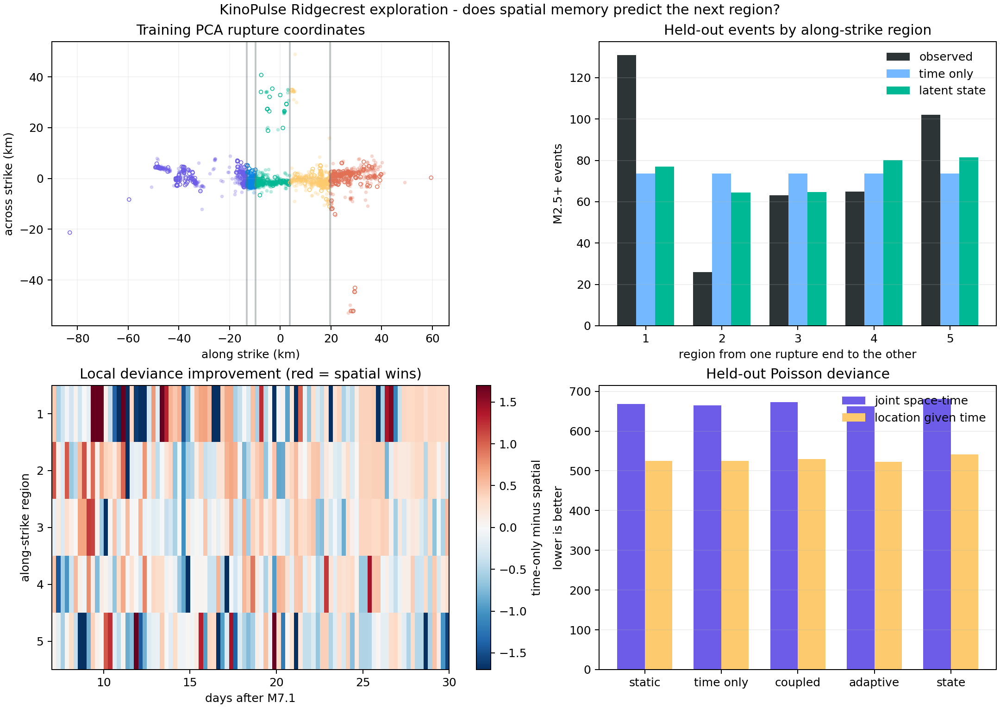

# Spatial Memory That Did Not Generalize

## Objective

The temporal self-excitation experiment improved the aggregate aftershock tail
slightly but failed to anticipate most active intervals. This experiment asks
whether the missing information is spatial: given everything observed before a
prediction boundary, can a model say which part of the Ridgecrest rupture will
be active next?

The answer on this single sequence is **no**. Several plausible spatial-memory
models improve training scores, but none delivers a meaningful held-out gain.
The most expressive latent state overfits badly.

This is a causal model-comparison exercise, not an operational earthquake
forecast.

## Data and coordinate system

The experiment reuses the M2.5+ catalog and hour-1/day-7/day-30 boundaries from
the preceding [relaxation](12_ridgecrest_aftershocks.md) and
[temporal-excitation](13_aftershock_excitation.md) studies. The catalog comes
from the public [USGS Event Web Service](https://earthquake.usgs.gov/fdsnws/event/1/).

A principal axis is learned from training-event longitude and latitude only.
The training cloud has an along-strike standard deviation of `19.67 km`, versus
`6.02 km` across strike. Training events are divided into five equal-frequency
regions along that axis. This makes the static training allocation exactly 20%
per region without looking at holdout locations.

The held-out distribution changes sharply:

```text
region:             1      2      3      4      5
training share:   20.0%  20.0%  20.0%  20.0%  20.0%
holdout events:    131     26     63     65    102
holdout share:    33.9%   6.7%  16.3%  16.8%  26.4%
```

Activity moves toward both rupture ends. This is a demanding out-of-time test
for any local-persistence rule.

## Causal protocol

The default grid has approximately 3-hour training bins and 6-hour holdout
bins. Every cell-bin prediction uses only events strictly earlier than the
bin's start. Events inside the target bin cannot explain themselves. The PCA
axis, region boundaries, baseline spatial probabilities, and all model
parameters use days before the day-7 boundary only.

All spatial models inherit the temporal total from the previous experiment,
allowing a separate score for location given the observed time-bin total. This
distinguishes failure to predict **where** from failure to predict **how many**.

## Model ladder

Four increasingly flexible spatial treatments are compared with the static
Omori baseline:

1. **Time only:** causal magnitude-weighted temporal excitation, allocated with
   the fixed 20% training proportions.
2. **Coupled excitation:** every prior event adds an Omori-decaying spatial
   Gaussian kernel; productivity, magnitude response, and spatial width are
   fitted jointly.
3. **Adaptive allocation:** recent Omori-weighted history controls a learned
   fraction of spatial probability independently of the predicted total.
4. **Latent regional state:** events drive a regional activity state that
   decays exponentially with its own learned memory time. This separates local
   persistence from global Omori relaxation.

KinoPulse `LevenbergMarquardt` fits each differentiable model with deterministic
multistarts. Expected counts are scored with Poisson deviance. The implementation
also checks the no-history fallback and proves synthetically that an event after
a bin boundary cannot influence that bin.

## Results

| Model | Training spatial deviance | Holdout spatial deviance | Holdout joint deviance |
|---|---:|---:|---:|
| Static Omori | `380.10` | `525.03` | `667.95` |
| Time only | `380.10` | `525.03` | `664.91` |
| Coupled spatial excitation | `370.32` | `529.58` | `672.40` |
| Adaptive spatial allocation | `357.48` | **`522.98`** | **`662.86`** |
| Latent regional state | **`319.08`** | `541.17` | `681.05` |

The adaptive allocation is technically best in holdout, but its improvement is
only `2.05` spatial-deviance units (`0.39%`) and `2.05` joint-deviance units
(`0.31%`) relative to time only. It predicts region totals of approximately
`75, 73, 72, 73, 75`; that barely departs from uniformity and misses the
observed end concentration.

The latent state is the important failure. It learns a seemingly coherent
story:

- `44.7%` of spatial allocation follows recent activity;
- magnitude response `alpha = 1.622`;
- along-strike influence width `7.57 km`;
- regional memory time `0.121 days`, or `2.91 hours`.

That model reduces training spatial deviance by `16.1%` relative to time only,
then increases holdout spatial deviance by `3.1%`. The interpretable parameters
describe the training sequence but do not survive the change in spatial
regime.



## Interpretation

Recent events do contain a little information about the next region, but not
enough for this five-zone representation to explain the day-7-to-30 shift. A
short-memory state mostly learns transient clustering already present in the
training period. The held-out concentration at both rupture ends is a broader
structural change, not a continuation of that local pattern.

This result is more valuable than a training-only success. Without the frozen
time boundary, the latent state's `2.9-hour` memory and `7.6-km` scale would
look physically persuasive. Holdout evaluation reveals that they are not a
general forecasting law for this sequence.

## Limitations and next questions

One PCA coordinate collapses cross-strike branches and off-fault clusters.
Quantile regions have unequal physical widths, and discrete cells discard
continuous location information. Catalog completeness and location uncertainty
are not modeled. The study contains only one mainshock sequence, so it cannot
separate a Ridgecrest-specific regime change from a systematic failure of
local-memory models.

The next spatial experiment should avoid learning and testing regime behavior
inside one sequence. Better tests are:

- train spatial scales across several historical mainshocks and hold out an
  entire sequence;
- represent continuous two-dimensional fault geometry rather than PCA cells;
- incorporate mapped fault traces or focal mechanisms;
- compare a genuine space-time point-process likelihood with a latent stress
  field under identical sequence-level validation.

The current negative result says not to add more parameters to Ridgecrest. It
says to add independent sequences.

## Reproduce

```powershell
.\.venv\Scripts\python.exe fetch_ridgecrest.py
.\.venv\Scripts\python.exe aftershock_spatial_lab.py
.\.venv\Scripts\python.exe -m unittest tests.test_aftershock_spatial_lab -v
```

The full deterministic multistart run takes roughly three minutes on the
development machine.
