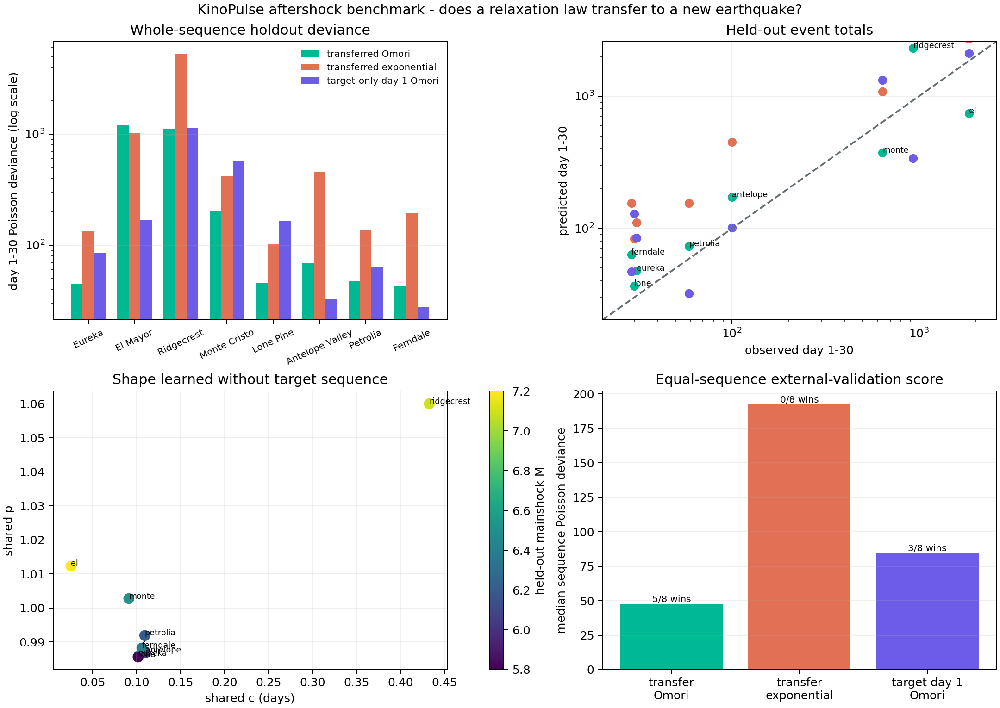

# A Useful Prior, Not a Universal Law

## Objective

The Ridgecrest spatial-memory study ended with a clear prescription: stop
tuning one sequence and hold out entire earthquakes. This experiment does that.
It asks whether an aftershock relaxation shape learned from seven mainshocks can
predict an eighth after seeing only its first day.

The result is mixed in an informative way. A transferred modified Omori law is
the best model for five of eight sequences and has the best equal-sequence
median score. It nevertheless fails badly on the two largest sequences in
opposite directions. A near-`p = 1` decay is a useful prior, not a universal
forecasting law.

This is a retrospective model benchmark, not an operational earthquake
forecast.

## Benchmark data

All catalogs come from the public
[USGS FDSN Event Web Service](https://earthquake.usgs.gov/fdsnws/event/1/).
Every query applies the same rule: M2.5+ earthquakes within 100 km, from 30 days
before through 30 days after the mainshock. Mainshock metadata and event IDs are
fixed in `fetch_aftershock_benchmark.py`; URLs and SHA256 digests are preserved
in the generated JSON evidence.

| Sequence | Mainshock | Catalog rows | Events after hour 1 |
|---|---:|---:|---:|
| Eureka 2010 | M6.5 | `79` | `55` |
| El Mayor 2010 | M7.2 | `2,550` | `2,483` |
| Ridgecrest 2019 | M7.1 | `2,487` | `1,947` |
| Monte Cristo 2020 | M6.5 | `914` | `859` |
| Lone Pine 2020 | M5.8 | `87` | `48` |
| Antelope Valley 2021 | M6.0 | `236` | `203` |
| Petrolia 2021 | M6.2 | `137` | `101` |
| Ferndale 2022 | M6.4 | `93` | `66` |

The M6.0 South Napa sequence was screened but excluded before fitting because
the uniform query returned only 14 training-window and 7 holdout events. The
benchmark deliberately retains Lone Pine and the offshore northern-California
sequences despite their small counts; transfer should be tested where local
three-parameter estimation is least stable.

## Strict transfer protocol

Each of eight folds performs three steps:

1. Learn one shared decay shape from all 30 post-mainshock days of the other
   seven sequences. Each training sequence has its own productivity amplitude
   and fixed pre-mainshock background.
2. Freeze that shape. Use target events from hour 1 through day 1 to learn only
   one amplitude.
3. Score target days 1 through 30, which were not used for either shape or
   amplitude.

Logarithmic bins contain an exact day-1 boundary. Variance-stabilized count
residuals give every sequence the same number of training terms rather than
explicitly weighting by catalog size. KinoPulse `LevenbergMarquardt` performs
deterministic multistart fits.

Three models are compared:

- **Transferred Omori:** shared `c` and `p`, target-specific day-1 amplitude.
- **Transferred exponential:** shared `tau`, target-specific day-1 amplitude.
- **Target day-1 Omori:** all three Omori parameters estimated from the target's
  first day, with no information borrowed from other earthquakes.

The last model tests whether transfer regularizes sparse early data. Synthetic
regression tests verify recovery of a shared shape and show that changing every
post-day-1 count cannot alter target amplitude calibration.

## Results by held-out sequence

| Target | Day 1-30 events | Transfer Omori | Transfer exponential | Target day-1 Omori | Winner |
|---|---:|---:|---:|---:|---|
| Eureka | `31` | **`44.5`** | `134.6` | `84.7` | Transfer |
| El Mayor | `1,851` | `1,207.9` | `1,014.6` | **`169.0`** | Target-only |
| Ridgecrest | `928` | **`1,122.3`** | `5,254.7` | `1,131.6` | Transfer |
| Monte Cristo | `636` | **`205.3`** | `421.7` | `575.5` | Transfer |
| Lone Pine | `30` | **`45.3`** | `101.8` | `165.0` | Transfer |
| Antelope Valley | `100` | `68.2` | `454.1` | **`32.9`** | Target-only |
| Petrolia | `59` | **`47.7`** | `138.2` | `64.0` | Transfer |
| Ferndale | `29` | `42.8` | `192.4` | **`27.5`** | Target-only |

Values are day-1-to-30 Poisson deviances; lower is better.

| Summary | Transfer Omori | Transfer exponential | Target day-1 Omori |
|---|---:|---:|---:|
| Sequence wins | **`5 / 8`** | `0 / 8` | `3 / 8` |
| Median sequence deviance | **`47.7`** | `192.4` | `84.7` |
| Summed deviance | `2,784.1` | `7,712.1` | **`2,250.2`** |
| Deviance per evaluation event | `0.760` | `2.105` | **`0.614`** |

The two summaries answer different questions. Giving each earthquake equal
standing favors transfer: it wins most sequences and nearly halves the median
deviance versus target-only fitting. Weighting implicitly by the number and
difficulty of events favors target-only fitting because El Mayor contains half
the evaluation catalog and is dramatically better fit by its own first day.
Neither summary should be hidden.



## Where universality breaks

Six leave-one-out folds learn a remarkably concentrated shared shape:
approximately `p = 0.986-1.003` and `c = 0.091-0.110 days`. El Mayor and
Ridgecrest destabilize that consensus:

- When El Mayor is held out, the other sequences select `c = 0.025 days` and
  `p = 1.012`. Calibrated on El Mayor's first day, this shape predicts only
  `742` later events versus `1,851` observed. El Mayor decays more slowly than
  the transferred law expects.
- When Ridgecrest is held out, the other sequences select `c = 0.433 days` and
  `p = 1.060`. Ridgecrest's enormous first day then implies `2,308` later
  events versus `928` observed. Ridgecrest decays more quickly than that shared
  shape expects.

The same one-parameter calibration therefore underpredicts one M7 sequence and
overpredicts the other. Mainshock magnitude alone cannot explain the mismatch.
Sequence-specific early-time shape, catalog completeness, foreshock history,
fault geometry, or changing secondary activity must matter.

The target-only model exposes the opposite problem. With only one day, its
offset collapses nearly to zero for Monte Cristo and Lone Pine, producing
unstable exponents and severe long-horizon overprediction. Cross-sequence
transfer acts as valuable regularization for these smaller catalogs.

## What was learned

The transferable object is not a complete universal rate law. It is a
regularizing prior centered near inverse-time decay. That prior is especially
helpful when a target's first day cannot identify three shape parameters, but
it needs a mechanism for rapid sequence-specific adaptation when early and late
activity disagree.

A promising next model is hierarchical rather than fully pooled: learn a
population distribution over `c` and `p`, update that distribution from the
target's accumulating counts, and retain uncertainty instead of committing to
one shared curve. The benchmark now supplies the whole-sequence folds needed to
judge such a model honestly.

## Limitations

The eight catalogs span different seismic networks, tectonic settings, offshore
coverage, and years of changing detection capability. A uniform M2.5 threshold
does not guarantee uniform completeness. Circular 100-km queries include
unrelated seismicity and do not decluster secondary sequences. Pre-mainshock
background estimates contain few events and may include other activity.

The benchmark is small and geographically concentrated in California, Nevada,
and northern Baja California. Model selection used binned counts and Poisson
deviance rather than a continuous-time point-process likelihood. No formal
uncertainty intervals are claimed.

## Reproduce

```powershell
.\.venv\Scripts\python.exe fetch_aftershock_benchmark.py
.\.venv\Scripts\python.exe aftershock_transfer_lab.py
.\.venv\Scripts\python.exe -m unittest tests.test_aftershock_transfer_lab -v
```
