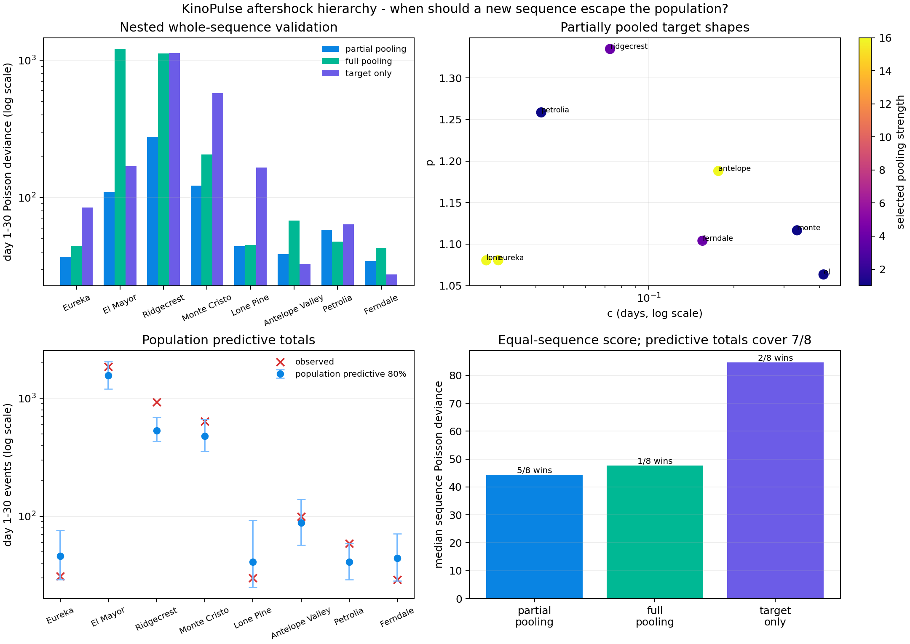

# When a New Earthquake Should Escape the Population

## Objective

The whole-sequence benchmark found that a shared Omori shape regularizes small
catalogs but fails oppositely on El Mayor and Ridgecrest. This experiment tests
the natural middle ground: partially pool each new sequence toward a robust
population shape, while allowing its first day to justify a different decay.

The hierarchical model succeeds. It reduces summed whole-sequence deviance by
`74.1%` relative to full pooling and by `67.9%` relative to fitting the target's
first day alone. It wins five of eight outer folds. Population predictive
totals cover seven of eight sequences, with Ridgecrest as a clear and useful
failure.

This is an empirical-Bayes-style retrospective benchmark, not an operational
earthquake forecast or a complete Bayesian analysis.

## Data and outer boundary

The eight M2.5+, 100-km catalogs are identical to the preceding
[transfer benchmark](15_aftershock_law_transfer.md), downloaded from the public
[USGS FDSN Event Web Service](https://earthquake.usgs.gov/fdsnws/event/1/).
Each outer fold holds out an entire mainshock sequence. Training sequences may
use their full 30-day histories; the target contributes only hour 1 through day
1. Target days 1 through 30 remain untouched until final scoring.

## Robust population model

Independent full-history Omori fits to small catalogs can be pathological.
Examples in this benchmark include an offset effectively equal to zero and an
exponent at its upper bound. Treating their ordinary mean and covariance as a
population prior would turn numerical non-identifiability into scientific
belief.

The model therefore works in KinoPulse's constrained optimizer coordinates:

```text
shape = [log(c), logit((p - 0.3) / 1.7)]
```

Individual estimates are restricted to broad physical/numerical bounds before
population construction. The population center is the componentwise median;
scale is `1.4826 * MAD`, bounded away from zero and capped against extreme
dispersion. The target optimization minimizes

```text
first-day variance-stabilized count residuals
    + sqrt(lambda) * standardized distance from population shape
```

Productivity remains target-specific and unpenalized. KinoPulse
`LevenbergMarquardt` fits the resulting differentiable objective.

## Nested selection without target leakage

Pooling strength is chosen from `0.25, 1, 4, 16`. For every outer target, an
inner leave-one-sequence-out loop runs entirely within the other seven
earthquakes. It selects the strength with the smallest median inner-sequence
deviance. Only then is the target's first day fitted.

This produces meaningfully different decisions:

| Outer target | Selected strength | Fitted `c` days | Fitted `p` |
|---|---:|---:|---:|
| Eureka | `16` | `0.0295` | `1.081` |
| El Mayor | `1` | `0.4134` | `1.063` |
| Ridgecrest | `4` | `0.0730` | `1.335` |
| Monte Cristo | `1` | `0.3335` | `1.117` |
| Lone Pine | `16` | `0.0267` | `1.080` |
| Antelope Valley | `16` | `0.1760` | `1.188` |
| Petrolia | `1` | `0.0418` | `1.259` |
| Ferndale | `4` | `0.1547` | `1.104` |

Sparse Eureka and Lone Pine receive strong regularization. The highly
informative El Mayor first day receives weak pooling and moves far from the
population offset. Ridgecrest takes an intermediate strength and learns a much
steeper exponent than the fully pooled law.

## External-validation results

| Target | Partial pooling | Full pooling | Target day-1 only | Winner |
|---|---:|---:|---:|---|
| Eureka | **`37.1`** | `44.5` | `84.7` | Partial |
| El Mayor | **`110.0`** | `1,207.9` | `169.0` | Partial |
| Ridgecrest | **`276.5`** | `1,122.3` | `1,131.6` | Partial |
| Monte Cristo | **`122.3`** | `205.3` | `575.5` | Partial |
| Lone Pine | **`44.3`** | `45.3` | `165.0` | Partial |
| Antelope Valley | `38.7` | `68.2` | **`32.9`** | Target-only |
| Petrolia | `58.1` | **`47.7`** | `64.0` | Full pooling |
| Ferndale | `34.6` | `42.8` | **`27.5`** | Target-only |

Values are day-1-to-30 Poisson deviances.

| Summary | Partial pooling | Full pooling | Target day-1 only |
|---|---:|---:|---:|
| Sequence wins | **`5 / 8`** | `1 / 8` | `2 / 8` |
| Median sequence deviance | **`44.3`** | `47.7` | `84.7` |
| Summed deviance | **`721.6`** | `2,784.1` | `2,250.2` |

The median improvement over full pooling is modest because that model already
works on most small sequences. The summed improvement is dramatic because
partial pooling resolves the two catastrophic M7 failures without giving up
regularization elsewhere.

For El Mayor, full pooling predicts `742` later events versus `1,851` observed.
Partial pooling predicts `1,521` and lowers deviance from `1,208` to `110`, even
beating the unconstrained target-only fit. For Ridgecrest, partial pooling
predicts `616` versus `928`; this remains low, but is far better than full
pooling's `2,308` or target-only fitting's `338`.



## Predictive uncertainty

Point estimates are not enough when the population contains only seven outer
training sequences. Each fold therefore constructs an empirical population
predictive distribution:

1. Draw `4,096` candidate shapes from the robust transformed population.
2. Calibrate each candidate's productivity from the target first day.
3. Weight candidates by first-day Poisson fit.
4. Resample `1,024` shapes and draw future Poisson counts.

The central 80% total-count interval covers `7 / 8` held-out totals. Mean
binwise coverage is `77.6%`, close to the nominal 80%, but this average is not a
calibration certificate. Coverage is highly uneven:

- Eureka, Lone Pine, and Ferndale have at least `91.7%` binwise coverage.
- El Mayor has `62.5%`.
- Ridgecrest has only `20.8%`, and its observed total `928` lies above the
  interval `[434, 695]`.

Ridgecrest is not merely a large residual; it is recognized as outside the
population predictive envelope. Its importance-sampling effective size also
falls to about `90` of `4,096` proposals, showing that the first day forces the
population prior into a narrow, strained region.

## What was learned

Aftershock relaxation is neither one universal curve nor eight unrelated
curves. A robust population prior plus sequence-specific adaptation is the
right abstraction for this benchmark. Borrowing strength solves the sparse-data
instability, while controlled escape from the population handles El Mayor's
slow tail and much of Ridgecrest's rapid transition.

The model also changes the next research question. The remaining error is not
primarily about choosing a better global `p`. It is about predicting *why* a
sequence should escape: foreshock history, rupture geometry, depth, tectonic
setting, magnitude completeness, and early secondary-event structure are
candidate covariates for the population shape.

## Limitations

This is robust penalized estimation with empirical predictive sampling, not a
joint probabilistic hierarchical model. Median/MAD population statistics and
the pooling grid are design choices. The same eight heterogeneous catalogs set
the population, tune regularization through nested validation, and assess final
performance; outer targets remain untouched, but the benchmark is still small.

Predictive proposals assume an axis-aligned transformed population and use
binned Poisson counts. Importance weighting can concentrate strongly, as it
does for Ridgecrest. Catalog completeness, network differences, spatial
geometry, and secondary triggering remain unmodeled.

## Reproduce

```powershell
.\.venv\Scripts\python.exe fetch_aftershock_benchmark.py
.\.venv\Scripts\python.exe aftershock_hierarchy_lab.py
.\.venv\Scripts\python.exe -m unittest tests.test_aftershock_hierarchy_lab -v
```
