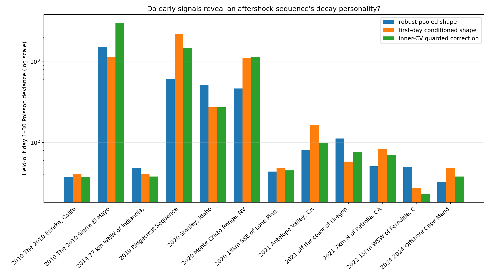

# Can a First Day Reveal an Aftershock Sequence's Personality?

## Objective

The eight-sequence hierarchy showed that a new earthquake sometimes needs to
escape the population decay law. This experiment asks whether information
available by day one can predict the direction of that escape. It first builds
a larger, model-blind population from the public USGS catalog, then tests a
regularized meta-model in strict leave-one-sequence-out forecasts.

The answer is currently **no**. A first-day/metadata-conditioned Omori shape
wins `5 / 12` sequences but raises summed day-1-to-30 deviance from `3,576.5`
for a robust pooled shape to `5,222.7`. An inner-validated safety blend also
fails (`4 / 12` wins; deviance `6,350.9`). This negative result rejects a
tempting shortcut: predictable-looking parameter variation is not yet a safe
forecast correction.

This is a retrospective dynamics experiment, not an operational earthquake
forecast.

## Model-blind population screen

`fetch_aftershock_population.py` queries the official
[USGS FDSN Event Web Service](https://earthquake.usgs.gov/fdsnws/event/1/)
for M5.8+ earthquakes from 2010 through 2025 in a western North American box
(`30–50° N`, `130–100° W`). The rules are fixed before fitting:

1. Within a `45`-day, `150`-km neighborhood, retain only the largest event.
2. Download M2.5+ events within `100 km`, from 30 days before through 30 days
   after each independent candidate.
3. Require at least `15` events from hour 1 through day 1 and at least `15`
   events from day 1 through day 30.
4. Record every accepted catalog, rejected candidate, reason, query URL, and
   SHA-256 digest in the generated manifest.

The screen starts with `40` candidates. Space-time de-duplication leaves `32`;
catalog-count requirements retain `12`. Most rejected offshore events have too
few M2.5+ observations to support the same experiment. South Napa, for example,
has only three qualifying first-day events and is rejected without consulting
a model score.

The retained population contains the previous eight sequences plus the 2014
offshore Northern California event, Stanley 2020, an offshore Oregon sequence
in 2021, and 2024 Cape Mendocino. Counts range from `18` to `1,019` in the
calibration day and from `29` to `1,851` in evaluation, so catalog scale still
varies enormously.

## Prediction boundary

Every outer fold holds out one complete earthquake sequence. Historical
training sequences may contribute their full 30-day trajectories. The target
may contribute only:

- mainshock magnitude and depth;
- background rate estimated from days `-30` through `-2`;
- its event count from hour 1 through day 1; and
- the log count ratio between hours 1–6 and hours 6–24.

Target days 1–30 are untouched until the final Poisson-deviance score. A test
also verifies that adding future target events cannot change the feature
vector.

## KinoPulse meta-model

Each historical sequence receives a full-history Omori fit using KinoPulse
`LevenbergMarquardt`. Its decay personality is represented in the same bounded
optimizer coordinates used by the hierarchy:

```text
shape = [log(c), logit((p - 0.3) / 1.7)]
```

KinoPulse `ridge_solve` maps standardized early features to these two shape
coordinates. Within every outer fold, another leave-one-sequence-out loop over
the remaining eleven sequences chooses ridge strength from
`0.01, 0.1, 1, 10, 100`. The resulting shape is applied to the target, while
productivity is recalibrated solely from its first day.

The robust baseline does the same productivity calibration but uses the
componentwise median/MAD shape of the eleven historical sequences.

## Results

| Held-out sequence | Robust pool | Conditioned | Guarded blend | Best |
|---|---:|---:|---:|---|
| Eureka 2010 | **`37.3`** | `40.9` | `37.7` | Pool |
| El Mayor 2010 | `1,519.9` | **`1,143.6`** | `3,015.1` | Conditioned |
| Offshore N. California 2014 | `48.8` | `41.2` | **`37.9`** | Guarded |
| Ridgecrest 2019 | **`616.7`** | `2,185.9` | `1,488.1` | Pool |
| Stanley 2020 | `516.1` | **`272.4`** | **`272.4`** | Conditioned/guarded |
| Monte Cristo 2020 | **`467.2`** | `1,107.6` | `1,146.9` | Pool |
| Lone Pine 2020 | **`43.8`** | `48.1` | `45.4` | Pool |
| Antelope Valley 2021 | **`80.8`** | `165.4` | `99.1` | Pool |
| Offshore Oregon 2021 | `112.6` | **`58.1`** | `76.4` | Conditioned |
| Petrolia 2021 | **`50.8`** | `83.2` | `70.3` | Pool |
| Ferndale 2022 | `49.9` | `27.7` | **`23.3`** | Guarded |
| Cape Mendocino 2024 | **`32.7`** | `48.8` | `38.1` | Pool |

Values are held-out day-1-to-30 Poisson deviances.

| Summary | Robust pool | Conditioned | Guarded blend |
|---|---:|---:|---:|
| Wins versus pool | — | `5 / 12` | `4 / 12` |
| Median deviance | **`50.8`** | `58.1` | `70.3` |
| Summed deviance | **`3,576.5`** | `5,222.7` | `6,350.9` |



There is real-looking local signal. Conditioning improves El Mayor, Stanley,
the offshore Oregon sequence, Ferndale, and the 2014 offshore event. But it
predicts a shallow `p=0.714` decay for Ridgecrest and forecasts `3,062` later
events versus `928` observed. For Monte Cristo it predicts a steep `p=1.735`
and only `138` later events versus `636`. Those two failures erase all gains.

## Why the guard did not guard

A second nested policy chooses both ridge strength and a correction weight from
`0, 0.25, 0.5, 0.75, 1`. Zero means fall back completely to the robust
population. It still selects nonzero weights in every outer fold.

The problem is objective mismatch. Inner selection minimizes standardized
error in the two latent shape coordinates. Final evaluation measures future
count likelihood after target-specific amplitude calibration. A modest error
in transformed shape can induce a huge tail-count error in a highly productive
sequence. Cross-validation is not protective when it validates the wrong loss.

## What was learned

The enlarged screen supports the population idea but weakens the simplest
covariate story. Magnitude, depth, background, first-day abundance, and one
early timing ratio do not explain enough about sequence escape. More
importantly, treating a noisy full-history point estimate as the supervised
target discards uncertainty and trains at the wrong level of abstraction.

The next design should condition a *distribution over future counts* and tune
it directly with held-out count likelihood. Rupture geometry, spatial spread,
magnitude distribution, catalog completeness, and tectonic regime may enter as
covariates, but only through a model whose regularization is judged in the same
space as its forecast.

## Limitations

The population has only twelve usable sequences and is geographically and
observationally heterogeneous. The event-count threshold favors well-monitored
or unusually productive sequences. A fixed M2.5 cutoff does not guarantee
equal completeness across networks, years, or offshore regions. The greedy
overlap rule is transparent but not a seismological declustering algorithm.

The meta-model is linear, its feature set is deliberately compact, and its
training targets are bounded point estimates. The negative conclusion applies
to this shortcut, not to all covariate-conditioned aftershock models.

## Reproduce

```powershell
.\.venv\Scripts\python.exe fetch_aftershock_population.py
.\.venv\Scripts\python.exe aftershock_meta_lab.py
.\.venv\Scripts\python.exe -m pytest tests\test_fetch_aftershock_population.py tests\test_aftershock_meta_lab.py -q
```
