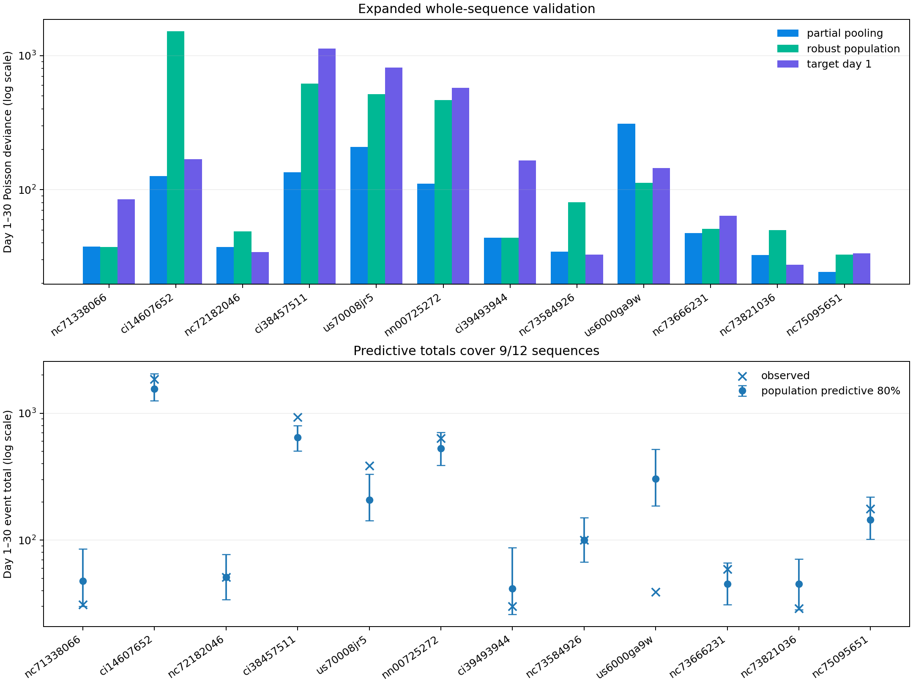
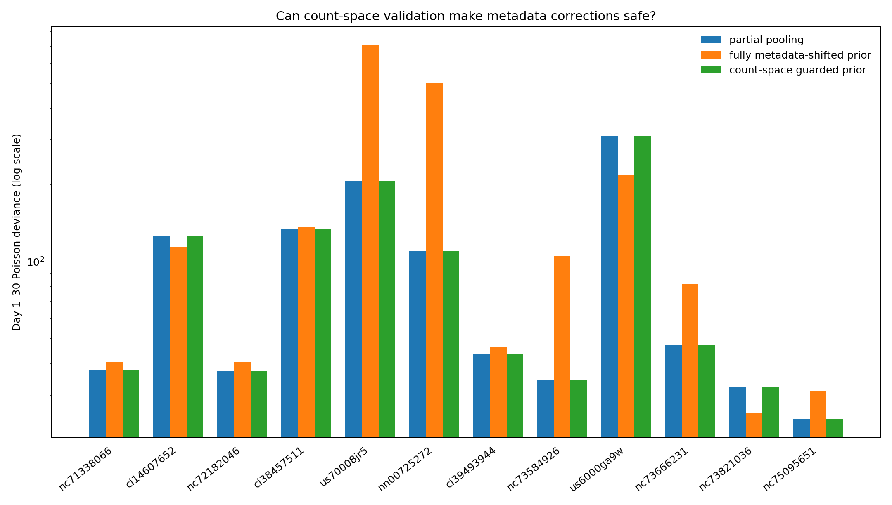

# A Larger Aftershock Hierarchy, and a Guard That Says No

## Objective

The first eight-earthquake hierarchy was promising, while the subsequent
metadata regression was not. This experiment resolves two open questions:

1. Does robust partial pooling survive expansion to the model-blind
   12-sequence population?
2. Can metadata corrections become safe when their trust weight is selected
   with future-count likelihood rather than latent parameter error?

The answers are **yes** and **yes, by rejecting the correction**. Partial
pooling wins `7 / 12` sequences and reduces summed day-1-to-30 Poisson deviance
from `3,576.5` for a robust fixed population shape to `1,148.4`. Its population
predictive 80% total intervals cover `9 / 12` sequences. A nested count-space
guard then selects zero metadata trust in every outer fold, exactly preserving
the hierarchy instead of accepting a harmful complexity increase.

This remains a retrospective benchmark, not an operational earthquake
forecast.

## Data and leakage boundary

The data are the twelve catalogs retained by the model-blind screen in
[report 17](17_aftershock_population_meta_prediction.md). Each outer fold holds
out an entire earthquake. Historical sequences may use their full 30-day
histories; the target contributes only events from hour 1 through day 1.
Target days 1–30 remain unavailable until final scoring.

The outer hierarchy constructs a median/MAD population from eleven historical
full-history Omori shapes. A nested leave-one-sequence-out loop within those
eleven selects pooling strength from `0.25, 1, 4, 16`. Ten targets select `4`;
the sparse Eureka and Lone Pine sequences select `16`.

## Expanded partial-pooling result

KinoPulse `LevenbergMarquardt` fits target productivity and shape to first-day
counts with a robust population penalty on transformed `c` and `p`. The
comparators are:

- **robust population:** the historical median shape, with target productivity
  calibrated from day one;
- **target day 1:** an unconstrained target-specific Omori fit using only day
  one; and
- **partial pooling:** the target-specific fit regularized toward the robust
  historical population.

| Held-out sequence | Partial pooling | Robust population | Target day 1 |
|---|---:|---:|---:|
| Eureka 2010 | `37.5` | **`37.3`** | `84.7` |
| El Mayor 2010 | **`126.3`** | `1,519.9` | `169.0` |
| Offshore N. California 2014 | `37.3` | `48.8` | **`34.3`** |
| Ridgecrest 2019 | **`135.2`** | `616.7` | `1,131.6` |
| Stanley 2020 | **`207.8`** | `516.1` | `813.2` |
| Monte Cristo 2020 | **`110.5`** | `467.2` | `575.5` |
| Lone Pine 2020 | **`43.6`** | `43.8` | `165.0` |
| Antelope Valley 2021 | `34.5` | `80.8` | **`32.9`** |
| Offshore Oregon 2021 | `311.3` | **`112.6`** | `145.1` |
| Petrolia 2021 | **`47.5`** | `50.8` | `64.0` |
| Ferndale 2022 | `32.5` | `49.9` | **`27.5`** |
| Cape Mendocino 2024 | **`24.2`** | `32.7` | `33.5` |

Values are held-out day-1-to-30 Poisson deviances.

| Summary | Partial pooling | Robust population | Target day 1 |
|---|---:|---:|---:|
| Sequence wins | **`7 / 12`** | `2 / 12` | `3 / 12` |
| Median deviance | **`43.6`** | `50.8` | `84.7` |
| Summed deviance | **`1,148.4`** | `3,576.5` | `3,276.2` |

The result strengthens the original hierarchy finding. Partial pooling retains
the stability needed by small catalogs while escaping strongly enough for El
Mayor, Ridgecrest, Stanley, and Monte Cristo. The important counterexample is
the 2021 offshore Oregon sequence: partial pooling scores `311.3`, substantially
worse than both comparators. A larger population reveals a new failure mode
rather than merely adding confirming cases.



## Predictive intervals

The same empirical population-predictive procedure used in report 16 draws
historical shapes, weights them by target first-day likelihood, and simulates
future Poisson counts. Central 80% total-count intervals cover `9 / 12`
sequences, with mean bin coverage `74.0%`.

The three misses are scientifically distinct:

| Sequence | Predictive 80% total | Observed | Bin coverage |
|---|---:|---:|---:|
| Ridgecrest | `[503, 800]` | `928` | `45.8%` |
| Stanley | `[143, 332]` | `385` | `54.2%` |
| Offshore Oregon | `[186, 521]` | `39` | `4.2%` |

Ridgecrest and Stanley are more persistent than the population predicts. The
Oregon sequence is the opposite: its first day looks productive, but activity
collapses so sharply that the observed total lies far below the population
envelope. This is a better-defined target for future regime or rupture-feature
work than a generic search for a different global exponent.

## Count-space metadata guard

Report 17 selected metadata trust by error in transformed Omori parameters,
then discovered that small shape errors could cause enormous future-count
errors. Here the trust decision is moved into the forecast space.

For each outer target:

1. A ridge model predicts a shape shift from magnitude, depth, background,
   first-day count, and early/late first-day timing.
2. Inner historical folds try weights `0, 0.25, 0.5, 0.75, 1` between the
   robust population center and the metadata-predicted center.
3. Every candidate undergoes the same first-day nonlinear hierarchical fit.
4. Mean inner day-1-to-30 Poisson deviance chooses the weight. Weight zero is
   an explicit rejection of metadata.

The fully shifted hierarchical prior wins only `3 / 12` outer targets and
raises total deviance from `1,148.4` to `2,049.8`; median deviance rises from
`43.6` to `81.9`. Count-space validation selects weight zero for all twelve
targets. Consequently, the guarded forecast is numerically identical to the
unmodified hierarchy.



This is a successful safety result rather than an accuracy improvement. The
guard cannot make a weak feature set informative, but it can prevent that
feature set from degrading an already adaptive model. Unlike the prior guard,
its validation objective matches the final forecast objective and it uses the
same nonlinear adaptation path.

## What was learned

Robust partial pooling is now supported across a broader, reproducibly screened
population. The first day contains enough information for nonlinear escape
from a population law, but coarse metadata adds no stable residual information
after that adaptation. The most honest model-selection decision is therefore
to refuse the extra model.

The next useful covariates should describe mechanisms not already summarized
by the first-day decay curve: spatial rupture extent and anisotropy, aftershock
magnitude distribution, catalog completeness, focal mechanism, plate-boundary
regime, and secondary-mainshock structure. Any such proposal should retain the
count-space rejection gate.

## Limitations

Twelve sequences remain a small and heterogeneous population. The hierarchy is
empirical-Bayes-style penalized estimation rather than a joint probabilistic
model. Predictive sampling uses an axis-aligned robust population and does not
propagate all fitting uncertainty. Inner mean deviance emphasizes highly
productive sequences; a safety policy optimized for equal-sequence risk or
worst-case regret could choose differently.

The metadata ridge strength is still selected by historical shape error; only
its trust weight is selected directly in count space. A joint count-space
search over feature model, regularization, prior shift, and pooling strength
would be more complete but would also consume much more validation information
from this small population.

## Reproduce

```powershell
.\.venv\Scripts\python.exe fetch_aftershock_population.py
.\.venv\Scripts\python.exe aftershock_population_hierarchy_lab.py
.\.venv\Scripts\python.exe aftershock_count_guard_lab.py
.\.venv\Scripts\python.exe -m pytest tests\test_aftershock_count_guard_lab.py -q
```
