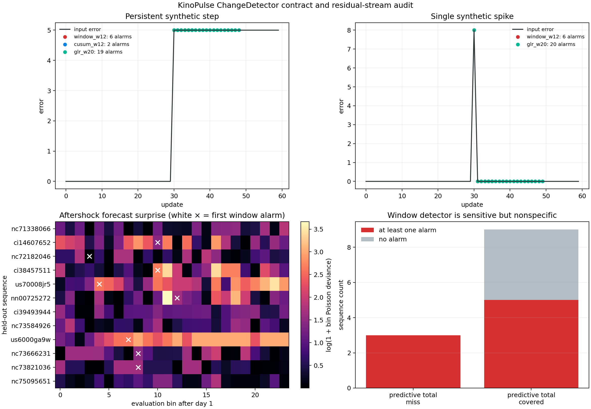

# When an Alarm Is Not a Change

## Objective

The expanded aftershock hierarchy exposed three predictive-total misses:
Ridgecrest and Stanley remain more active than expected, while the 2021
offshore Oregon sequence collapses dramatically. This lab asks whether
KinoPulse's online `ChangeDetector` can recognize those evolving forecast
failures from residuals as new bins arrive.

The detector is not yet suitable for that claim. Controlled streams reveal
dead GLR configurations, repeated alarms for one event, and incomplete reset
semantics. On the earthquake residuals, one window configuration is sensitive
but nonspecific, CUSUM is silent, and GLR flags every sequence. The correct
outcome is a detector contract audit and a KinoPulse gap report—not a claimed
regime-discovery success.

## Causal residual stream

For each of the twelve outer folds from
[report 18](18_expanded_aftershock_hierarchy_and_count_guard.md), the
hierarchical model is fitted using only hour 1 through day 1. As each later
log-time bin arrives, the lab computes its Poisson-deviance contribution:

```text
D_i = 2 [y_i log(y_i / μ_i) - (y_i - μ_i)]
```

with the zero-count limit handled explicitly. Contributions are non-negative
and sum exactly to the held-out Poisson deviance already reported for each
sequence. This gives `ChangeDetector` the documented kind of input—a stream of
squared prediction errors—without refitting on future data.

Before using those real streams, the detector is challenged with 60-update
controlled cases: a stable zero stream, a clean step from 0 to 5 at update 30,
and one isolated spike of 8 at update 30.

## Controlled-stream results

| Configuration | Persistent step alarms | Single-spike alarms |
|---|---:|---:|
| Window, size 12, threshold 3 | `6` | `6` |
| CUSUM, size 12, threshold 3 | `2` | `0` |
| GLR, size 12, threshold 3 | `0` | `0` |
| GLR, size 20, threshold 3 | `19` | `20` |

The size-12 GLR result is not conservative behavior. Its implementation
requires at least 20 samples, but its deque can retain only 12, so the detector
can never evaluate. The constructor accepts this permanently inert
configuration without warning.

The other methods expose an event-lifecycle problem. Window mode reports the
same step at updates 30–35, and also turns one spike into six “changes” as the
spike traverses overlapping windows. GLR with a viable window does the same
more severely. Raw threshold crossings are counted as independent changes;
there is no latch, release condition, cooldown, or minimum separation.



## Reset contract

After 35 step-stream updates, a window detector reports:

```text
n_updates=35, n_changes_detected=5, last_change_index=35,
buffer_length=20
```

After `reset()`:

```text
n_updates=35, n_changes_detected=5, last_change_index=35,
buffer_length=0
```

The residual buffer and accumulators are reset, but public counters and the
last index retain stale provenance. The method's docstring promises to “Reset
detector state,” so either the implementation or the contract needs to change.

## Aftershock stress test

Three exploratory configurations are applied to the 24 evaluation-bin streams.
Their thresholds are probes, not tuned operating points:

| Configuration | Sequences with at least one alarm |
|---|---:|
| Window, size 8, threshold 6 | `8 / 12` |
| CUSUM, size 8, threshold 2 | `0 / 12` |
| GLR, size 20, threshold 3 | `12 / 12` |

The window detector flags all three predictive-total misses. It first flags
Stanley by day `2.03`, offshore Oregon by day `3.11`, and Ridgecrest by day
`4.75`. But it also flags five of the nine sequences whose total lies inside
the population interval. With predictive-total misses treated only as a rough
reference label, sensitivity is `3/3` and specificity is `4/9`; there is not
enough discrimination for a scientific alarm.

The Oregon residual heatmap is nevertheless informative. Its bin deviance
rises and remains high after the first few evaluation bins, unlike an isolated
count fluctuation. That supports the qualitative description of a sustained
forecast-regime failure. It does not validate the detector or identify a
physical state transition.

CUSUM's silence and GLR's universal late alarms show that method names and a
single threshold are not interchangeable abstractions. Statistical calibration
must be specific to the error distribution, window, sampling grid, and desired
event lifecycle.

## What KinoPulse provided

This lab exercises `kinopulse.identification.online.adaptation.ChangeDetector`
in all three modes on synthetic and real held-out residual streams. KinoPulse
also supplies the Levenberg–Marquardt fits that generate the causal hierarchy
forecasts.

The generic detector defects are documented separately in
`kinopulse_gaps/change_detector_event_and_reset_contract.md`, including proposed
constructor validation, event semantics, reset behavior, and acceptance tests.

## What was learned

Online monitoring is still the right next layer for the aftershock hierarchy:
a forecast should be able to admit, before day 30, that its population prior is
failing. But a threshold crossing is not automatically a distinct dynamical
change. Reliable monitoring needs:

- a calibrated residual statistic;
- a warm-up contract that every configuration can satisfy;
- explicit event/rearm semantics;
- an untouched calibration population for false-alarm control; and
- separate evaluation of detection delay, sensitivity, and false alarms.

The offshore Oregon collapse remains a compelling regime candidate. The next
version of this experiment should use a repaired detector or a transparent
sequential likelihood-ratio design calibrated by whole-sequence validation.

## Limitations

The aftershock comparison has only twelve sequences and three rough “positive”
cases defined by predictive-total interval misses, not independently labeled
physical changes. Bins are equally spaced in log time, not clock time. The
probe thresholds were intentionally not optimized, so the reported sensitivity
and specificity characterize these configurations only.

Poisson-deviance contributions assume conditionally independent binned counts
and do not incorporate the hierarchy's full predictive uncertainty. The audit
focuses on observable API behavior; it does not establish the statistical
optimality or invalidity of CUSUM, GLR, or window tests in general.

## Reproduce

```powershell
.\.venv\Scripts\python.exe aftershock_population_hierarchy_lab.py
.\.venv\Scripts\python.exe change_detector_lab.py
.\.venv\Scripts\python.exe -m pytest tests\test_change_detector_lab.py -q
```
