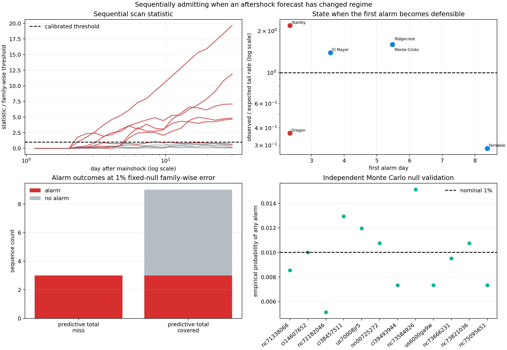

# Admitting, Early, That a Forecast Has Changed Regime

## Objective

The prior lab showed that KinoPulse's current `ChangeDetector` cannot yet
support a clean aftershock alarm claim. This experiment builds a transparent
reference monitor to answer the underlying scientific question: can the
hierarchical forecast recognize a sustained higher- or lower-rate regime before
day 30 while controlling its repeated-scan false-alarm probability?

Under a fixed fitted Poisson null, yes. A Monte Carlo calibrated sequential scan
alarms on all three sequences whose predictive totals missed their 80%
interval. It identifies Stanley and the 2021 offshore Oregon collapse by day
`2.34`, and Ridgecrest by day `5.48`. Independent null simulations reproduce
the requested horizon-wide 1% false-alarm rate (`0.972%` on average).

The monitor also alarms on three sequences whose total counts were covered but
whose temporal shapes depart persistently from the forecast. This is evidence
of time-structure mismatch, not automatically three false positives.

This is a retrospective monitoring benchmark, not an operational earthquake
warning system.

## Causal forecast boundary

The twelve outer hierarchical forecasts are identical to
[report 18](18_expanded_aftershock_hierarchy_and_count_guard.md). Each target
model sees only hour 1 through day 1. Its expected counts for the 24 later
log-time bins are frozen before monitoring begins.

At each new evaluation bin, the monitor may use all counts observed so far but
cannot inspect later bins. It requires at least three pre-change bins and three
post-change bins, preventing a one-bin fluctuation from being declared a
persistent tail regime immediately.

## Sequential tail-rate statistic

For each current endpoint `n`, the monitor scans candidate change locations
`k`. It aggregates observed and expected counts from `k` through `n`:

```text
Y(k,n) = sum observed counts
M(k,n) = sum expected counts
r_hat  = Y(k,n) / M(k,n)
```

The alternative says that this tail's rate is persistently multiplied by the
unknown factor `r_hat`. Its twice-log-likelihood ratio against the fixed
forecast is

```text
S(k,n) = 2 [Y log(Y/M) - (Y - M)].
```

The statistic at time `n` is the maximum over eligible `k`. It is two-sided:
both unexpectedly persistent activity (`r_hat > 1`) and collapse
(`r_hat < 1`) can trigger it.

## Controlling repeated scans

A pointwise chi-square threshold would ignore the fact that the monitor tries
many change points at many times. Instead, each target forecast generates
`8,192` complete Poisson null streams from its expected bin counts. The lab
computes the maximum statistic across the entire 24-bin monitoring process for
every stream.

For a requested false-alarm probability `alpha=0.01`, a conservative
finite-simulation order statistic sets the threshold:

```text
rank = ceil((B + 1) * (1 - alpha)) - 1
```

where `B=8,192`. A separate set of `4,096` null streams validates the threshold;
it is not reused for calibration. Across the twelve target-specific nulls, the
mean probability of any alarm is `0.972%`. Individual estimates range from
`0.51%` to `1.51%`, consistent with finite validation-sample variation around
1%.



## Held-out alarms

| Sequence | Total interval missed? | First alarm day | Estimated change day | Tail-rate multiplier | Direction |
|---|---|---:|---:|---:|---|
| El Mayor | No | `3.58` | `2.34` | `1.40×` | Higher |
| Ridgecrest | Yes | `5.48` | `3.58` | `1.60×` | Higher |
| Stanley | Yes | `2.34` | `1.53` | `2.19×` | Higher |
| Monte Cristo | No | `5.48` | `3.11` | `1.60×` | Higher |
| Offshore Oregon | Yes | `2.34` | `1.53` | `0.37×` | Lower |
| Ferndale | No | `8.38` | `2.03` | `0.29×` | Lower |

The other six sequences do not alarm. All three predictive-total misses alarm,
as do three of nine total-covered sequences.

The two categories measure different things. A population total interval can
cover the final count even when events arrive with the wrong temporal shape.
El Mayor and Monte Cristo show sustained `1.6×`-class tail persistence and have
substantial held-out shape deviance. Ferndale is marginal—its maximum statistic
is only `1.06` times threshold—and its late low-rate segment deserves less
confidence than the much larger Oregon signal (`19.7` times threshold).

## Comparison with the raw detector audit

The prior exploratory window detector flagged eight sequences, CUSUM flagged
none, and viable-window GLR flagged all twelve. The calibrated reference flags
six and attaches a horizon-wide null error interpretation, estimated change
time, direction, and effect size.

This is not a direct algorithm contest because the raw thresholds were not
calibrated to equal error rates. It demonstrates the missing contract: a change
statistic becomes scientifically interpretable only when its full monitoring
procedure is calibrated under an explicit null.

## What was learned

The hierarchy can do more than issue a day-30 forecast. It can monitor its own
failure and, for the strongest outliers, admit that failure within a few days.
The outliers divide naturally into two regimes:

- **persistent tails:** Ridgecrest, Stanley, El Mayor, and Monte Cristo remain
  more active than their adapted population law predicts;
- **collapsing tails:** offshore Oregon, and more weakly Ferndale, decay much
  faster than predicted.

That direction/effect-size view is more useful for the next model than a binary
alarm alone. A future adaptive forecaster could switch to a wider uncertainty
state or refit a second regime after a calibrated event, while preserving the
original forecast for audit.

## KinoPulse gap

KinoPulse supplies the nonlinear hierarchical fits, but the lab had to
implement batching, sequential tail scanning, maximum-over-time calibration,
finite-simulation quantiles, independent validation, and event provenance.
These generic needs are documented in
`kinopulse_gaps/calibrated_sequential_change_detection.md`.

## Limitations

The 1% false-alarm control is conditional on fixed expected bin counts with
independent Poisson noise. It does not integrate over population-shape,
target-fit, background-rate, or catalog-completeness uncertainty. The true
posterior-predictive false-alarm rate can therefore be larger. Counts may also
be dependent through secondary triggering.

The 24-bin horizon and three-bin segment minima are fixed design choices. Bins
are uniform in log time, so detection delay in bins is not detection delay in
clock time. The scan recognizes only a persistent multiplicative rate change;
it does not distinguish a new exponent, secondary mainshock, catalog outage,
or changing detection completeness.

Predictive-total misses are a useful reference but not ground-truth regime
labels. The twelve sequences were used to develop the scientific question, so
another earthquake population is needed for a genuinely external monitoring
benchmark.

## Reproduce

```powershell
.\.venv\Scripts\python.exe aftershock_population_hierarchy_lab.py
.\.venv\Scripts\python.exe sequential_regime_lab.py
.\.venv\Scripts\python.exe -m pytest tests\test_sequential_regime_lab.py -q
```
