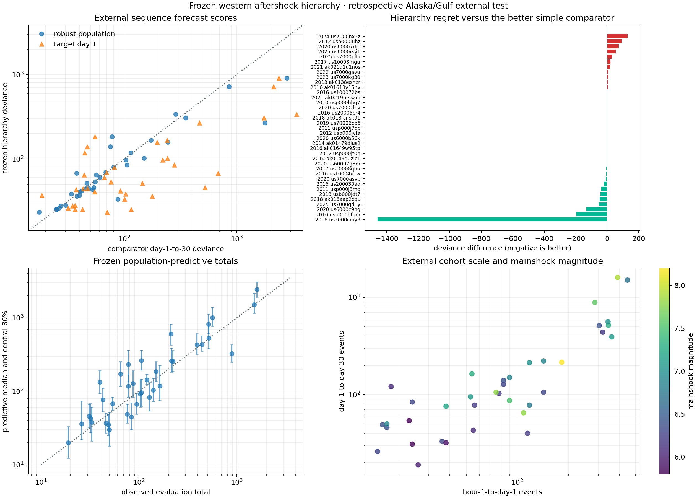

# A Frozen Aftershock Hierarchy Leaves Its Home Region

## Objective

Test the existing western North America aftershock hierarchy without adding a
feature, refitting its population on the new region, or relaxing the catalog
screen after seeing outcomes. The intended first test was temporally external
2026 earthquakes. When that frozen screen produced no eligible sequence, a
separately labelled Alaska/Gulf-of-Alaska geographic cohort became the fallback.

The result has two parts. The adaptive hierarchical point forecast transfers:
it wins `19 / 37` external sequences and cuts summed Poisson deviance `43.2%`
relative to the fixed robust population shape. Its predictive distribution
does not transfer: nominal central 80% future-total intervals cover only
`19 / 37` sequences, with a strong excess of lower-tail misses.

This is a retrospective geographic external validation, not prospective or
operational earthquake forecasting.

## Frozen protocol

The complete modeling protocol was fixed before Alaska target scores were
computed.

### Development side

The development population is exactly the 12 western North America sequences
from reports 17–20. All 12 full 30-day fits define one robust population center
and scale. Leave-one-development-sequence-out count scoring selects one global
pooling strength from `0.25, 1, 4, 16`:

| Pooling strength | Development inner median deviance |
|---:|---:|
| `0.25` | `51.84` |
| `1` | `47.02` |
| `4` | **`43.25`** |
| `16` | `46.07` |

The resulting frozen center has `c = 0.04070 days`, `p = 1.0838`, and pooling
strength `4`. None of these values is recalculated from Alaska.

### Target side

Each external target supplies only counts from hour 1 through day 1 and its
pre-event background estimate. Three day-1-to-day-30 forecasts are compared:

- **frozen hierarchy:** target productivity and shape adapt under the frozen
  western population penalty;
- **robust pool:** frozen western shape, with target productivity calibrated
  from day one; and
- **target day 1:** unconstrained target-specific Omori fit using day one only.

Target days 1–30 enter only the final Poisson-deviance score and predictive
coverage calculation. A regression test changes every future target count and
verifies that the frozen hierarchical expected trajectory remains bit-identical.

## Temporal screen: no eligible 2026 sequence

The first query retained the original western box, M5.8 mainshock threshold,
and model-blind rules, but covered 2026-01-01 through 2026-06-15. The exact end
date guaranteed 30 days of follow-up at protocol freeze.

The official USGS query returned one candidate: M6.0 `us7000rq0d`, off Oregon
on 2026-01-16. Its M2.5+, 100-km catalog contained only one qualifying
hour-1-to-day-1 event and four day-1-to-day-30 events. It therefore failed both
predeclared minimums of 15. The thresholds and magnitude cutoff were not
relaxed.

The candidate-query SHA-256 is
`fa18bcd364893e4a241769e3dd661721c15355465ea41c44d2364beb7dcca283`.
This experiment consequently makes no temporal or prospective validation
claim.

## Geographic external screen

The fallback query covers 50–72° N and 180–130° W from 2010-01-01 through
2026-01-01. It includes Alaska, the Aleutians, the Gulf of Alaska, and an
adjacent north Pacific North America sector. All other rules match the
development screen:

- M5.8+ candidate mainshocks;
- retain the largest event in overlapping 45-day, 150-km neighborhoods;
- query M2.5+ events within 100 km from day -30 through day +30;
- require at least 15 hour-1-to-day-1 events and 15 day-1-to-day-30 events; and
- preserve every source URL, rejection, and catalog digest.

There are `127` raw candidates, `82` after overlap removal, and `37` retained
sequences. The candidate-query SHA-256 is
`5fae69e58b37aec7c3bb760525a4f3fb341f3462fa9105e4e9cc7a796265ba94`.

This is a substantial domain shift, but not a random sample. The fixed M2.5
screen strongly favors productive and well-recorded sequences. The sector also
mixes subduction, crustal, offshore, and interior events.

## External point-forecast results

| Model | Sequence wins | Median deviance | Summed deviance |
|---|---:|---:|---:|
| Frozen hierarchy | **`19 / 37`** | **`53.87`** | **`4629.97`** |
| Robust population | `11 / 37` | `55.06` | `8158.28` |
| Target day 1 | `7 / 37` | `81.46` | `14123.75` |

The hierarchy beats the robust population on `22 / 37` sequences and the
unconstrained day-one target fit on `29 / 37`. Its summed-deviance reductions
are `43.2%` and `67.2%`, respectively. This strengthens the earlier conclusion
that partial pooling is a useful way to let a short target history escape a
population decay law without accepting the instability of a fully local fit.

The largest gain occurs for the 2018 M7.9 event southeast of Chiniak. Hierarchy
deviance is `907.9`, still poor in absolute terms, but the better simple
comparator scores `2365.9`; the reduction is `1458.0`. The 2010 event west of
Nikolski improves by `197.0`, and the 2020 Sand Point sequence by `131.9`.

The result is not uniform. Selected regressions against the better comparator
are:

| Sequence | Hierarchy regret |
|---|---:|
| 2024, 108 km SSW of Adak | `+128.6` |
| 2012, SW of Prince Rupert | `+92.9` |
| 2020, 84 km W of Adak | `+73.8` |
| 2025 Hubbard Glacier | `+53.0` |
| 2025, 88 km SSE of Adak | `+29.9` |

Here regret is hierarchy deviance minus the lower of the two comparator
deviances. These failures prevent the aggregate improvement from becoming a
universal transfer claim.



## Predictive uncertainty fails to transfer

The frozen population-predictive sampler produces central 80% intervals for
each future total. Only `19 / 37` contain the observed day-1-to-day-30 total,
or `51.4%` coverage. Mean per-bin coverage is `68.0%`.

The misses are asymmetric:

- `13` observed totals fall below the 10th percentile;
- `5` fall above the 90th percentile; and
- `19` are covered.

The western population therefore tends to expect aftershock activity that is
too persistent for many Alaska-sector targets. This is visible even when the
penalized point estimate improves deviance. Point-forecast ranking and
predictive calibration are distinct claims, and only the first transfers here.

Examples clarify the distinction. The hierarchy greatly improves the 2018
Chiniak point score, yet its predictive total interval is `[1912, 3087]`
against 1602 observed events. The 2018 Kaktovik interval is `[608, 1126]`
against 513 observed. Conversely, the 2020 Sand Point sequence records 887
events against a predictive interval of `[250, 432]`.

## What was learned

The central partial-pooling mechanism is more robust than the original
12-sequence geography suggested. A frozen western prior plus one day of target
adaptation remains a stronger point-forecast baseline across 37 external
sequences than either no shape adaptation or unconstrained local adaptation.

The uncertainty model is not robust. Its population-shape proposal, axis-aligned
robust scale, fixed-Poisson count sampling, and omission of completeness
uncertainty do not span the external distribution. The next improvement should
target calibration and domain structure, not optimize the same point score
more aggressively.

The failed 2026 screen is also useful. With the protocol unchanged, six months
of new western catalog time supplied no evaluable sequence. A prospective
claim needs patience or a registered multi-region design; it cannot be created
by weakening the screen after observing sparse data.

## Limitations

The Alaska cohort overlaps the development years, so only geography—not time—is
external. The population screen is based on catalog counts, not a formal
time-varying magnitude-of-completeness analysis. USGS source catalogs can be
revised after download. Spatial circles do not establish triggering or fault
association, and the overlap rule is not seismological declustering.

Several high-count sequences dominate summed deviance. Sequence wins and
median deviance partly counterbalance that dominance but do not define an
operational loss. Predictive sampling inherits all limitations described in
report 18 and additionally applies a western empirical population outside its
home region. No comparison with ETAS, operational systems, or prospective
CSEP-style testing is made.

## Reproduce

```powershell
.\.venv\Scripts\python.exe fetch_aftershock_population.py
.\.venv\Scripts\python.exe fetch_external_aftershock_population.py
.\.venv\Scripts\python.exe external_aftershock_lab.py
.\.venv\Scripts\python.exe -m unittest tests.test_fetch_external_aftershock_population tests.test_external_aftershock_lab -v
```

Generated manifests and CSV catalogs are ignored, while the figure is
committed for review. The JSON evidence is written to
`artifacts/external_aftershock_validation.json` and is also ignored.
