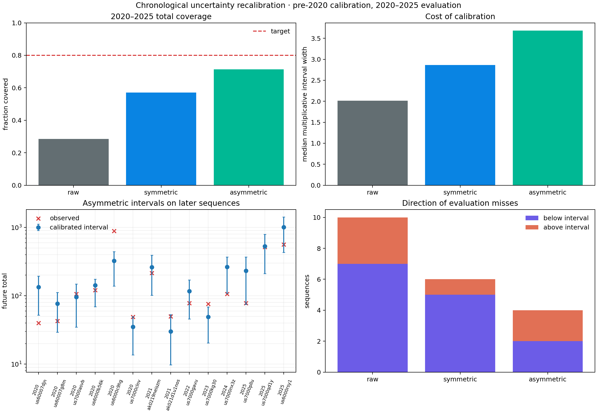

# Wider, but Still Not Calibrated

## Objective

Report 23 found that the frozen western hierarchy transferred as a point
forecast but its nominal 80% predictive totals covered only `19 / 37` external
Alaska-sector sequences. This follow-up asks whether earlier external-domain
outcomes can repair later uncertainty without changing a single point forecast.

The 37 external sequences are split chronologically:

- **calibration:** 23 sequences before 2020; and
- **evaluation:** 14 sequences from 2020 through 2025.

A conservative split-conformal expansion improves later coverage from `4 / 14`
to `10 / 14`, but remains below the 80% target and nearly doubles typical
interval width. Earlier Alaska experience helps, but the later sequences are
not stable enough to justify an exchangeable calibration claim.

This is a post-hoc follow-up designed after report 23 exposed undercoverage. It
is not an independent validation of the original hierarchy.

## Frozen inputs

The expected counts, point estimates, and raw population-predictive intervals
are exactly those generated for report 23. No earthquake is refit, no pooling
strength changes, and no future count enters the pre-2020 calibration result.

Each complete earthquake is one calibration observation. Bins within an
earthquake are not treated as independent calibration examples. The target is
the day-1-to-day-30 total, with raw lower and upper bounds from the existing
10th and 90th percentiles.

## Interval expansion

For observed total `y`, raw lower bound `L`, raw upper bound `U`, and continuity
correction `c=0.5`, the lower and upper multiplicative nonconformity scores are

```text
s_lower = max(0, log((L + c) / (y + c)))
s_upper = max(0, log((y + c) / (U + c)))
```

Two prespecified calibration forms are compared.

### Symmetric joint expansion

Take `max(s_lower, s_upper)` for each calibration earthquake. For nominal 80%
coverage and `n=23`, the conservative one-based rank is

```text
ceil((n + 1) * 0.8) = 20.
```

The selected log expansion is `0.17690`, multiplying the lower bound downward
and upper bound upward by `exp(0.17690) = 1.1935`.

### Asymmetric tail expansion

Allocate 10% error to each tail and calibrate them separately. Both ranks are

```text
ceil((n + 1) * 0.9) = 22.
```

The fitted lower-tail log expansion is `0.58439`, a factor of `1.7939`. The
upper-tail log expansion is only `0.02116`, a factor of `1.0214`. Earlier
Alaska sequences therefore diagnose almost all of the raw miscalibration as
overprediction: the lower bound needs much more movement than the upper bound.

Both methods only expand supplied intervals. They cannot improve point scores
or contract an overly conservative base interval.

## Results

| Method | Pre-2020 coverage | 2020–2025 coverage | Later misses below/above | Later median multiplicative width |
|---|---:|---:|---:|---:|
| Raw | `15 / 23` (`65.2%`) | `4 / 14` (`28.6%`) | `7 / 3` | `2.01×` |
| Symmetric | `20 / 23` (`87.0%`) | `8 / 14` (`57.1%`) | `5 / 1` | `2.86×` |
| Asymmetric | `21 / 23` (`91.3%`) | **`10 / 14` (`71.4%`)** | `2 / 2` | `3.68×` |



The asymmetric correction is directionally right: it removes six of ten raw
misses and balances later miss direction. Its cost is substantial. Median
multiplicative width rises by `83%`, from `2.01×` to `3.68×`, yet observed
coverage remains below target.

The four remaining misses are physically diverse:

| Sequence | Observed | Adjusted interval | Direction |
|---|---:|---:|---|
| 2020, 84 km W of Adak | `40` | `[52.2, 194.1]` | lower |
| 2020 Sand Point | `887` | `[139.1, 441.3]` | higher |
| 2023 Sand Point | `76` | `[20.4, 68.4]` | higher |
| 2024, 108 km SSW of Adak | `106` | `[109.0, 369.8]` | lower |

Two are just outside a boundary, while the 2020 Sand Point sequence is a large
high-tail failure that a lower-tail-heavy correction cannot absorb responsibly.

## Interpretation

The raw uncertainty failure is not merely a fixed scale error. If pre-2020 and
later sequences were exchangeable under the nonconformity score, the
finite-sample correction would have a defensible marginal interpretation.
Instead, later coverage remains low and the correction is expensive in
sharpness. The external domain itself appears heterogeneous or drifting.

This does not disprove conformal calibration. It shows that the group-level
exchangeability assumption is the scientific bottleneck. Possible causes
include changing catalog completeness, different subregions and tectonic
regimes, temporal changes in network sensitivity, secondary-mainshock
structure, and an uncertainty sampler that omits important parameter and event
dependence.

The main practical conclusion is negative: multiplying every interval by one
historical Alaska correction is not enough for a calibrated practitioner
forecast. A more honest system should condition uncertainty on domain and
catalog state or explicitly enter a wider ``unknown domain`` regime.

## KinoPulse gap

The finite-sample ranks, grouped split, asymmetric scores, interval provenance,
coverage, and sharpness accounting are generic validation operations. The lab
implements them locally because no suitable public KinoPulse contract was
found. The proposed reusable API and acceptance checks are documented in
`kinopulse_gaps/grouped_conformal_predictive_calibration.md`.

## Limitations

The 2020 cutoff was chosen after the overall external failure was known, though
before this chronological result was computed. Only 14 evaluation sequences
remain, so one sequence changes coverage by 7.1 percentage points. The
earthquakes are not guaranteed exchangeable within either period, and several
share broad tectonic regions.

The calculation calibrates total counts only. It does not repair bin-level
coverage, magnitude forecasts, spatial distributions, or the sequential
monitor. The continuity correction and multiplicative score are transparent
design choices, not uniquely correct. Coverage is empirical evidence, not a
formal certificate under temporal drift.

## Reproduce

```powershell
.\.venv\Scripts\python.exe external_aftershock_lab.py
.\.venv\Scripts\python.exe external_uncertainty_lab.py
.\.venv\Scripts\python.exe -m unittest tests.test_external_uncertainty_lab -v
```

The lab writes ignored JSON evidence to
`artifacts/external_uncertainty_recalibration.json` and the committed figure to
`artifacts/external_uncertainty_recalibration.png`.
