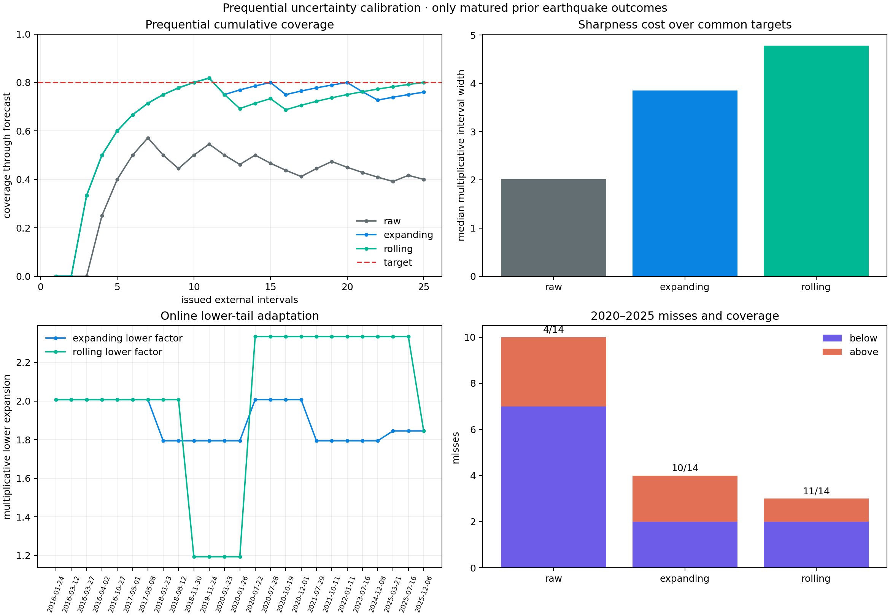

# Coverage by Surrendering Sharpness

## Objective

Report 24 froze one pre-2020 uncertainty correction and obtained only `10 / 14`
coverage on later Alaska-sector sequences. This follow-up asks whether the
calibration can learn sequentially as each completed earthquake becomes
available.

The rolling method reaches `20 / 25` coverage over all issued intervals and
`11 / 14` from 2020 onward, close to the 80% target. But its median later
interval spans a factor of `8.73`. Online adaptation recovers coverage mainly
by becoming too broad to be an informative practitioner forecast.

This is a post-hoc methods study. It does not rescue the original predictive
distribution or create prospective validation.

## Prequential and maturity boundary

All 37 external sequences are ordered by mainshock origin. A method begins
issuing intervals only after 12 historical sequences are available. More
importantly, a historical sequence is not available until 30 days after its
mainshock, when the complete evaluation total has matured.

For target origin `t`, calibration may use sequence `i` only when

```text
origin_i + 30 days <= t.
```

This embargo matters. The January 23 and January 26, 2020 Adak-region targets
cannot learn from one another, nor can the July 22 and July 28 targets. A test
verifies that every recorded calibration event precedes its target and that
changing a future outcome cannot change an already issued interval.

After the 12-sequence warm-up, 25 targets from 2016–2025 receive intervals. All
methods are compared on exactly those targets.

## Methods

The raw bounds are the frozen hierarchy's existing 10th and 90th percentile
future totals. Both calibrated methods use the asymmetric multiplicative
nonconformity scores from report 24 and allocate 10% error to each tail.

- **raw:** no interval correction;
- **expanding:** recalibrate from every fully matured prior sequence; and
- **rolling:** recalibrate from the 12 most recent fully matured sequences.

With 12 rolling examples, the conservative tail rank is
`ceil((12 + 1) * 0.9) = 12`: the maximum recent lower-tail and upper-tail score.
This makes the rolling method responsive but also extremely sensitive to one
large recent miss.

The rolling window was specified before this run. It is reported beside the
expanding history, not selected as a winner using target outcomes.

## Results

### All 25 issued intervals

| Method | Covered | Misses below/above | Median multiplicative width |
|---|---:|---:|---:|
| Raw | `10 / 25` (`40%`) | `10 / 5` | `2.02×` |
| Expanding | `19 / 25` (`76%`) | `2 / 4` | `3.85×` |
| Rolling 12 | **`20 / 25` (`80%`)** | `2 / 3` | `4.78×` |

### 2020–2025 subset

| Method | Covered | Misses below/above | Median multiplicative width |
|---|---:|---:|---:|
| Raw | `4 / 14` (`28.6%`) | `7 / 3` | `2.01×` |
| Expanding | `10 / 14` (`71.4%`) | `2 / 2` | `3.77×` |
| Rolling 12 | **`11 / 14` (`78.6%`)** | `2 / 1` | `8.73×` |



The expanding method nearly doubles typical width and removes nine of fifteen
overall misses. The rolling method removes one additional miss, but later
width more than quadruples relative to raw intervals and more than doubles
relative to expanding calibration.

## What the chronology reveals

The first two later targets both fall below their intervals:

| Target | Observed | Rolling interval |
|---|---:|---:|
| 2020-01-23, 84 km W of Adak | `40` | `[78.7, 227.8]` |
| 2020-01-26, 240 km WSW of Adak | `43` | `[44.3, 131.9]` |

Their outcomes are not yet available to each other. Once both mature, the
rolling lower-tail factor jumps from about `1.19` to `2.33`, and subsequent
lower-tail intervals become much wider.

The 2020 Sand Point sequence then produces 887 events above a rolling upper
bound of 432. After it matures, the upper-tail factor rises to about `2.05`.
Later intervals consequently become enormous: several span factors from 9 to
13 even when centered on modest count forecasts.

This is legitimate prequential adaptation, not leakage. It is also a poor
substitute for a model that understands why regimes differ.

## Interpretation

The experiment separates three meanings of "calibrated":

1. Raw model intervals are plainly underdispersed.
2. Expanding empirical correction is materially better and moderately costly.
3. A short rolling window can match nominal aggregate coverage by memorizing
   recent extremes, but its sharpness collapses.

Coverage alone would rank rolling calibration first. A practitioner who must
make decisions from the interval may prefer the expanding method or refuse to
forecast when domain uncertainty is this large. That choice needs an explicit
utility or abstention policy; it cannot be decided by coverage after the fact.

The 30-day maturity delay is fundamental. Sequential calibration cannot react
to a new domain regime until completed outcomes arrive. A real-time system
would need earlier, scientifically justified feedback signals—perhaps
catalog-completeness diagnostics or within-sequence residual monitoring—while
preserving the distinction between early warning that a model is wrong and
knowing the final correction.

## KinoPulse gap

The grouped conformal gap from report 24 also needs a prequential contract:
ordered groups, outcome-maturity timestamps, rolling or expanding history,
exact calibration group IDs for every issued interval, and replayable online
state. These additions are recorded in
`kinopulse_gaps/grouped_conformal_predictive_calibration.md`.

## Limitations

The entire online design follows discovery of external undercoverage. The 25
forecasts are retrospective replays, and 80% equals exactly 20 successes, so
the apparent nominal result is fragile. The rolling-window size was not tuned,
but many alternative windows could now be tried; doing so on the same outcomes
would create another selection layer.

Sequences are ordered by mainshock time, not catalog publication or revision
time. The 30-day embargo approximates outcome availability but not USGS review
latency. Group exchangeability remains questionable, and no finite-sample
conformal statement protects against temporal drift. Only total counts are
calibrated.

## Reproduce

```powershell
.\.venv\Scripts\python.exe external_aftershock_lab.py
.\.venv\Scripts\python.exe online_uncertainty_lab.py
.\.venv\Scripts\python.exe -m unittest tests.test_online_uncertainty_lab -v
```

The lab writes ignored JSON evidence to
`artifacts/online_uncertainty_calibration.json` and the committed figure to
`artifacts/online_uncertainty_calibration.png`.
