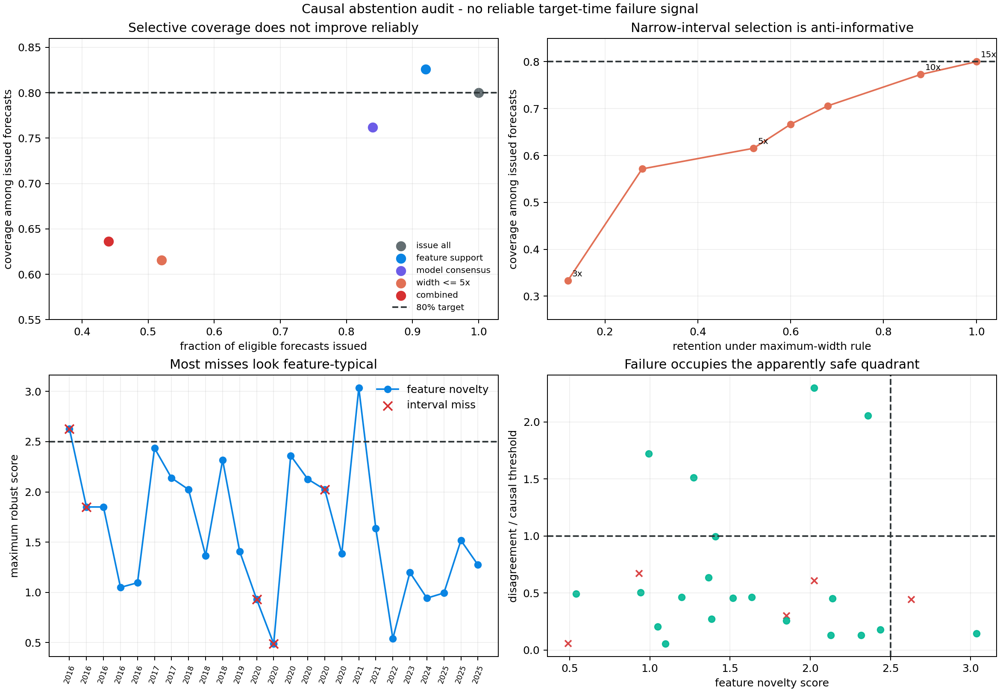

# Abstention Without a Failure Signal

## Result

The previous experiment reached nominal aggregate coverage only by allowing
very wide intervals. It suggested that the system should sometimes say "I do
not know." This experiment tests whether three simple signals available when
the day-one forecast is issued can support that decision.

They cannot on this cohort:

- a feature-support gate abstains on two of 25 forecasts, catching one miss and
  one success;
- a model-consensus gate abstains on four forecasts, all four covered;
- a fivefold interval-width cap abstains on 12 forecasts, all 12 covered; and
- requiring all three gates retains 11 forecasts and covers only seven
  (`63.6%`).

The honest conclusion is not that abstention is useless. Abstention is itself a
prediction problem, and these target-time proxies do not identify failures in
this small external cohort.

## Forecast and causality boundary

This audit replays the same 25 rolling-calibrated intervals from report 25. A
forecast is eligible only after 12 earlier 30-day outcomes have fully matured.
For each target, the abstention decision uses only mainshock magnitude, depth,
pre-mainshock background rate, observed first-day event count, the three
existing day-one total forecasts, and the already-issued rolling interval
width.

It never reads the target's day-1-to-30 evaluation count. Every row records the
complete maturity-qualified history identifiers and causal threshold used at
that time. Tests change the target outcome and introduce an arbitrary future
object without changing the decision.

This remains a post-hoc method study. Reports 24 and 25 motivated the question,
and the external cohort is not a prospective deployment stream.

## Predeclared gates

The gates are deliberately simple and inspectable.

### Feature support

Four transformed features are compared with all fully matured earlier
sequences: magnitude, `log1p(depth)`, log background rate, and
`log1p(first-day count)`. Each score is absolute distance from the historical
median divided by `1.4826 * MAD`; the largest component is the support score. A
conventional robust score limit of `2.5` defines the gate.

This is a marginal-envelope diagnostic, not a learned probability of failure.
It avoids fitting another meta-model after the negative result in report 17.

### Model consensus

Disagreement is the log ratio between the largest and smallest predicted total
from the frozen hierarchy, robust population model, and unpooled day-one fit,
with a `0.5` count correction. The gate issues only when target disagreement is
no larger than the conservative 80th percentile among matured historical
sequences. Its exact finite-sample rank is saved for every decision.

### Sharpness cap

The gate refuses any rolling interval whose multiplicative upper-to-lower
width exceeds `5x`. This tests the intuitive policy that an extremely broad
interval is not decision-useful even when it covers.

The combined rule issues only when all three gates issue. These constants were
fixed before the final audit run; they were not selected from the coverage
results below.

## Overall results

| Policy | Issued | Retention | Covered | Selective coverage | Median width | Covered forecasts rejected |
|---|---:|---:|---:|---:|---:|---:|
| Issue all | 25 | 100% | 20 | 80.0% | 4.78x | 0 |
| Feature support | 23 | 92% | 19 | 82.6% | 4.78x | 1 |
| Model consensus | 21 | 84% | 16 | 76.2% | 4.74x | 4 |
| Width at most 5x | 13 | 52% | 8 | 61.5% | 3.88x | 12 |
| Combined | 11 | 44% | 7 | 63.6% | 4.03x | 13 |

Feature support yields a nominally higher fraction, but it removes only two
examples and makes one correct and one incorrect abstention. That is not enough
evidence for an operational gate. More importantly, model consensus retains
all five misses while rejecting four successes. Forecast agreement is not a
reliability certificate here.



## Narrow is not safe

Coverage rises monotonically as the maximum allowed width is relaxed:

| Maximum width | Issued | Coverage |
|---:|---:|---:|
| 3x | 3 | 33.3% |
| 4x | 7 | 57.1% |
| 5x | 13 | 61.5% |
| 6x | 15 | 66.7% |
| 8x | 17 | 70.6% |
| 10x | 22 | 77.3% |
| 15x | 25 | 80.0% |

All five misses have widths between `2.88x` and `4.74x`. The wide intervals are
not causing the failures; they are the online calibrator's successful response
to previously observed extremes. Refusing them improves usability but destroys
the apparent coverage guarantee.

This exposes a policy conflict. A system can require sharp intervals, or it can
report the broad uncertainty implied by this history, but it cannot call the
sharp subset safer on the present evidence.

## Later-period stress

The 14 forecasts from 2020 onward make the failure sharper:

| Policy | Issued | Covered | Selective coverage |
|---|---:|---:|---:|
| Issue all | 14 | 11 | 78.6% |
| Feature support | 13 | 10 | 76.9% |
| Model consensus | 11 | 8 | 72.7% |
| Width at most 5x | 4 | 1 | 25.0% |
| Combined | 4 | 1 | 25.0% |

All three later misses occupy the apparently safe region: feature-typical,
model-consensual, and narrower than `5x`. The width cap rejects ten later
successes and none of the failures.

## What an abstention system actually needs

An unknown-domain state cannot be inferred reliably from coarse metadata,
ensemble disagreement, or interval width alone. Better evidence must be tied
to mechanisms that can make a count forecast fail, such as:

- time-varying magnitude completeness and network detection state;
- focal mechanism, rupture geometry, and tectonic regime;
- nearby competing mainshocks or secondary triggering structure;
- spatial relation to the development population rather than scalar metadata;
- causal within-sequence residual trajectories; and
- a loss function that values abstention separately from a missed interval.

The sequential monitor from reports 20 and 21 may provide a stronger signal
after the forecast begins accumulating evidence. That is a different contract:
early failure detection, not confidence known at day one.

## Limitations

There are only 25 eligible targets and five misses. One changed decision moves
selective coverage substantially. The score ignores dependence among features,
the transforms and cutoff are generic rather than seismologically calibrated,
and the three forecasts are related rather than an independent ensemble. The
`5x` usability limit has no stakeholder study behind it.

No hypothesis test or confidence interval is attached to differences between
policies. Multiple plausible gates were inspected, so this is a falsification
of these simple proposals, not a benchmark of all reject-option methods.

## KinoPulse gap

KinoPulse supplies the count objectives and model machinery underneath the
forecast, but this lab had to implement causal reject-option accounting,
coverage-retention summaries, abstention error accounting, and decision
provenance. The reusable gap is documented in
`kinopulse_gaps/selective_prediction_abstention_audit.md`.

## Reproduction

```powershell
.\.venv\Scripts\python.exe abstention_audit_lab.py
.\.venv\Scripts\python.exe -m unittest tests.test_abstention_audit_lab -v
```

The lab reads the ignored external-validation JSON, writes detailed ignored
evidence to `artifacts/abstention_audit.json`, and writes the review figure to
`artifacts/abstention_audit.png`.
