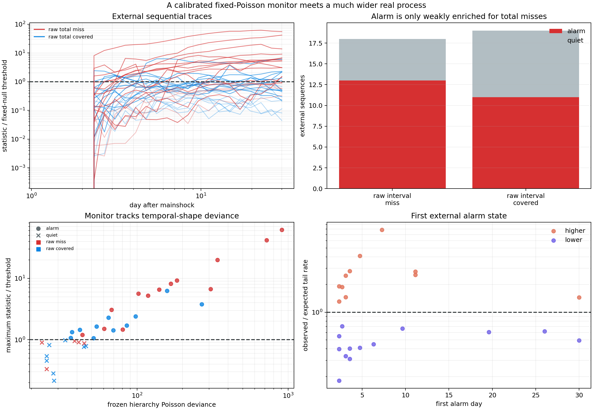

# When a 1% Alarm Fires on 65% of Earthquakes

## Result

Report 20 developed a sequential monitor on 12 western North America
aftershock forecasts. Under each forecast's fixed independent-Poisson null, a
Monte Carlo threshold controlled the probability of any day-1-to-day-30 alarm
at 1%. This experiment applies that unchanged monitoring design to the 37
Alaska/Gulf-sector sequences from report 23.

The external monitor alarms on `24 / 37` sequences (`64.9%`). This is not
evidence that it discovered an extraordinary number of objectively real regime
changes. It is evidence that the fixed-Poisson null is much narrower than the
real process encountered outside the development region.

Internal validation still reproduces the nominal false-alarm probability almost
exactly: mean `0.998%` across 37 independent target-specific simulation tests.
The code is doing what was requested. The request is conditional on an
inadequate null.

## Frozen external protocol

The population model, pooling strength, target fit, monitoring horizon, scan
statistic, minimum segment lengths, and 1% threshold policy are unchanged from
reports 20 and 23:

- all 12 western sequences define the frozen population;
- pooling strength remains `4`;
- each Alaska target contributes only hour-1-to-day-1 counts to its fit;
- 24 later log-time bins are monitored causally through day 30;
- candidate changes require at least three pre-change and three post-change
  bins; and
- every target uses `8,192` calibration simulations and a separate `4,096`
  validation simulations.

The lab reconstructs each expected trajectory and refuses to proceed unless
its total matches the saved external-validation forecast to relative tolerance
`1e-10`. Alaska outcomes select no model parameter or detector threshold.

This is a retrospective geographic external test, not a prospective alarm
trial or operational earthquake product.

## The monitor and its conditional guarantee

At each prefix endpoint, the detector scans eligible change locations and
compares the observed tail count with the frozen expected tail count. Its
two-sided Poisson likelihood-ratio statistic responds to persistent higher or
lower rate. The threshold is calibrated against the maximum statistic over
every scan and time in a complete 24-bin stream.

That procedure controls repeated scans under this null:

```text
counts[b] independently follow Poisson(frozen_expected[b])
```

It does not include population-shape uncertainty, target-fit uncertainty,
background uncertainty, secondary triggering, overdispersion, catalog changes,
or other structural errors.

## External alarm outcomes

| Raw total outcome | Alarm | Quiet | Total |
|---|---:|---:|---:|
| Predictive interval missed | 13 | 5 | 18 |
| Predictive interval covered | 11 | 8 | 19 |
| Total | 24 | 13 | 37 |

The monitor catches `72.2%` of raw interval misses, but it also alarms on
`57.9%` of covered totals. Among alarmed sequences, `54.2%` are raw misses,
only slightly above the cohort's `48.6%` miss prevalence. Refusing every alarm
would retain 13 forecasts with `61.5%` raw coverage, compared with `51.4%`
before rejection, at the cost of discarding nearly two thirds of the cohort.

That weak enrichment disappears after the rolling interval correction from
report 25:

| Rolling total outcome | Alarm | Quiet | Total |
|---|---:|---:|---:|
| Calibrated interval missed | 3 | 2 | 5 |
| Calibrated interval covered | 12 | 8 | 20 |
| Total | 15 | 10 | 25 |

Exactly `20%` of alarmed rolling forecasts miss, identical to the `20%` miss
prevalence among all 25 eligible forecasts. The quiet subset covers `8 / 10`,
also the same 80% aggregate coverage. Once total uncertainty is widened, the
sequential alarm contains no selective information about total coverage.



## What the statistic does diagnose

The monitor is strongly informative about temporal-shape mismatch:

- median frozen-hierarchy Poisson deviance is `91.62` among alarmed sequences
  versus `28.23` among quiet sequences; and
- the Spearman correlation between maximum threshold ratio and full-horizon
  Poisson deviance is `0.919`.

This explains why 11 raw-total-covered sequences alarm. A final total can land
inside its interval while events arrive in a persistently different temporal
pattern. The detector is functioning as an early model-criticism instrument,
not as a validated oracle for whether the final total interval will cover.

The timing remains potentially useful for research diagnosis. Median first
alarm is day `3.58`; 13 of 24 alarms occur by day `3.6`, and 17 by day `7.3`.
The directions are balanced: 11 higher-rate and 13 lower-rate alarms. That
pattern argues against interpreting the external result as one simple regional
bias.

## Simulation validation does not validate reality

Across the 37 external expected trajectories, independent fixed-null
simulations produce:

| Quantity | Result |
|---|---:|
| Requested horizon-wide false-alarm probability | 1.000% |
| Mean empirical validation probability | 0.998% |
| Minimum target validation probability | 0.635% |
| Maximum target validation probability | 1.343% |
| Observed real-sequence alarm fraction | 64.865% |

This contrast is the main finding. More Monte Carlo samples would estimate the
wrong-null threshold more precisely; they would not make the null more
realistic. A calibrated detector inherits every omission in its sampler.

## What should come next

A predictive monitoring null should sample complete plausible forecast paths,
not only conditional Poisson noise around one fitted mean. For this hierarchy,
that likely requires propagating:

- the empirical population distribution over decay shapes;
- uncertainty in the day-one target adaptation;
- background-rate uncertainty and count overdispersion;
- dependence or self-excitation between bins; and
- catalog completeness or observation-process state.

The resulting threshold would almost certainly be higher and could sacrifice
some early sensitivity. That is the honest cost of distinguishing an actual
regime departure from uncertainty the forecasting system already knows it has.

Until then, the exported monitor remains useful as a generic diagnostic kernel
when researchers supply a scientifically adequate null. It should not be
described as having a 1% real-earthquake false-alarm rate.

## KinoPulse gap

The existing gap in
`kinopulse_gaps/calibrated_sequential_change_detection.md` already requires
null samplers with parameter uncertainty and forbids a point null from silently
claiming posterior-predictive control. This external experiment adds concrete
evidence: a perfectly validated 1% conditional calibration can coexist with a
64.9% real alarm fraction. The gap document now records that external failure
mode and calls for explicit conditional-versus-predictive provenance.

## Limitations

The Alaska cohort was selected for productive, well-recorded M2.5+ sequences
and is not a random earthquake sample. The monitor design predates this
external replay, but the data are retrospective and geographically rather than
temporally external. Raw or calibrated total-interval misses are imperfect
labels for temporal regime change.

Poisson deviance and the scan statistic are mathematically related, so their
strong correlation is a diagnostic consistency result rather than independent
validation. The sequences share a frozen population model and broad tectonic
region, so a binomial calculation treating all 37 alarms as independent would
overstate evidence. No ETAS, operational monitor, or CSEP-style prospective
comparison is attempted.

## Reproduction

```powershell
.\.venv\Scripts\python.exe external_sequential_monitor_lab.py
.\.venv\Scripts\python.exe -m unittest tests.test_external_sequential_monitor_lab -v
```

The lab reads ignored source catalogs and external-validation evidence, writes
detailed ignored output to `artifacts/external_sequential_monitor.json`, and
writes the review figure to `artifacts/external_sequential_monitor.png`.
