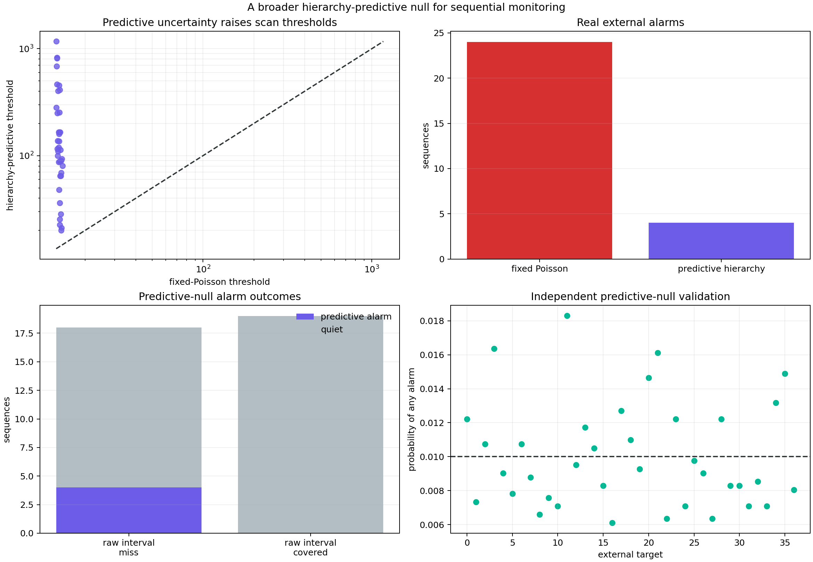

# A Better Null Knows When to Stay Quiet

> **Later measurement-channel audit:** The four alarm identities below belong
> to the downloaded M2.5 protocol. [Report 35](35_magnitude_floor_alarm_robustness.md)
> refits the population and targets at higher reported-magnitude floors; none
> of the four remains an alarm at M3, while two different sequences begin
> alarming. Seed stability does not imply magnitude-channel invariance.

## Result

The fixed-Poisson monitor in report 27 was numerically calibrated but
scientifically overconfident: it alarmed on `24 / 37` external earthquakes.
This experiment keeps the same sequential statistic and replaces only its null
sampler. Instead of simulating around one fitted mean, it draws decay shapes
from the frozen western population, conditions them on the target's first day,
and simulates complete future count paths.

That one change reduces real external alarms from 24 to four. All four are raw
predictive-total misses; none of the 19 raw-covered sequences alarms. The price
is equally important:

- raw-miss sensitivity falls to `4 / 18` (`22.2%`);
- median threshold rises by `8.46x`;
- median first alarm moves to day `13.99`; and
- after rolling interval calibration, only two of five misses alarm, while one
  covered interval also alarms.

The predictive null converts an alarm flood into a small set of unusually
strong departures. It is a useful research prototype, not yet an operational
monitor.

## What changed—and what did not

The central frozen hierarchy forecast, 24-bin day-1-to-day-30 horizon,
two-sided tail-rate statistic, three-bin segment minima, complete-scan maximum,
and requested 1% horizon-wide alarm probability remain unchanged.

For each external target, the new calibration sampler:

1. draws `4,096` transformed decay-shape proposals from the robust 12-sequence
   western population;
2. calibrates each proposal's amplitude from target counts observed through
   day one;
3. weights proposals by their first-day Poisson deviance;
4. resamples complete shape trajectories using those weights;
5. simulates Poisson future counts for every selected trajectory; and
6. scores every simulated path against the frozen central forecast using the
   same sequential scan applied to reality.

Each target uses `8,192` predictive paths to calibrate its threshold and an
independent set of `4,096` paths to validate it. Tests replace all future target
counts and recover bit-identical predictive paths under a fixed seed. Target
outcomes therefore cannot enter their own null.

This sampler matches the population-predictive mechanism behind reports 18 and
23. It propagates empirical decay-shape and future Poisson variation. It still
omits background uncertainty, calibration-count observation uncertainty,
within-sequence self-excitation, catalog state, spatial structure, and other
sources of model error.

## Threshold expansion

| Threshold comparison | Multiplier over fixed Poisson |
|---|---:|
| Minimum | `1.38x` |
| Median | `8.46x` |
| Maximum | `86.61x` |

The enormous target-to-target range is meaningful. First-day evidence
constrains some population shapes strongly and leaves others highly ambiguous.
A single global inflation factor could not reproduce this behavior.



## The four surviving alarms

| Sequence | First alarm day | Direction | Raw interval | Rolling interval |
|---|---:|---|---|---|
| 2014 northern Alaska | `30.00` | Lower | Miss | Not yet eligible |
| 2016, 72 km SSE of Atka | `8.38` | Higher | Miss | Miss |
| 2018, southeast of Chiniak | `19.61` | Lower | Miss | Covered |
| 2020 Sand Point | `6.31` | Higher | Miss | Miss |

All four were among the 24 fixed-null alarms, so the predictive calibration
adds no new alarm. It removes 20 alarms that can be explained by the broader
population-shape uncertainty represented in the sampler.

Two alarms arrive early enough to be plausibly useful for research response:
Atka by day 8.38 and Sand Point by day 6.31. Chiniak arrives after almost 20
days, and northern Alaska only at the final boundary. A day-30 alarm is a
retrospective diagnosis, not an early warning.

## Raw and rolling interval associations

Against the original raw 80% total intervals:

| Outcome | Predictive alarm | Quiet | Total |
|---|---:|---:|---:|
| Raw interval missed | 4 | 14 | 18 |
| Raw interval covered | 0 | 19 | 19 |

Alarm precision for a raw miss is therefore `100%`, but sensitivity is only
`22.2%`. These values come from four alarms and should not be treated as stable
rates.

For the 25 sequences eligible for rolling interval calibration:

| Outcome | Predictive alarm | Quiet | Total |
|---|---:|---:|---:|
| Rolling interval missed | 2 | 3 | 5 |
| Rolling interval covered | 1 | 19 | 20 |

Here alarm precision is `66.7%`, sensitivity is `40%`, and the quiet subset
covers `19 / 22` (`86.4%`). This is the first target-time or sequential signal
in the external chain that improves selective rolling coverage rather than
merely reproducing it. The evidence is only three eligible alarms, so it is a
hypothesis for another cohort, not a validated gate.

The Chiniak alarm illustrates why temporal monitoring and total coverage remain
different tasks. Its rolling total interval covers, but the temporal trajectory
is extreme relative to the central forecast even after population-shape
uncertainty is admitted.

## Independent predictive-null validation

| Quantity | Result |
|---|---:|
| Requested probability of any alarm | `1.000%` |
| Mean independent validation rate | `1.002%` |
| Minimum target validation rate | `0.610%` |
| Maximum target validation rate | `1.831%` |
| Median proposal effective sample size | `1,396 / 4,096` |

The mean is excellent, but the target range is wider than binomial validation
noise alone would ideally produce. Calibration and validation each construct a
fresh finite importance proposal population. For some targets their approximate
predictive tails differ enough to move a 99th-percentile threshold visibly.

This is not a reason to reuse the same proposals for calibration and validation;
that would hide the instability. It is evidence that a production sampler
needs convergence diagnostics, repeated proposal batches, or a more direct
conditional sampler. The smallest calibration effective sample size is only
about 132 for the Sand Point target, although that target's independent alarm
rate remains near nominal.

## Interpretation

The experiment resolves the apparent paradox from report 27. Most real
fixed-null alarms were not necessarily distinct physical change points. They
were trajectories that a point Poisson null declared impossible while the
forecast hierarchy itself regarded similar shapes as plausible.

Calibrating against the hierarchy's own predictive distribution makes the
monitor ask a better question:

> Is the accumulating trajectory surprising even after the model's known
> population-shape uncertainty is propagated?

Only four external sequences cross that stronger boundary. This is closer to
the meaning researchers usually want from an alarm, but the answer remains
conditional on an incomplete empirical hierarchy.

## KinoPulse gaps

The sequential-calibration gap now has a positive counterexample to the fixed
point null: a predictive sampler reduces external alarms from 24 to four while
retaining independent 1% simulation calibration. The experiment also required
a complete project-specific importance-conditioning and trajectory-resampling
implementation. That reusable need is documented separately in
`kinopulse_gaps/conditional_predictive_trajectory_sampling.md`.

## Limitations

This null repair was motivated by seeing the fixed-null external failure, so it
is post-hoc on the same 37-sequence cohort. The western empirical population is
itself externally miscalibrated and does not constitute a full Bayesian
posterior. The four alarm precision result has extreme sampling uncertainty.

The central monitor still scores every path relative to one frozen hierarchy
fit; alternative formulations could integrate the statistic itself over
forecast trajectories. Importance resampling can duplicate a small number of
high-weight proposals, especially for informative first-day catalogs. Poisson
future draws remain conditionally independent and cannot reproduce secondary
triggering or catalog dependence.

No threshold or sampler choice was compared against ETAS, an operational
forecast distribution, or prospective CSEP-style monitoring. This remains a
software and model-criticism experiment, not a public earthquake alarm.

## Reproduction

```powershell
.\.venv\Scripts\python.exe predictive_sequential_monitor_lab.py
.\.venv\Scripts\python.exe -m unittest tests.test_predictive_sequential_monitor_lab -v
```

The lab reads the ignored catalogs and report-27 evidence, writes detailed
ignored evidence to `artifacts/predictive_sequential_monitor.json`, and writes
the review figure to `artifacts/predictive_sequential_monitor.png`.
