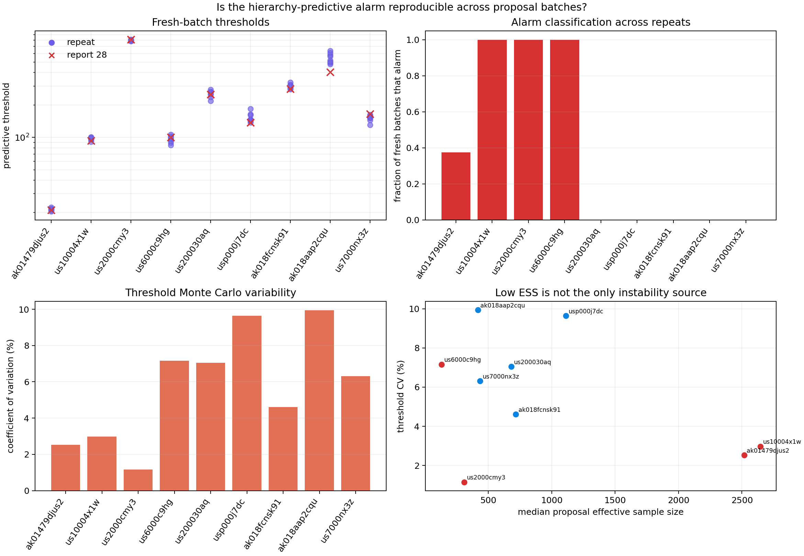

# Three Alarms Survive Rerolling the Null

> **Later measurement-channel audit:** The repeated decisions below establish
> Monte Carlo stability for the M2.5 pipeline only. [Report 35](35_magnitude_floor_alarm_robustness.md)
> shows that none remains an alarm after an honest M3 refit: three are eligible
> and quiet, while one is ineligible. Random-seed robustness and observation-
> policy robustness are different tests.

## Result

Report 28 replaced a narrow fixed-Poisson monitoring null with complete
hierarchy-predictive trajectories. External alarms fell from 24 to four. This
experiment asks whether those four classifications survive fresh importance
proposal batches or are artifacts of one Monte Carlo threshold.

Three alarms are fully reproducible across eight independent recalibrations:

- 2016 Atka alarms in `8 / 8` batches;
- 2018 Chiniak alarms in `8 / 8`; and
- 2020 Sand Point alarms in `8 / 8`.

The fourth, 2014 northern Alaska, alarms in only `3 / 8` batches, always at day
30. It should be downgraded from a surviving predictive alarm to a
Monte-Carlo-sensitive boundary case.

All five deliberately stressed quiet targets remain quiet in `8 / 8` fresh
batches. The core result from report 28 therefore becomes smaller but stronger:
three external trajectories robustly exceed the hierarchy-predictive null.

## Diagnostic panel and boundary

The panel was selected after report 28 and is explicitly diagnostic rather
than representative. It contains nine targets:

- all four original hierarchy-predictive alarms;
- the three quiet targets with the highest independent validation rates;
- one additional quiet target with low effective sample size and high
  validation rate; and
- one low-effective-sample-size quiet target.

Each target receives eight new calibrations. Every calibration independently
draws `4,096` shape proposals, conditions them on target day-one counts,
resamples `8,192` complete future paths, and recomputes the 99th percentile of
the full sequential scan maximum. Proposal pools and sampled paths are never
shared across repeats.

No repeat threshold was used to alter the sampler, alarm statistic, target
panel, or original report-28 result.

## Classification stability

| Target | Report-28 state | Fresh alarms | Threshold CV | Threshold range | Median proposal ESS |
|---|---|---:|---:|---:|---:|
| 2014 northern Alaska | Alarm | `3 / 8` | 2.5% | `1.09x` | 2,517 |
| 2016 Atka | Alarm | `8 / 8` | 3.0% | `1.11x` | 2,645 |
| 2018 Chiniak | Alarm | `8 / 8` | 1.2% | `1.04x` | 308 |
| 2020 Sand Point | Alarm | `8 / 8` | 7.2% | `1.26x` | 130 |
| 2015 Fox Islands | Quiet | `0 / 8` | 7.0% | `1.28x` | 679 |
| 2011 east of Atka | Quiet | `0 / 8` | 9.6% | `1.35x` | 1,111 |
| 2018 Point MacKenzie | Quiet | `0 / 8` | 4.6% | `1.16x` | 716 |
| 2018 Kaktovik | Quiet | `0 / 8` | 9.9% | `1.33x` | 417 |
| 2024 south of Adak | Quiet | `0 / 8` | 6.3% | `1.25x` | 435 |

Across targets, median threshold coefficient of variation is `6.31%`; the
largest is `9.94%`. Median maximum-to-minimum threshold ratio is `1.25x`.



## Instability is about decision margin, not only sampler quality

Northern Alaska has the highest effective sample size in the panel and one of
the least variable thresholds. Its fresh thresholds span only `20.53` to
`22.35`, compared with the original `21.19`. Yet that narrow range straddles
the observed maximum scan statistic, flipping the binary outcome. Every
crossing occurs at day 30, further weakening its value as an early alarm.

The two lowest-ESS alarm targets behave differently:

- Chiniak has median ESS near 308 and only `1.2%` threshold CV. It alarms at day
  `19.61` in every repeat.
- Sand Point has median ESS near 130 and `7.2%` threshold CV, yet its departure
  is strong enough to alarm in every repeat.

Low ESS can make tail calibration unstable, but it does not determine whether
an observed trajectory is classification-stable. The relevant quantity is the
joint relationship between threshold uncertainty and the observed statistic's
margin from that threshold.

## Timing stability

Atka always first alarms at day `8.38`, and Chiniak always at day `19.61`.
Sand Point remains an alarm in every batch, but its first crossing ranges from
day `3.58` to day `6.31`; median is day `5.89`. The alarm conclusion is stable
while the claimed detection delay is not bit-exact.

This distinction should be preserved in exported evidence. A system should not
report one Monte Carlo-derived first-crossing time without revealing whether
nearby valid threshold draws move that time materially.

## Revised interpretation of report 28

The most defensible external result is now:

1. Three targets robustly alarm under all eight fresh predictive-null batches.
2. All three are raw interval misses.
3. Among rolling-eligible targets, the same three remain the relevant alarms:
   Atka and Sand Point are rolling misses, while Chiniak's broad rolling total
   covers despite its extreme temporal trajectory.
4. The day-30 northern Alaska result is marginal and should not support a
   scientific regime-change claim.

This does not create a prospective validation. It demonstrates that repeated
calibration can distinguish a robust alarm core from one threshold-boundary
artifact before another cohort exists.

## KinoPulse gap refinement

`kinopulse_gaps/conditional_predictive_trajectory_sampling.md` already calls
for independent proposal batches and effective-sample-size diagnostics. This
experiment adds two required outputs:

- repeated-batch classification frequency; and
- alarm margin or threshold-distribution context.

An ESS warning alone would miss the unstable high-ESS northern Alaska case.
The calibration result should support repeated independent fits or bootstrap
replicates and report whether the discrete alarm decision and first-crossing
time survive them.

## Limitations

The nine-target panel is intentionally selected from the prior result, not an
unbiased evaluation sample. Eight repeats give alarm frequencies in coarse
12.5-point increments and do not characterize extreme threshold tails. A full
37-target stability replay would be more complete but substantially more
expensive.

Fresh proposal batches vary both proposal approximation and future path Monte
Carlo. This experiment does not separately decompose those sources. Threshold
CV does not quantify scientific misspecification in the western population,
which remains the larger uncertainty. Repeated agreement can make a result
computationally reproducible without making its null physically correct.

No comparison with an operational earthquake forecast or prospective monitor
is made. These remain retrospective model-diagnostic events, not public alerts.

## Reproduction

```powershell
.\.venv\Scripts\python.exe predictive_threshold_stability_lab.py
.\.venv\Scripts\python.exe -m unittest tests.test_predictive_threshold_stability_lab -v
```

The lab writes ignored detailed evidence to
`artifacts/predictive_threshold_stability.json` and the review figure to
`artifacts/predictive_threshold_stability.png`.
