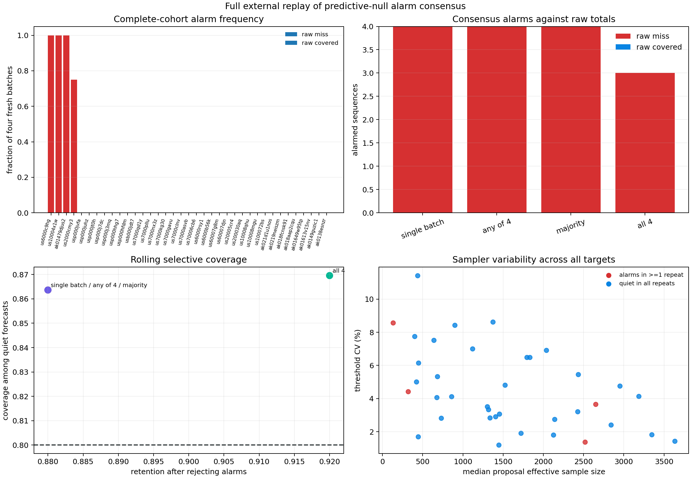

# The Quiet Targets Stay Quiet

> **Later measurement-channel audit:** The complete replay below is internally
> stable for the M2.5 catalog channel. [Report 35](35_magnitude_floor_alarm_robustness.md)
> finds a different alarm set at M3 and M3.5 after refitting both development
> and target models. These results should not be read as magnitude-invariant
> target labels.

## Result

Report 29 stress-tested nine selected targets and found three reproducible
predictive-null alarms plus one Monte Carlo-sensitive boundary case. Selection
could have hidden unstable quiet targets. This experiment removes that concern
by recalibrating all 37 external sequences four independent times each.

The complete result is sharply separated:

- 33 targets alarm in `0 / 4` fresh batches;
- three targets alarm in `4 / 4`;
- one target alarms in `3 / 4`; and
- no target alarms in exactly one or two batches.

All 33 targets that were quiet in report 28 remain quiet in every fresh batch.
The predictive null is not generating a hidden population of seed-sensitive
false alarms. Instability is confined to the original four-alarm set.

## Complete-cohort protocol

Every external target receives four entirely fresh calibrations. Each
calibration draws `4,096` population-shape proposals, conditions them on the
target's first day, resamples `8,192` complete future paths, and computes the
99th percentile of the full sequential scan maximum.

The sampler and scan were defined in report 28. The repeated-batch methodology
was defined in report 29. No target was selected or omitted using the new
four-batch results. This remains a retrospective geographic external replay,
not prospective monitoring.

The experiment performs 148 new target calibrations. Report-29 proposal pools
are not reused. Its eight repeats are combined only afterward for a larger
independent view of the four original alarm targets.

## Four-batch classification

| Four-batch alarm frequency | Targets |
|---:|---:|
| `0 / 4` | 33 |
| `1 / 4` | 0 |
| `2 / 4` | 0 |
| `3 / 4` | 1 |
| `4 / 4` | 3 |

The three unanimous alarms are 2014 northern Alaska, 2016 Atka, and 2020 Sand
Point. Chiniak alarms in `3 / 4`.

This does not contradict report 29 so much as reveal the danger of treating a
small number of Monte Carlo repeats as a categorical truth. Report 29 found
northern Alaska in only `3 / 8` and Chiniak in `8 / 8`. Different independent
proposal batches can move a boundary target between apparent unanimity and
apparent instability.



## Combined independent evidence for the four alarms

Combining the eight diagnostic repeats from report 29 with the four
complete-cohort repeats gives:

| Target | Report 29 | Full replay | Combined |
|---|---:|---:|---:|
| 2014 northern Alaska | `3 / 8` | `4 / 4` | `7 / 12` |
| 2016 Atka | `8 / 8` | `4 / 4` | `12 / 12` |
| 2018 Chiniak | `8 / 8` | `3 / 4` | `11 / 12` |
| 2020 Sand Point | `8 / 8` | `4 / 4` | `12 / 12` |

Atka and Sand Point form the strongest computationally reproducible core.
Chiniak is also strong but not invariant. Northern Alaska is genuinely
threshold-sensitive: a 58.3% alarm frequency and exclusively day-30 crossings
do not support an early regime-change claim.

## Consensus policies

Four natural policies are evaluated without changing any threshold:

- the single report-28 calibration;
- alarm if any of four fresh batches alarms;
- alarm under a strict majority, at least three of four; and
- alarm only if all four agree.

For raw intervals, the first three policies all select the same four targets.
All four are raw misses, giving 100% alarm precision and `4 / 18` (`22.2%`)
miss sensitivity. Unanimity removes Chiniak, leaving three raw misses and
`16.7%` sensitivity.

Raw quiet-set coverage remains poor because the original external intervals
are badly undercalibrated: `19 / 33` (`57.6%`) after rejecting four alarms. A
precise alarm cannot repair the other 14 raw misses.

## Rolling interval selection

Among the 25 rolling-calibrated targets:

| Policy | Alarms | Misses alarmed | Covered alarmed | Quiet coverage | Retention |
|---|---:|---:|---:|---:|---:|
| Single batch | 3 | 2 | 1 | `19 / 22` = 86.4% | 88% |
| Any of four | 3 | 2 | 1 | `19 / 22` = 86.4% | 88% |
| Majority | 3 | 2 | 1 | `19 / 22` = 86.4% | 88% |
| All four | 2 | 2 | 0 | `20 / 23` = 87.0% | 92% |

The unanimous rule selects Atka and Sand Point, both rolling misses, while
retaining Chiniak, whose broad rolling total covers despite its temporal-shape
alarm. On this cohort it is an attractive reject option: 100% precision, 40%
miss sensitivity, higher quiet coverage, and 92% retention.

It is not validated. The unanimity result depends on only four batches, and
Chiniak alarms in 11 of 12 batches when report 29 is included. More
fundamentally, the consensus policies and their usefulness are assessed on the
same external cohort that motivated predictive-null repair. A new cohort must
decide whether unanimous predictive alarms really enrich rolling misses.

## Full-cohort sampler variability

| Quantity | Result |
|---|---:|
| Median target threshold CV | `4.12%` |
| Maximum target threshold CV | `11.42%` |
| Median target maximum/minimum threshold | `1.11x` |

The maximum-CV target is a quiet 2024 sequence south of Adak; it remains quiet
in all four repeats. Conversely, classification instability occurs for Chiniak,
whose threshold CV is low. This confirms report 29's central lesson: threshold
variability and proposal ESS matter, but the observed statistic's decision
margin determines whether they alter an alarm.

## What was learned

The full replay strengthens three conclusions:

1. The hierarchy-predictive null is highly effective at suppressing the
   fixed-Poisson alarm flood across the complete external cohort.
2. Quiet classifications are computationally robust under fresh proposal
   batches in this sample.
3. Binary consensus from a handful of batches is too brittle for marginal
   alarm targets; repeat frequency and alarm timing should remain visible.

A practical research monitor could require a high repeat-alarm frequency and a
minimum lead-time margin, while reporting temporal-shape alarms separately from
total-interval rejection. Those policies require prospective costs and another
population before implementation as defaults.

## KinoPulse gap refinement

The conditional predictive sampling gap now records a complete-cohort result:
all 33 originally quiet targets remain quiet across four independent
calibrations, while alarm frequencies cluster at zero or near one. A reusable
API should support consensus evaluation across every target, not only selected
stress cases, and preserve the distinction between single-batch, any-repeat,
majority, and unanimous decisions.

## Limitations

Four repeats per target provide only coarse 25-point alarm frequencies. The
combined 12-repeat view exists only for the four original alarms because report
29 selected those targets. The same catalogs developed the predictive-null
repair, threshold-stability question, and consensus analysis.

Repeated calibration measures Monte Carlo robustness under one empirical
western population; it does not address missing catalog, spatial, triggering,
or tectonic uncertainty. Raw and rolling interval misses are imperfect labels
for temporal-shape departures. The apparent specificity has only 33 quiet
examples and no prospective replication.

No operational or state-of-the-art comparison is claimed. These alarms are
research diagnostics, not public earthquake warnings.

## Reproduction

Generate report-29 evidence first, then run the complete replay:

```powershell
.\.venv\Scripts\python.exe predictive_threshold_stability_lab.py
.\.venv\Scripts\python.exe full_predictive_stability_lab.py
.\.venv\Scripts\python.exe -m unittest tests.test_full_predictive_stability_lab -v
```

The lab writes ignored evidence to `artifacts/full_predictive_stability.json`
and the review figure to `artifacts/full_predictive_stability.png`.
