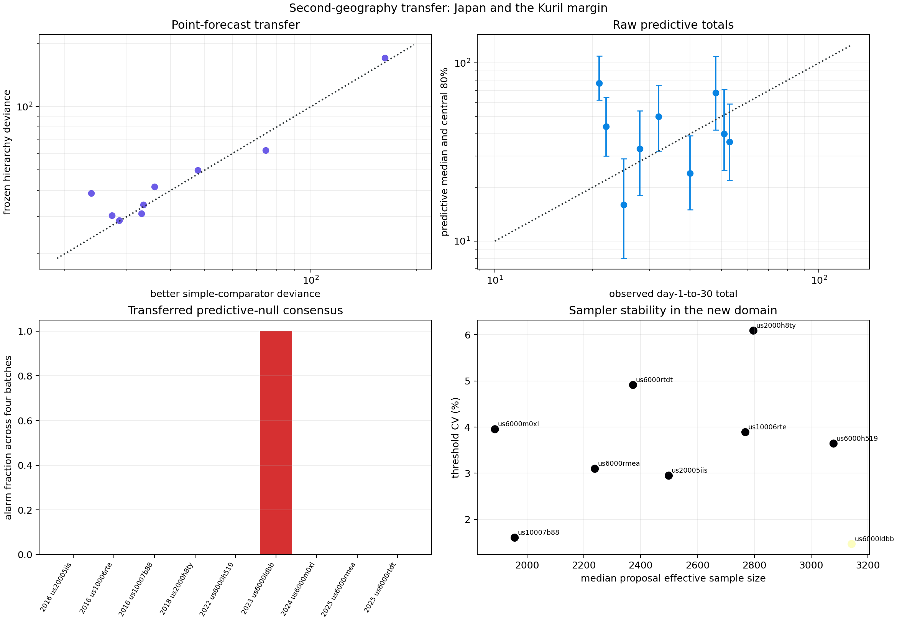

# A Rare Alarm Appears in a Second Geography

**Status correction:** the sole alarm is invalidated by the boundary-free
isolation audit in [report 32](32_japan_alarm_anatomy_and_cohort_edge.md). The
original frozen-protocol result is preserved below, followed by the correction.
Report 34 additionally shows that Japan's downloaded rows are effectively M4+
global reporting rather than magnitude-support-matched M2.5 transfer data.

## Result

The Alaska experiments ended with an attractive but post-hoc observation: a
hierarchy-predictive sequential alarm that survives all four independent
calibrations is rare and enriched for forecast misses. This experiment asks a
new population to challenge that result.

A Japan/Kuril cohort was defined before its catalogs were downloaded. The same
model-blind screen retained nine independent sequences from 119 candidate
M>=5.8 earthquakes during 2016--2025. The western North America population,
pooling choice, first-day conditioning, predictive sampler, 1% scan threshold,
four-batch replay, and unanimous decision rule were then transferred without
tuning on Japan.

The result is encouraging but deliberately small:

- eight of nine targets remain quiet in all four calibrations;
- one target, the 2023 Izu Islands sequence, alarms in all four;
- the one unanimous alarm is one of three raw predictive-total misses;
- none of six covered intervals alarm; and
- the gate retains eight of nine forecasts.

On these nine cases, unanimous-alarm precision is `1 / 1`, miss sensitivity is
`1 / 3`, quiet-set coverage is `6 / 8` (`75%`), and retention is `8 / 9`
(`88.9%`). These fractions are descriptive evidence, not reliable estimates of
future operating characteristics.

## Correction after the cohort-edge audit

Report 32 subsequently found that the sole alarm fails a boundary-free
isolation check. The selected Izu event lies just north of the cohort's 30
degree N boundary, while an equal-M6.1 event occurred `0.98` days earlier only
`32.8` km away, just south of the boundary. The rectangular candidate query
excluded the earlier event even though the target-centered sequence catalog
included its swarm.

The clean boundary-audited subset therefore contains eight targets, all quiet
in all four calibrations, with two raw misses and six covered totals. The
apparent `1 / 1` alarm precision is withdrawn: there is no valid alarm in this
small second-geography subset. The original nine-target result below is
preserved because it faithfully records the frozen rectangular protocol, but
it must not be cited as independent replication of alarm precision. See
[report 32](32_japan_alarm_anatomy_and_cohort_edge.md).

## Frozen cohort protocol

The second geography was specified before catalog outcomes were collected:

| Field | Frozen value |
|---|---:|
| Candidate interval | 2016-01-01 through 2026-01-01 |
| Latitude | 30 to 50 degrees N |
| Longitude | 125 to 150 degrees E |
| Candidate mainshock threshold | M5.8 |
| Local catalog | M2.5+, within 100 km |
| Independence exclusion | 45 days and 150 km |
| Required first-day events | at least 15 |
| Required day-1-to-30 events | at least 15 |

The raw candidate query returned 119 events. Magnitude-first spatiotemporal
deduplication left 93 independent candidates, and the count requirements left
nine selected sequences. The frozen candidate response has SHA-256
`728b5fc66a815d39d4ba4633b615cb41dcf3775eb6261452fe1d6f298fa1d4e7`.

The candidate and local sequence queries use the public USGS FDSN event API.
The generated manifest records every candidate, rejection reason, query URL,
and response digest. Downloaded catalogs and JSON evidence remain ignored so
the public repository contains the reproducible protocol rather than a copied
data archive.

## What was transferred

No Japanese target is used to alter the model or threshold method. The lab:

1. reconstructs the robust Omori-shape population from the original western
   North America development cohort;
2. reselects pooling strength using only nested development-cohort folds;
3. fits each target using events from hour 1 through day 1;
4. evaluates counts from day 1 through day 30;
5. draws 4,096 population-shape proposals and conditions them on the target's
   first day;
6. resamples 8,192 complete predictive paths for each calibration;
7. calibrates the maximum sequential scan statistic to a 1% predictive-null
   tail; and
8. repeats the complete proposal/path calculation four times independently.

The primary transferred gate requires all four batches to alarm. The primary
outcome is whether the observed day-1-to-30 total falls outside the raw central
80% predictive interval. Both were already defined in the Alaska work.



## Target-level results

| Sequence | Observed | Predictive median | Central 80% | Alarms | Raw miss |
|---|---:|---:|---:|---:|---:|
| 2016 Kumamoto | 28 | 33 | 18--54 | `0 / 4` | no |
| 2016 east-southeast of Katsuura | 22 | 44 | 30--64 | `0 / 4` | yes |
| 2016 east-southeast of Namie | 48 | 68 | 42--109 | `0 / 4` | no |
| 2018 east-southeast of Chitose | 25 | 16 | 8--29 | `0 / 4` | no |
| 2022 east-northeast of Namie | 40 | 24 | 15--39 | `0 / 4` | yes |
| 2023 Izu Islands | 21 | 77 | 62--110 | `4 / 4` | yes |
| 2024 Noto Peninsula | 53 | 36 | 22--59 | `0 / 4` | no |
| 2025 east of Yamada | 32 | 50 | 32--75 | `0 / 4` | no |
| 2025 Aomori Prefecture | 51 | 40 | 25--71 | `0 / 4` | no |

The two uncaught misses are boundary-scale total errors. The 2022 Namie
sequence observes 40 against an upper endpoint of 39, while Katsuura observes
22 against a lower endpoint of 30. The scan is not designed to reject every
total miss: it seeks a sustained temporal-rate departure somewhere in the
future trajectory.

The Izu sequence is qualitatively different. It observes 21 events against a
median of 77 and lower endpoint of 62, and its frozen-hierarchy Poisson
deviance is `170.7`. Every calibration first crosses late, at day `22.60`, in
the lower-rate direction. Thresholds range from `74.55` to `77.57`. This is a
reproducible late diagnosis that the decay trajectory was much quieter than
the western hierarchy expected. It is not an early warning and it does not
indicate increased earthquake hazard.

## Point forecasts and uncertainty

Point-score transfer is useful but not decisive:

| Model | Total Poisson deviance | Median sequence deviance | Sequence wins |
|---|---:|---:|---:|
| Frozen partial-pooling hierarchy | `487.2` | `38.7` | 2 |
| Frozen robust population | `493.0` | `38.5` | 4 |
| Target-only day-one fit | `737.5` | `73.4` | 3 |

The hierarchy reduces total deviance only `1.2%` relative to the simpler
frozen population, although it reduces it `34.0%` relative to the local
day-one fit. This supports population regularization in the small Japan sample
but does not establish that partial pooling is materially better than simply
using the robust population shape.

Raw central 80% total intervals cover `6 / 9` (`66.7%`), below nominal but
compatible with wide sampling uncertainty at nine targets. Mean interval
coverage across individual time bins is `84.3%`. Threshold Monte Carlo
variation is controlled: median target CV is `3.64%` and the maximum is
`6.09%`. Alarm classifications are completely separated at zero or four of
four; there are no one-, two-, or three-batch boundary cases.

## What changed scientifically

This was the first time the predictive-null consensus rule was asked to
survive a population that did not motivate its construction. The initial
nine-target result appeared to preserve the Alaska pattern, but the later
cohort-edge audit invalidated its sole alarm target. The honest conclusion is
now narrower: the transferred monitor stays quiet on all eight
boundary-isolated targets, including two raw misses. This provides a small
specificity stress test but no independent evidence about alarm precision or
sensitivity.

The failure is scientifically useful. Model-blind screening is not sufficient
when a rectangular candidate query clips the very neighborhoods used to claim
mainshock independence. Cohort geometry must be padded before deduplication,
or every selected target must receive a boundary-free isolation audit.

## KinoPulse use and gap refinement

KinoPulse count objectives and fitting machinery support the frozen
first-day-conditioned forecasts. The missing reusable layer remains
conditional predictive trajectory sampling: proposal conditioning, effective
sample size, complete-path resampling, repeated threshold calibration, and
consensus accounting are still implemented in the playground.

The second-geography result strengthens the gap's acceptance case. An API
should make it easy to freeze a predictive sampler and consensus rule, replay
them on a new cohort, and preserve provenance proving that only the declared
prefix affected proposals and thresholds.

## Limitations

- Nine selected targets cannot characterize false-alarm rates or precision
  tightly.
- USGS M2.5 catalog completeness and network practice differ across time and
  place, especially between Japan, offshore regions, and the western
  development population.
- A 100 km radial catalog ignores rupture geometry and tectonic structure.
- The screen requires at least 15 future events, so it is suitable for model
  evaluation but cannot be applied as an outcome-blind operational entry rule.
- The empirical western shape population does not represent all parameter,
  catalog, triggering, spatial, or observation uncertainty.
- Four repeats measure Monte Carlo stability, not physical model certainty.
- No comparison with ETAS, Reasenberg--Jones, JMA operational methods, or a
  prospective CSEP experiment is performed.

No state-of-the-art or public-safety claim is made.

## Reproduction

Use the repository `.venv`:

```powershell
.\.venv\Scripts\python.exe fetch_japan_aftershock_population.py
.\.venv\Scripts\python.exe japan_transfer_lab.py
.\.venv\Scripts\python.exe -m unittest tests.test_fetch_japan_aftershock_population tests.test_japan_transfer_lab -v
```

The fetch requires network access to the public USGS API. The lab writes
ignored evidence to `artifacts/japan_transfer.json` and the review figure to
`artifacts/japan_transfer.png`.
