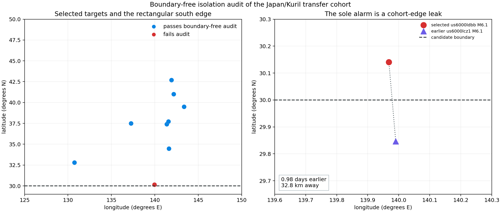
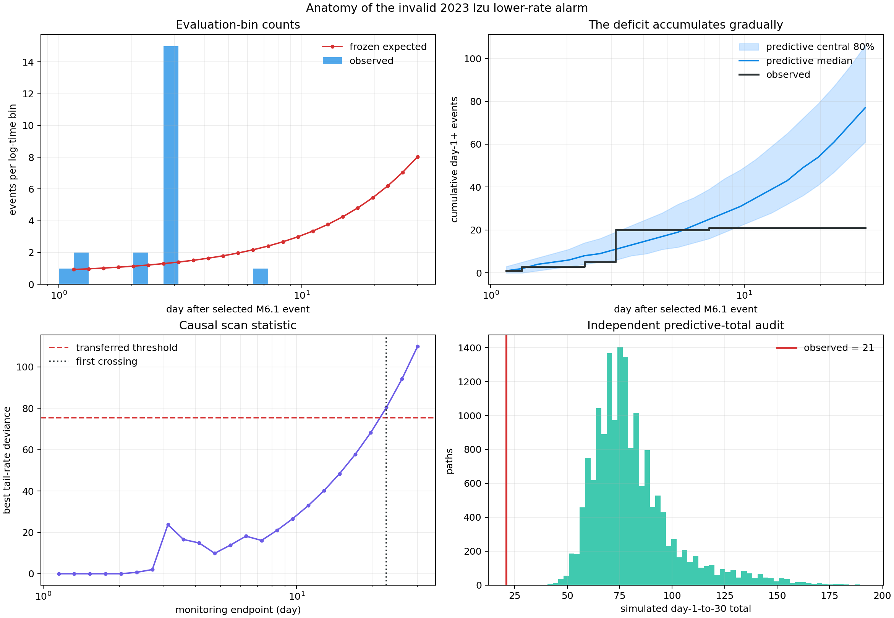

# The Sole Japan Alarm Is a Cohort-Edge Leak

## Result

Report 31 appeared to deliver a clean second-geography replication: one of nine
Japan/Kuril targets alarmed in all four predictive-null calibrations, that
target was a raw interval miss, and none of six covered targets alarmed.

An explanatory audit reverses the attractive interpretation. The sole alarm,
the 2023 Izu Islands target, is not an independent mainshock under the intended
45-day, 150 km rule. An equal-M6.1 event occurred `0.98` days earlier and only
`32.8` km away. Its latitude, `29.8466` degrees N, placed it just outside the
candidate rectangle's 30 degree N boundary. The selected event at `30.1409`
degrees N was therefore deduplicated without seeing its higher-priority local
neighbor.

The target-centered 100 km catalog did cross the boundary, so the forecasting
lab conditioned on the ongoing swarm generated by events the cohort screen had
hidden. This is a cohort-construction artifact, not evidence that the frozen
alarm generalized.



## Boundary-free isolation audit

Every one of the nine selected targets receives a new target-centered USGS
query with no rectangular clipping:

- 45 days before through 45 days after the target;
- 150 km radius;
- M5.8 or greater; and
- the original priority rule: larger magnitude first, then earlier origin.

The audit finds exactly one failure:

| Target | Higher-priority neighbor | Time difference | Distance | Neighbor inside rectangle? |
|---|---|---:|---:|---:|
| `us6000ldbb` | `us6000lcz1`, M6.1 | `-0.98` days | `32.8` km | no |

The other eight selected targets pass. Each neighborhood query URL and response
SHA-256 is retained in ignored evidence. This audit is post-selection: it
diagnoses the original protocol and does not pretend that the corrected
eight-target subset was prospectively frozen.

## Corrected transfer accounting

Removing the invalid Izu target changes the interpretation completely:

| Quantity | Original rectangular cohort | Boundary-audited subset |
|---|---:|---:|
| Targets | 9 | 8 |
| Raw intervals covered | 6 | 6 |
| Raw interval misses | 3 | 2 |
| Targets alarming in all four batches | 1 | 0 |
| Covered targets alarming | 0 | 0 |
| Misses alarming | 1 | 0 |

All eight valid targets remain quiet in all four batches. That is compatible
with the monitor's intended rarity, but it supplies no independent alarm from
which to estimate precision. The apparent `1 / 1` precision and `1 / 3`
sensitivity in report 31 are withdrawn for scientific interpretation.

## Anatomy of the invalid alarm

The signal itself is numerically real within the incorrectly constructed
sequence. It is useful to understand because it shows how cohort leakage enters
a causal monitor.

The target catalog contains 53 control-window events and an intense sequence
before the selected October 6 M6.1 event. During evaluation, 20 events are
recorded by day `3.58`, compared with a frozen expected total of `10.6`. After
the scan's eventual change location at day `3.107`, only one event is recorded
through day 30, versus `60.1` expected.

The monitor behaves causally:

| Endpoint | Observed cumulative | Expected cumulative | Best tail multiplier | Threshold ratio |
|---:|---:|---:|---:|---:|
| day 3.58 | 20 | 10.6 | `3.57x` higher | `0.219` |
| day 7.27 | 21 | 20.5 | `0.087x` lower | `0.213` |
| day 14.77 | 21 | 37.6 | `0.035x` lower | `0.641` |
| day 22.60 | 21 | 54.0 | `0.022x` lower | `1.065` |
| day 30 | 21 | 69.1 | `0.0166x` lower | `1.457` |

The best explanation flips from an initially high-rate tail to a near-total
shutdown beginning around day 3.11. The strict horizon-wide threshold delays
the first alarm until day `22.60`. This was never an early warning.



## Independent predictive rarity audit

A separate random stream draws 4,096 shape proposals and 16,384 complete
future paths. It is not used to change the four report-31 thresholds.

| Diagnostic | Result |
|---|---:|
| Proposal effective sample size | `3157.3` |
| Predictive total 1st percentile | 52 |
| Predictive total median | 77 |
| Observed total | 21 |
| Paths with total <= 21 | `0 / 16,384` |
| One-sided 95% upper bound after zero paths | `0.0183%` |
| Paths with scan maximum at least observed | `29 / 16,384` (`0.177%`) |

These numbers establish that the recorded trajectory is extreme under the
frozen empirical hierarchy. They do not establish a physical regime change.
The prefix was contaminated by an already-active swarm, and USGS offshore
catalog practice differs materially from the western development population.

## The protocol bug

The candidate screen deduplicates only events returned inside a rectangle.
Near an edge, its 150 km independence neighborhood extends outside that
rectangle. A target may therefore win by omission even though a stronger or
equal-earlier event sits next door.

A correct future cohort builder should separate two geometries:

1. the rectangle defines which event centers may become targets; and
2. a spatially and temporally padded query supplies all competitors used for
   independence decisions.

An equivalent but slower safeguard is a target-centered isolation query for
every provisional selection. The audit implemented here is reusable for that
purpose. The issue belongs to this playground's data protocol, not KinoPulse,
so no KinoPulse library gap is filed.

## What was learned

This negative result is more valuable than the apparent one-alarm success:

1. A frozen protocol can still contain a frozen mistake.
2. Model-blind selection does not guarantee geometry-safe selection.
3. Causal fitting cannot repair contamination already present in its declared
   prefix.
4. Explaining an alarm at event level can reveal cohort defects that aggregate
   precision tables hide.
5. The Japan cohort now supports only the statement that eight
   boundary-isolated targets stayed quiet; it does not replicate alarm
   precision.

## Limitations

The boundary audit uses the current USGS event representation and a simple
magnitude/time priority rule. Earthquake sequence declustering is scientifically
richer than radial overlap. An equal-magnitude predecessor does not by itself
identify a unique physical mainshock, but it is sufficient to show that the
selected event violates this project's stated independence rule.

The audit does not rebuild and rerun a new prospectively frozen Japan cohort.
Doing so now would be outcome-informed. A future geography should use the
corrected padded protocol from the beginning.

A follow-up applies the same audit to all western development and Alaska
targets. The development population passes completely; one Alaska graph-policy
ambiguity has negligible metric impact. See [report 33](33_foundational_cohort_isolation_audit.md).

## Reproduction

```powershell
.\.venv\Scripts\python.exe audit_japan_cohort_isolation.py
.\.venv\Scripts\python.exe japan_alarm_anatomy_lab.py
.\.venv\Scripts\python.exe -m unittest tests.test_audit_japan_cohort_isolation tests.test_japan_alarm_anatomy_lab -v
```

The isolation audit requires the public USGS API. JSON evidence and downloaded
catalogs remain ignored; both review figures are committed.
