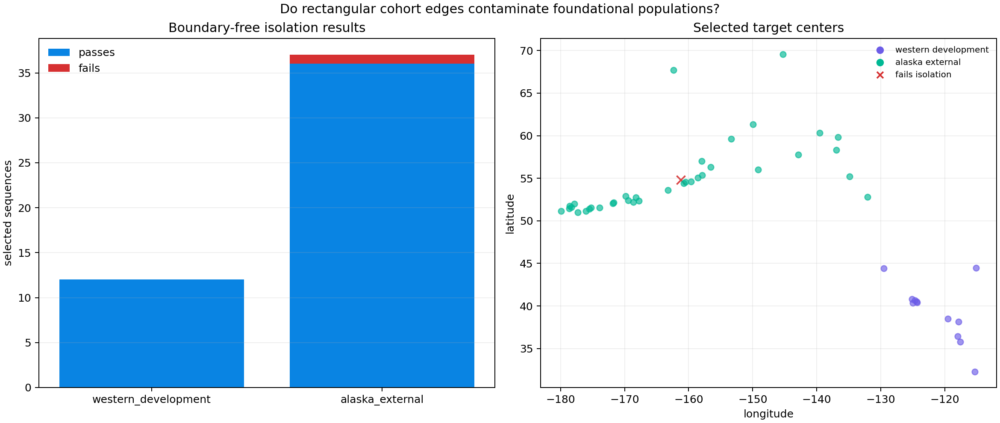
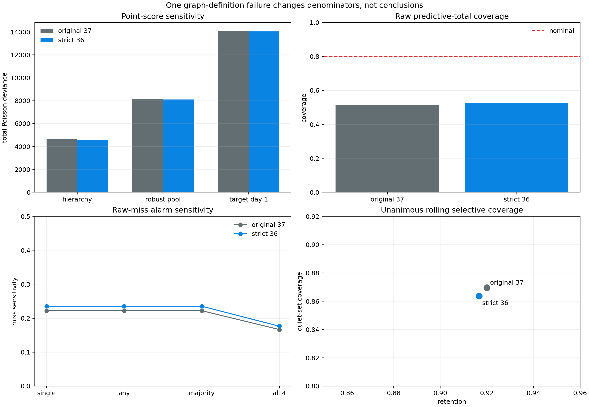

# The Foundational Population Survives the Isolation Audit

## Result

The Japan/Kuril cohort-edge failure in report 32 could have undermined every
later earthquake result if the same selection flaw contaminated the western
development population. This experiment applies a boundary-free neighborhood
audit to all 49 selected sequences in the two foundational populations:

- all 12 western development targets pass;
- 36 of 37 Alaska external targets pass strict local dominance; and
- the one Alaska failure is a graph-definition ambiguity, not direct target
  catalog contamination or a rectangular edge leak.

Removing that Alaska target as a strict sensitivity check changes denominators
but none of the main conclusions. The hierarchy remains the best aggregate
point model, raw predictive intervals remain undercovered, the same four
single-batch predictive alarms survive, and the same two rolling-eligible
targets satisfy four-of-four consensus.



## Audit protocol

Each selected target receives a current USGS query covering:

- 45 days before through 45 days after its origin;
- a 150 km radius with no rectangular clipping;
- earthquakes of M5.8 or greater; and
- the original priority order, larger magnitude then earlier origin.

A target fails strict local dominance if any higher-priority event exists in
that neighborhood, even if the original greedy screen rejected that neighbor
for conflict with a third event. Every URL and response digest is retained in
ignored evidence.

This is a post-selection protocol audit, not a prospectively frozen rebuild.
USGS event representations can evolve, so the evidence preserves the response
digests used here.

## The western development cohort is clean

All 12 development targets pass. This matters more than the raw count suggests:
these sequences define the robust population shape, choose the partial-pooling
strength, and supply the proposal population for predictive-null calibration.

No western model needs to be refit under this audit. The hierarchy and every
Japan/Alaska forecast continue to use the same development population.

## The Alaska graph chain

The sole strict failure is `us6000b56k`, the July 28, 2020 M6.1 southwest of
Sand Point. Its local graph contains three relevant events:

| Event | Magnitude | Relation |
|---|---:|---|
| `us7000asvb` | 7.8 | original July 22 mainshock |
| `us7000asx4` | 6.1 | 3.6 minutes later, 30.6 km from the M7.8 |
| `us6000b56k` | 6.1 | 6.07 days later, 139.8 km from the other M6.1 |

The July 28 target is 169.5 km from the M7.8, outside the declared 150 km
conflict radius. The original greedy algorithm therefore:

1. retains the M7.8;
2. rejects the first M6.1 because it conflicts with the M7.8; and
3. retains the second M6.1 because it does not directly conflict with any
   already-retained event.

Strict local dominance instead rejects the second M6.1 because the earlier
equal-magnitude event is within 150 km, regardless of that neighbor's own
rejection.

Both definitions are coherent, but they answer different questions:

- **Greedy retained-set independence** guarantees that no two retained centers
  conflict.
- **All-neighbor local dominance** requires every retained center to dominate
  every original candidate in its neighborhood.

The original code and prose implied the latter more strongly than the
implementation provided. Future manifests should name the graph policy
explicitly and preserve the relevant candidate cluster.

This Alaska case is not the Japan failure. The neighbor is inside the original
rectangle but 139.8 km from the target, outside its 100 km sequence catalog.
There is no direct evidence that the omitted neighbor contaminated the target's
first-day counts.

## Strict-filter sensitivity

The flagged Alaska target is a quiet predictive-null case, a raw predictive
interval miss, and a rolling-interval success. Removing it gives:

| Quantity | Original greedy 37 | Strict local-dominance 36 |
|---|---:|---:|
| Raw total intervals covered | `19 / 37` = 51.4% | `19 / 36` = 52.8% |
| Raw total misses | 18 | 17 |
| Predictive alarms | 4 | 4 |
| Raw misses alarmed | `4 / 18` = 22.2% | `4 / 17` = 23.5% |
| Covered totals alarmed | 0 | 0 |
| Median predictive alarm day | 13.99 | 13.99 |

Point-model totals also preserve the same ordering:

| Model | Original deviance | Strict deviance | Original wins | Strict wins |
|---|---:|---:|---:|---:|
| Frozen hierarchy | `4630.0` | `4569.4` | 19 | 18 |
| Robust population | `8158.3` | `8097.5` | 11 | 11 |
| Target day one | `14123.8` | `14057.3` | 7 | 7 |



## Consensus and rolling intervals

The four predictive alarm event IDs do not change. Under strict filtering:

- all 32 quiet targets remain quiet in every fresh calibration;
- the four any-repeat/majority alarms remain four raw misses;
- the three unanimous raw alarms remain unchanged; and
- Atka and Sand Point remain the two unanimous rolling-eligible alarms.

For the unanimous rolling rule, retention changes from `23 / 25` (`92.0%`) to
`22 / 24` (`91.7%`). Quiet-set coverage changes from `20 / 23` (`87.0%`) to
`19 / 22` (`86.4%`) because the removed target was covered and quiet. This is a
small denominator correction, not a reversal.

## What was learned

The audit separates three issues that should not be conflated:

1. **Rectangular edge leakage** can omit a directly contaminating predecessor,
   as in Japan.
2. **Greedy graph non-transitivity** can retain a target that fails strict
   all-neighbor dominance, as in Alaska.
3. **Model robustness to target removal** is a separate empirical question;
   here the results survive.

The western development population passes the strongest check. That preserves
the core fitted hierarchy. The Alaska evidence remains valid under its original
retained-set definition and substantively unchanged under the stricter
sensitivity definition.

## KinoPulse boundary

This is a data-cohort construction issue, not a KinoPulse defect. KinoPulse
fits and scores the sequences it receives; it cannot infer whether a geographic
query clipped a candidate graph. No library gap is filed.

The broader software lesson still matters: scientific provenance should name
selection algorithms precisely enough to distinguish a maximal independent set
from local dominance, and downstream reports should support eligibility
sensitivity without rerunning unrelated numerical work.

## Limitations

The radial 45-day/150 km rule is a reproducible engineering screen, not a
seismological declustering gold standard. Rupture geometry, tectonic structure,
and established declustering methods could produce different clusters. The
audit uses current USGS magnitudes and locations and does not compare against
JMA, ANSS regional completeness, ETAS ancestry, or CSEP catalog rules.

Removing one target after observing outcomes is only a sensitivity analysis.
It must not be presented as a newly frozen 36-sequence validation cohort.

Target isolation is only one part of cohort validity. The next audit finds a
large reported-magnitude support mismatch between western/Alaska catalogs and
Japan; see [report 34](34_catalog_magnitude_support_audit.md).

## Reproduction

```powershell
.\.venv\Scripts\python.exe cohort_boundary_audit_lab.py
.\.venv\Scripts\python.exe cohort_boundary_impact_lab.py
.\.venv\Scripts\python.exe -m unittest tests.test_cohort_boundary_audit_lab tests.test_cohort_boundary_impact_lab -v
```

The audit requires the public USGS API. JSON evidence remains ignored; the two
review figures are committed.
