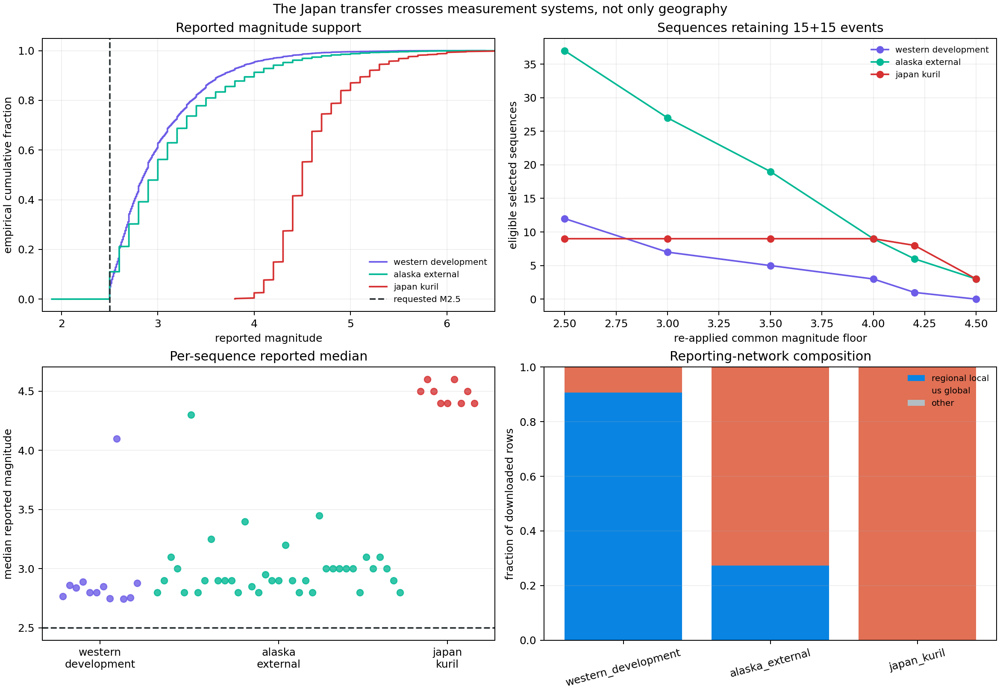

# The Japan Transfer Crosses Measurement Systems

## Result

Every aftershock query requests M2.5 or greater, but the downloaded catalogs do
not have comparable reported magnitude support. The western development and
Alaska cohorts contain abundant M2.5--3 regional-network events. The
Japan/Kuril cohort is effectively a global M4+ catalog.

| Cohort | Rows | Q10 | Median | Q90 | Below M3 | M4+ | Dominant network |
|---|---:|---:|---:|---:|---:|---:|---|
| Western development | 7,678 | 2.54 | 2.86 | 3.66 | 60.8% | 4.9% | `ci` (66.6%) |
| Alaska external | 15,497 | 2.50 | 3.00 | 4.00 | 47.9% | 10.6% | `us` (72.7%) |
| Japan/Kuril | 871 | 4.20 | 4.50 | 5.20 | 0% | 99.7% | `us` (100%) |

The requested M2.5 URL parameter therefore does not define a common
measurement process. The original Japan results are numerical transfer tests
across both geography and catalog/reporting systems. They are not matched-
magnitude evidence that an M2.5 western aftershock law transfers to Japan.



## Audit method

The audit reads every downloaded row for every selected sequence, excluding the
declared target event. It records reported magnitudes, reporting network,
magnitude type, and per-sequence distributions.

It then re-applies common magnitude floors from M2.5 through M4.5 and recounts
the original hour-1-to-day-1 calibration and day-1-to-day-30 evaluation
windows. A sequence remains eligible only if both windows still contain at
least 15 events.

This describes reported support. It is not a formal magnitude-of-completeness
estimate. Completeness requires detection analysis, network sensitivity, and
often time-varying methods beyond the downloaded event list.

## A requested threshold is not an observed threshold

The western catalog is dominated by regional `ci`, `nc`, and `nn` rows and
contains many local magnitudes. Alaska mixes global `us` and regional `ak`
reporting. Japan contains only `us` rows and is dominated by body-wave and
moment magnitudes.

The contrast is visible in every Japan sequence: per-sequence reported median
magnitudes range from 4.4 to 4.6. Eleven of twelve western medians are below
3.0; the exception is the offshore Oregon sequence, whose median is 4.1 and
which already looked measurement-system-like in the development population.

Alaska even contains a currently reported M1.9 row despite an M2.5 query,
illustrating that event magnitudes can be revised after query inclusion. A
query predicate is provenance about retrieval, not an immutable guarantee
about every later event value.

## Common-threshold feasibility

The existing minimum-count rule collapses the western population as the common
floor rises:

| Re-applied floor | Western | Alaska | Japan/Kuril |
|---:|---:|---:|---:|
| M2.5 | 12 | 37 | 9 |
| M3.0 | 7 | 27 | 9 |
| M3.5 | 5 | 19 | 9 |
| M4.0 | 3 | 9 | 9 |
| M4.2 | 1 | 6 | 8 |
| M4.5 | 0 | 3 | 3 |

After removing the invalid Izu target from report 32, eight boundary-isolated
Japan targets remain at M4.0. Only three western development targets remain.
That is insufficient to reproduce the existing 12-sequence robust population,
nested pooling selection, or empirical shape scale honestly.

Fitting a new hierarchy to three outcome-selected western sequences would
produce a number, but not a credible matched-support replication. This lab
therefore stops at the support diagnosis.

## Impact on earlier conclusions

### Western development

The western hierarchy remains a valid model of its downloaded mixed regional
catalogs. Report 33 showed that its target isolation is clean. Nothing here
changes its internal grouped-validation scores.

### Alaska external validation

Alaska overlaps western magnitude support much more strongly than Japan, but it
still changes reporting composition: 72.7% of its rows use the global `us`
network and per-sequence medians extend above M4 for one target. The Alaska
result should be interpreted as end-to-end pipeline transfer across a
heterogeneous catalog, not a controlled experiment holding the observation
system fixed.

The hierarchy's strong point-deviance advantage remains empirical. Its severe
predictive undercoverage may combine physical population shift with catalog
and reporting-system shift; this audit cannot decompose them.

The follow-up [magnitude-floor alarm audit](35_magnitude_floor_alarm_robustness.md)
refits the population and targets at M2.5, M3, M3.5, and M4. At M3, three
original alarm targets remain eligible but quiet and the fourth is ineligible,
while two different sequences begin alarming. The alarm evidence is therefore
magnitude-channel specific.

### Japan/Kuril transfer

Report 32 already removed the sole alarm because its target was not isolated.
This audit adds a population-wide limitation: even the eight isolated targets
do not share western reported magnitude support. Their all-quiet monitor result
is useful as a software stress test, but it cannot validate geographic alarm
specificity under a matched seismic catalog.

## Why amplitude calibration is not enough

The target first day recalibrates productivity, which absorbs much of the
difference in absolute event counts. That does not guarantee comparability.
Magnitude threshold and reporting practice can affect:

- apparent decay exponent through time-varying detection after a mainshock;
- early/late ratios when network saturation or review changes over time;
- background estimates;
- magnitude-type mixtures and revised event inclusion; and
- which earthquakes satisfy the minimum-count screen.

Omori shape can sometimes be stable across magnitude thresholds, but that is a
scientific hypothesis to test, not an invariance supplied by amplitude fitting.

## What a valid next transfer needs

At least one of these designs is required:

1. Obtain comparable regional catalogs, such as JMA and matched western
   regional sources, with defensible time-varying completeness estimates.
2. Build a substantially larger western M4+ development population before
   freezing a new external cohort.
3. Model detection/reporting jointly with seismic rate and propagate that
   uncertainty into predictive paths.
4. Restrict claims to end-to-end catalog-pipeline behavior rather than physical
   aftershock-rate transfer.

The current data cannot answer a matched-support Japan question without a new
collection protocol.

## KinoPulse gap refinement

The grouped-validation gap now records a pre-model requirement: group splits
are not enough when measurement support differs by group. A reusable validation
result should be able to carry group-level support summaries, overlap warnings,
and explicit refusal policies before fitting or scoring.

KinoPulse should not own earthquake completeness estimation. It can provide the
model-agnostic evidence contract that prevents a requested query threshold from
silently masquerading as common observed support.

## Limitations

Reported magnitude distributions mix space, time, magnitude scales, review
policies, and physical productivity. The audit does not estimate detection
probability or convert `ml`, `mb`, and moment magnitudes to a common calibrated
scale. Rows are not independent samples, and prolific sequences dominate
cohort-level distributions.

The threshold-retention table is conditioned on the originally selected
sequences. It is a sensitivity calculation, not a new model-blind population
screen.

## Reproduction

```powershell
.\.venv\Scripts\python.exe catalog_magnitude_support_lab.py
.\.venv\Scripts\python.exe -m unittest tests.test_catalog_magnitude_support_lab -v
```

The lab uses the already downloaded ignored catalogs. It writes ignored JSON
evidence and the committed review figure shown above.
