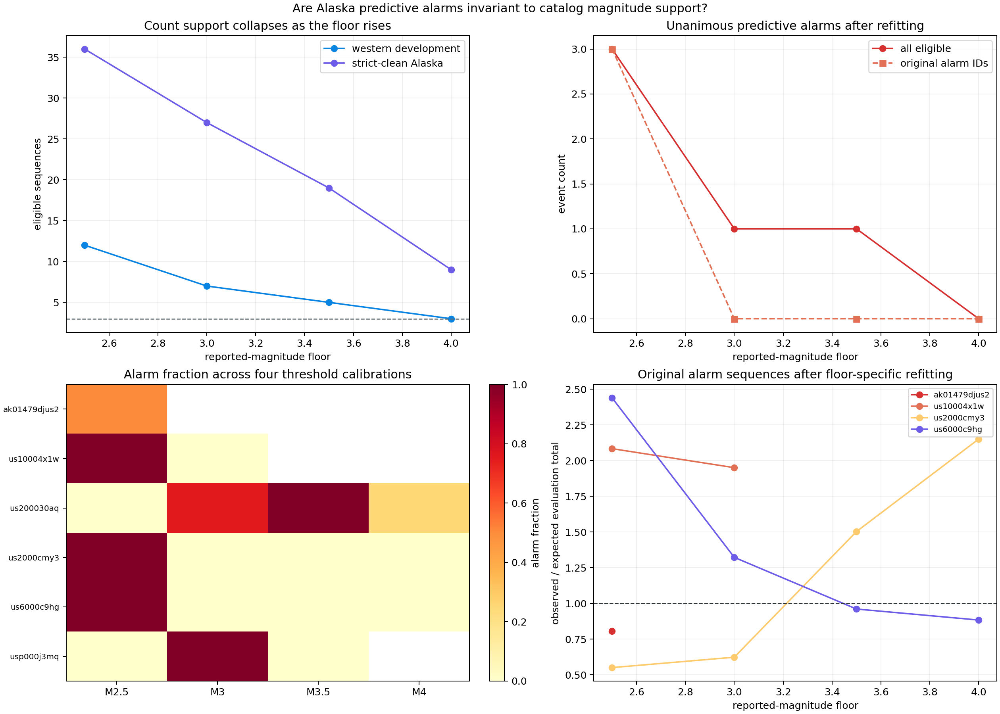

# Predictive Alarms Are Magnitude-Channel Specific

## Result

The rare Alaska predictive alarms are not invariant to the reported-magnitude
floor. After refitting both the western population and every Alaska target at
each floor, none of the four original identities remains an alarm at M3.0:
three are still eligible and quiet, while the fourth fails the count screen.
Two previously quiet Fox Islands sequences become higher-rate alarms instead.

| Re-applied floor | Eligible western | Eligible clean Alaska | Unanimous alarms | Majority alarms |
|---:|---:|---:|---|---|
| M2.5 | 12 | 36 | `us10004x1w`, `us2000cmy3`, `us6000c9hg` | same three |
| M3.0 | 7 | 27 | `usp000j3mq` | `usp000j3mq`, `us200030aq` |
| M3.5 | 5 | 19 | `us200030aq` | `us200030aq` |
| M4.0 | 3 | 9 | none | none |

An alarm is therefore not a stable property of an earthquake sequence in
these data. It is a property of a declared magnitude channel, catalog, model,
and calibration together.



## Protocol

This is a retrospective sensitivity audit prompted by report 34. Four floors
were frozen for the lab: M2.5, M3.0, M3.5, and M4.0. For each floor the lab:

1. explicitly filters every frozen western and Alaska CSV using the row's
   current reported magnitude;
2. recomputes the pre-event background and both forecast windows;
3. reapplies the original minimum of 15 calibration and 15 evaluation events;
4. fits an Omori law to every eligible western development sequence;
5. reconstructs the robust western population;
6. fits each eligible Alaska target from its first day using the original
   pooling strength of `4.0`; and
7. calibrates the complete sequential scan four times from 8,192 independent
   hierarchy-predictive paths per batch.

The pooling strength is deliberately not reselected at each floor. Reselecting
it after seeing the sensitivity result would add another post-hoc degree of
freedom. The Alaska graph-ambiguous event `us6000b56k` identified in report 33
is excluded, giving the strict-clean 36-target baseline.

## What happens to the original alarms

| Event | M2.5 | M3.0 | M3.5 | M4.0 |
|---|---:|---:|---:|---:|
| 2014 northern Alaska, `ak01479djus2` | 2/4, lower, day 30 | ineligible | ineligible | ineligible |
| 2016 Atka, `us10004x1w` | 4/4, higher, day 8.38 | 0/4 | ineligible | ineligible |
| 2018 Chiniak, `us2000cmy3` | 4/4, lower, day 19.61 | 0/4 | 0/4 | 0/4 |
| 2020 Sand Point, `us6000c9hg` | 4/4, higher, day 5.48 | 0/4 | 0/4 | 0/4 |

The M2.5 northern Alaska result is a useful reconciliation with reports 29 and
30. Its original observed scan maximum was `21.304` against a single threshold
of `21.186`. Fresh thresholds here range from `20.213` to `22.200`, so only two
of four batches alarm. The earlier combined evidence already classified this
day-30 crossing as marginal.

Atka becomes quiet at M3 despite retaining 17 first-day and 52 evaluation
events. Chiniak and Sand Point remain highly count-eligible through M4, yet
neither alarms above M2.5. Their disappearance cannot be explained only by
failing the count screen.

## New alarms emerge in a different magnitude band

The replacement alarms are not weak remnants of the original four:

- The 2011 Fox Islands sequence, `usp000j3mq`, is quiet at M2.5, alarms higher
  in 4/4 M3 batches by day `5.48`, and is quiet again at M3.5. At M3 it records
  119 evaluation events against a fitted total smaller by a factor of `3.21`.
- The 2015 Fox Islands sequence, `us200030aq`, is quiet at M2.5, alarms higher
  in 3/4 M3 batches by median day `3.11`, and alarms in 4/4 M3.5 batches by day
  `2.70`. At M4 it alarms in only 1/4 batches.

Both were covered by the original M2.5 raw predictive-total intervals. That
does not make the higher-floor alarms false positives: a valid outcome label
would require new floor-specific interval calibration. It does show that the
M2.5 alarm/outcome association cannot be carried unchanged into another
magnitude channel.

## This is not just loss of statistical power

Raising the floor certainly reduces power. The western proposal population
shrinks from 12 sequences at M2.5 to three at M4, while Alaska falls from 36 to
nine. Predictive thresholds can widen as the first-day count and empirical
population support contract.

But pure power loss would make existing alarms fade without creating coherent
new ones. Instead, two different sequences develop repeated higher-rate
crossings, and the robust western population exponent moves from `1.084` at
M2.5 to `1.006`, `1.164`, and `1.170` as the floor rises. The magnitude bands
are carrying different apparent decay shapes, not merely scaled copies of the
same count process.

Possible causes include real magnitude-dependent aftershock behavior,
time-varying catalog completeness, magnitude conversion and review practices,
network mixture, or interactions among them. This lab does not identify which
cause dominates.

[Report 36](36_magnitude_time_mark_coupling.md) tests the mechanism directly.
Conditioning on each sequence's margins, high reported magnitudes are strongly
front-loaded in both cohorts. The replacement alarm sequences are late-enriched
or nearly neutral against that pattern, consistent with their higher-floor
alarm behavior.

## Impact on the earthquake alarm claim

Reports 28--30 established that a hierarchy-predictive null makes alarms rare
and that several M2.5 alarm decisions reproduce across Monte Carlo batches.
This report adds a different robustness axis: those decisions do not reproduce
after changing the observed magnitude channel and refitting honestly.

The responsible interpretation is now narrower:

> The monitor detected rare departures in the downloaded Alaska catalogs under
> the western mixed-network M2.5 protocol. It did not discover a
> magnitude-invariant earthquake state.

Researchers should publish the requested query floor, the realized reported
magnitude distribution, the reporting networks and magnitude types, the
floor-specific population size, and alarm sensitivity to defensible alternate
floors. A target-level label such as "anomalous sequence" is too broad.

## KinoPulse gap refinement

The grouped-validation gap now includes observation-policy sensitivity. A
generic experiment result should be able to declare a transformation axis,
recompute group eligibility, rerun fits and stochastic calibration with seed
provenance, and compare membership and decisions across transformations.

The earthquake-specific magnitude filter does not belong in KinoPulse. The
reusable missing abstraction is the audit harness that makes a conclusion's
dependence on preprocessing or measurement policy visible.

## Limitations

The floors use reported magnitudes without homogenizing `ml`, `mb`, `mw`, and
related scales. They are sensitivity channels, not estimates of magnitude of
completeness. Floor selection is post-hoc, and the same earthquakes contribute
to every floor. The M3.5 and especially M4 western populations are very small.

The lab freezes the original model family and pooling strength, but refits its
population at every floor. It does not rerun nested pooling selection, total-
interval calibration, or outcome association. Four threshold batches identify
clear and marginal decisions but do not estimate an operational false-alarm
rate.

## Reproduction

```powershell
.\.venv\Scripts\python.exe magnitude_floor_alarm_robustness_lab.py
.\.venv\Scripts\python.exe -m unittest tests.test_magnitude_floor_alarm_robustness_lab -v
```

The full run performs 364 target-level threshold calibrations and took about
136 seconds on the development machine. It uses the already downloaded ignored
catalogs, writes ignored JSON evidence, and writes the committed review figure
shown above.
