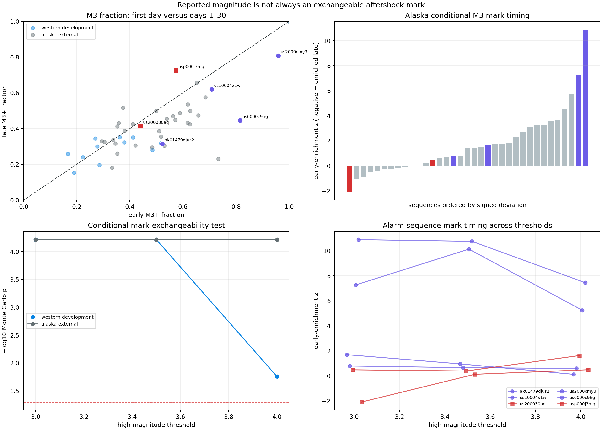

# Magnitude Is Not an Exchangeable Aftershock Mark

## Result

Reported aftershock magnitude is strongly coupled to time in both the western
development and clean Alaska cohorts. Conditional on each sequence's total
event count, first-day count, and number of events above a magnitude threshold,
high-magnitude labels are systematically concentrated in the first day.

| Cohort | High threshold | Early high fraction | Late high fraction | Signed z | Direction p | Heterogeneity p |
|---|---:|---:|---:|---:|---:|---:|
| Western | M3.0 | 43.0% | 32.3% | 8.27 | 0.000061 | 0.000061 |
| Western | M3.5 | 16.3% | 10.3% | 5.00 | 0.000061 | 0.000061 |
| Western | M4.0 | 5.4% | 2.8% | 2.42 | 0.0189 | 0.0175 |
| Alaska | M3.0 | 56.3% | 48.6% | 12.94 | 0.000061 | 0.000061 |
| Alaska | M3.5 | 27.4% | 17.6% | 13.68 | 0.000061 | 0.000061 |
| Alaska | M4.0 | 13.4% | 7.5% | 9.10 | 0.000061 | 0.000061 |

The repeated `0.000061` is the resolution limit of 16,384 conditional Monte
Carlo samples: no simulated statistic was at least as extreme, so the
conservative estimate is `1 / 16,385` rather than zero.



This provides a concrete mechanism for report 35's alarm swap. Raising the
magnitude floor is not a constant random thinning of one temporal process. It
selects a mark whose prevalence changes through the forecast window.

## Exact conditional question

Every frozen row with a finite current reported magnitude of at least M2.5 is
kept between hour one and day 30. For a chosen high threshold, each earthquake
produces a two-by-two table:

| | Below high threshold | At or above high threshold |
|---|---:|---:|
| Hour 1 through day 1 | fixed by data | fixed by data |
| Day 1 through day 30 | fixed by data | fixed by data |

Under the null, magnitude labels are exchangeable across event times within
that earthquake. Conditioning on the table margins makes the first-day high
count hypergeometric. This removes ordinary aftershock-rate decay, sequence
productivity, the total high-magnitude fraction, and the early/late event-count
imbalance from the null calculation.

For each sequence the lab standardizes the observed first-day high count by
its conditional hypergeometric expectation and variance. Two cohort statistics
are then simulated while preserving every sequence's margins:

- the sum of squared standardized deviations, detecting any magnitude-time
  coupling; and
- the signed sum, detecting coherent early or late enrichment.

The strict-clean Alaska cohort excludes the graph-ambiguous `us6000b56k`
target from report 33. Eleven or twelve western and 34 or 35 Alaska sequences
have nondegenerate margins, depending on threshold. Degenerate all-high or
all-low sequences remain in the evidence but cannot inform the conditional
test.

## Cohort-wide direction

Every signed cohort statistic is positive: high reported magnitudes are
overrepresented in the first day. The effect weakens toward M4 in the western
cohort but remains strong throughout Alaska.

One plausible explanation is time-varying completeness: immediately after a
large event, overlapping signals and network saturation can suppress the
smallest reported events, with smaller-event reporting recovering later. But
the same pattern could also contain physical magnitude-time evolution,
magnitude-type conversion, review-policy changes, spatial migration, or
network mixture. This audit detects mark-time dependence; it does not identify
its cause or estimate completeness.

The pooled early and late fractions in the table are descriptive only. The
inferential result conditions separately within every sequence, so prolific
earthquakes cannot create significance merely by dominating a pooled row
count.

## How this explains the alarm identities

The six sequences highlighted in report 35 behave differently at M3:

| Event | Role in report 35 | Early M3+ | Late M3+ | Late/early odds | Early-enrichment z |
|---|---|---:|---:|---:|---:|
| Northern Alaska, `ak01479djus2` | marginal original | 12/23 | 17/54 | 0.43 | 1.70 |
| Atka, `us10004x1w` | original | 17/24 | 52/84 | 0.69 | 0.80 |
| Chiniak, `us2000cmy3` | original | 375/391 | 1,294/1,602 | 0.18 | 7.27 |
| Sand Point, `us6000c9hg` | original | 234/287 | 396/887 | 0.18 | 10.89 |
| 2011 Fox Islands, `usp000j3mq` | replacement | 31/54 | 119/164 | 1.96 | -2.08 |
| 2015 Fox Islands, `us200030aq` | replacement | 63/143 | 92/222 | 0.90 | 0.49 |

Chiniak and Sand Point are the two largest contributors to Alaska's M3, M3.5,
and M4 heterogeneity. Their high-magnitude fractions fall much faster after day
one than their full M2.5 event streams, so the higher-floor refits see different
decay shapes and their original alarm decisions disappear.

The 2011 Fox Islands sequence is the clearest reversal. Its M3+ fraction rises
from `57.4%` to `72.6%`, making high-magnitude activity persist relative to a
western population in which high magnitudes are normally front-loaded. It
becomes a 4/4 higher-rate M3 alarm. At M3.5 its mark timing is nearly neutral
and the alarm disappears.

The 2015 Fox Islands sequence is nearly neutral at M3 and M3.5. Neutral timing
can still be anomalously persistent against a strongly early-enriched reference
population; it becomes the M3.5 unanimous alarm. At M4 its early enrichment
strengthens and its alarm falls to 1/4 batches.

These alignments are a mechanism-level consistency check, not a formal causal
decomposition of the sequential statistic. The floor-specific population,
first-day amplitude fit, predictive uncertainty, and scan threshold also
change in report 35.

## Consequence for modeling

A scalar point-process rate with magnitudes treated as ignorable metadata is
not enough to make cross-threshold claims. At minimum, a scientific model must
choose among these interpretations:

1. model event times and reported magnitudes jointly as a marked point process;
2. model multiple magnitude channels with coupled intensities;
3. add a time-varying observation/detection process; or
4. restrict every forecast and alarm claim to one frozen catalog channel.

Simply recalibrating amplitude after day one cannot repair a mark distribution
that changes with time.

## KinoPulse gap

The installed release has scalar `TemporalPointProcess` likelihoods and
simulation but no marked or multitype temporal point-process contract. The new
gap document proposes joint time/mark likelihood accounting, type-specific
compensators, causal history handling, batching, simulation, and explicit
missing-mark policies.

The conditional hypergeometric audit itself is ordinary statistical validation
and need not be owned by KinoPulse. The reusable dynamics gap appears when a
researcher tries to replace the diagnostic with a joint event-time/mark model.

## Limitations

Reported `ml`, `mb`, and moment magnitudes are not homogenized. Thresholds are
nested and their p-values are not independent. The early/late boundary was
inherited from the forecast protocol, but this analysis was conceived after
the alarm-floor result and is retrospective.

The exchangeability null ignores within-sequence mark clustering and treats
the fixed catalog as the observation. Strong rejection does not distinguish
physical magnitude evolution from time-varying detection. The Monte Carlo
tests condition on observed margins and quantify only this particular
first-day-versus-later contrast.

## Reproduction

```powershell
.\.venv\Scripts\python.exe magnitude_time_coupling_lab.py
.\.venv\Scripts\python.exe -m unittest tests.test_magnitude_time_coupling_lab -v
```

The lab uses the existing ignored catalogs, writes ignored JSON evidence, and
writes the committed review figure shown above.
