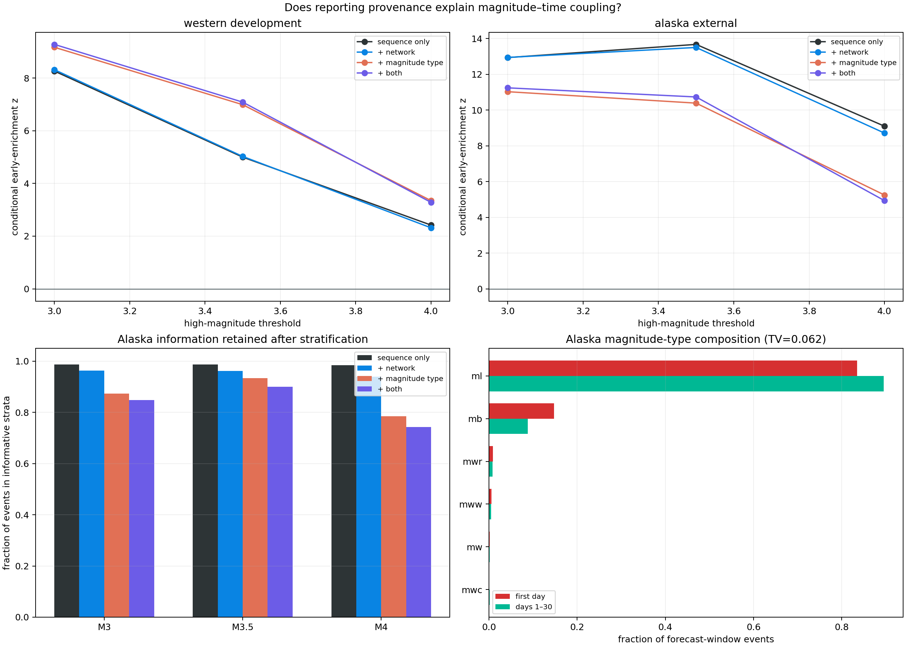

# Reporting Provenance Does Not Explain Away Mark Timing

## Result

The early concentration of high reported magnitudes survives conditioning on
reporting network and magnitude type. Provenance composition explains part of
Alaska's high-threshold effect, but not most of it; in the western cohort,
magnitude-type conditioning strengthens the conditional signal.

| Cohort | Threshold | Sequence only z | + Network z | + Magnitude type z | + Both z |
|---|---:|---:|---:|---:|---:|
| Western | M3.0 | 8.27 | 8.32 | 9.17 | 9.28 |
| Western | M3.5 | 5.00 | 5.03 | 6.99 | 7.09 |
| Western | M4.0 | 2.42 | 2.32 | 3.35 | 3.28 |
| Alaska | M3.0 | 12.94 | 12.95 | 11.03 | 11.24 |
| Alaska | M3.5 | 13.68 | 13.50 | 10.39 | 10.74 |
| Alaska | M4.0 | 9.10 | 8.71 | 5.25 | 4.94 |

Every M3 and M3.5 directional p-value reaches the `1 / 16,385` Monte Carlo
resolution limit under every scheme. Alaska M4 also reaches that limit after
conditioning on both fields. The most specific Alaska M4 test retains `74.2%`
of forecast-window events, so the residual is not created by discarding nearly
all data.



The result narrows report 36's interpretation. A changing mix of reporting
sources and magnitude labels is real, but it is insufficient to produce the
observed magnitude-time coupling.

## Stratified conditional design

Report 36 conditioned on four margins within each earthquake: total events,
first-day events, high-magnitude events, and later events. This lab repeats the
same hypergeometric randomization inside progressively finer strata:

1. earthquake only;
2. earthquake and reporting network;
3. earthquake and exact reported magnitude type; and
4. earthquake, reporting network, and magnitude type.

For example, the most specific null permutes an `ml` event's high/low label
only among `ml` events from the same reporting network and earthquake. It can
no longer attribute early enrichment to an early excess of `mb` rows or a late
excess of rows reported by another network.

Strata with all-high, all-low, only-early, or only-late events have fixed tables
and cannot inform conditional timing. They remain serialized. Every result
therefore reports the fraction of all events that remains in informative
strata, preventing finer conditioning from appearing successful merely because
it removes the difficult rows.

## Composition does change

The first day and later window do not have identical provenance composition,
although the pooled shifts are modest:

| Cohort | Network composition TV | Magnitude-type composition TV |
|---|---:|---:|
| Western | 0.0696 | 0.0848 |
| Alaska | 0.0477 | 0.0621 |

In Alaska, `ml` grows from `83.4%` of first-day rows to `89.5%` later, while
`mb` falls from `14.8%` to `8.8%`. Global `us` reporting grows from `69.1%` to
`73.9%`, while `ak` falls from `30.7%` to `26.1%`.

Western changes run in different mixtures: `ml` grows from `80.2%` to `88.1%`,
`mb` falls from `2.5%` to `0.5%`, and `nn` reporting grows while `nc` falls.
These shifts justify stratification, but their total-variation distances are
too small to imply that provenance alone dominates the mark-timing result.

## Network conditioning changes almost nothing

Adding reporting network leaves every signed statistic nearly unchanged. At
Alaska M3, `z = 12.94` becomes `12.95`; at M4 it becomes `8.71`. Western values
are similarly stable.

The USGS `net` field identifies the reporting or authoring network for the
event solution. It is not a complete record of station availability,
detection probability, association performance, or review history. Failure of
this field to explain the effect does not rule out network-related observation
bias; it rules out simple mixture confounding by the recorded label.

## Magnitude type explains a component, especially in Alaska

Conditioning on exact magnitude type reduces Alaska's early-enrichment z:

- M3: `12.94` to `11.03`;
- M3.5: `13.68` to `10.39`; and
- M4: `9.10` to `5.25`.

The reduction grows with threshold, consistent with early `mb` enrichment
contributing to the raw high-magnitude contrast. But the residual remains
large and directionally coherent. Conditioning on both type and network gives
`z = 4.94` at M4 with a conservative p-value of `0.000061`.

Western magnitude-type conditioning increases the statistics. At M4 it keeps
only `56.3%` of events in informative strata, so that amplification should not
be compared as a simple effect-size ratio. It nevertheless establishes that
the western signal does not depend on pooling unlike magnitude-type labels.

## Scientific interpretation

Three explanations remain entangled:

1. Within a recorded magnitude type and network, the observation process may
   still recover over time as overlapping waveforms and review backlogs ease.
2. Physical magnitude distributions may evolve with aftershock time.
3. Unrecorded spatial, station, processing, or revision covariates may change
   alongside time.

The public catalog fields available here cannot separate these. The evidence
does say something stronger than report 34: catalog heterogeneity is not only a
between-geography or between-network mismatch. Magnitude-time dependence
persists inside the recorded provenance categories used by the same
earthquake.

Operationally, a reported magnitude threshold remains a time-dependent
observation channel unless a completeness or joint mark model demonstrates
otherwise.

## KinoPulse gap refinement

The marked temporal point-process gap now requires observed event context and
provenance covariates in the mark model, plus an optional observation layer.
Merely adding a mark tensor is not enough when recorded network and magnitude
type can affect both mark support and detection.

A useful result should expose likelihood contributions before and after
conditioning on event context, and distinguish physical marks from observation
metadata. KinoPulse need not define earthquake provenance fields; it should
allow them to enter a causal marked-process contract without ad hoc parallel
loops.

## Limitations

`net` and `magType` are coarse catalog fields. Conditioning on their labels
does not homogenize magnitude scales or reconstruct the detection pipeline.
Fine strata reduce information, especially at western M4, and strata are still
assumed exchangeable internally.

The tested thresholds are nested, schemes are not independent, and this is a
post-hoc diagnostic. The p-values assess the conditional randomization null,
not a choice among physical and observation mechanisms. Exact row provenance
may itself be revised over time.

## Reproduction

```powershell
.\.venv\Scripts\python.exe magnitude_provenance_stratification_lab.py
.\.venv\Scripts\python.exe -m unittest tests.test_magnitude_provenance_stratification_lab -v
```

The lab uses the existing ignored catalogs, writes ignored JSON evidence, and
writes the committed review figure shown above.
