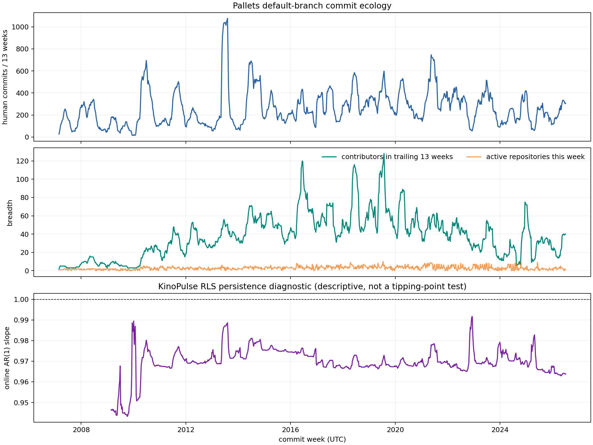

# Lab 39: A whole-organization commit ecology

## Question

Can public Git history support a defensible first experiment on open-source
community dynamics, and does a simple persistence signal already justify
language about decline or tipping points?

## Result in one sentence

Yes for building a reproducible **commit-ecology** state, no for diagnosing
community health: Pallets' most recent 52 complete weeks contain 97.4% as many
human commits as the prior 52, while contribution concentration changes
dramatically and a high KinoPulse persistence estimate remains scientifically
ambiguous.

## Why begin here

The long-term question in `RESEARCH_QUESTIONS.md` is whether open-source
communities decline smoothly or undergo detectable transitions. Jumping
straight to a detector would invite selection bias: choosing famous projects
that visibly declined would make retrospective warning signals look stronger
than they are.

This lab therefore starts with a deliberately modest data contract. It selects
one entire public organization rather than hand-picking repositories, retains
archived repositories, freezes every default-branch head, and asks what can be
measured before defining an outcome.

## Public-data contract

The snapshot was retrieved without authentication from GitHub's official
[organization repositories endpoint](https://docs.github.com/en/rest/repos/repos#list-organization-repositories)
at `2026-07-17T03:30:49.857318Z`.

Selection rule:

> all public repositories owned by `pallets`, excluding forks only

This produces 17 repositories, including six currently archived repositories.
The archived repositories are intentionally retained. Excluding them would
condition the cohort on present-day survival.

`fetch_open_source_community.py` stores a manifest and blob-free bare clones
under the ignored `data/open_source_community/` directory. The manifest records
the API URL, retrieval time, repository metadata, default branch, exact head,
and commit count. The analysis refuses to run if a local head differs from the
manifest. Its SHA-256 is
`200136231453bd214a8a8bb05a996c3bb05f40a9b608dfa924fae57ecaebcc2b`.

The broader program could use [GH Archive](https://www.gharchive.org/), which
publishes GitHub's public event stream as hourly archives and in BigQuery.
That is the right route for review, issue, and cross-repository event histories,
but it is unnecessary for this first, credential-free feasibility pass.

## Measurement

The lab reads every commit reachable from each frozen default-branch head. It
uses committer time in UTC for weekly placement and the mailmap-aware author
email for contributor identity. GitHub `noreply` variants are normalized.
Names and emails never enter the JSON artifact; only aggregate counts are
written. A documented regular expression separates obvious automation such as
GitHub Actions, Dependabot, Renovate, and pre-commit-ci.

Weekly state contains:

- human and bot commit counts;
- active and first-observed contributor counts;
- active-repository breadth;
- contributor commit concentration (HHI);
- trailing-13-week human commits and contributor union.

Only complete UTC weeks are compared, through
`2026-07-12T23:59:59.999999Z`. The current partial week remains in repository
provenance but not in the recent-year comparison.

## Data audit

| Quantity | Value |
|---|---:|
| Frozen repositories | 17 |
| Currently archived repositories | 6 |
| Default-branch commits | 21,741 |
| Human-classified commits | 20,535 |
| Bot-classified commits | 1,206 |
| Normalized human author identifiers | 2,161 |
| Complete weekly states | 1,011 |
| History spanned | 2007-02-26 to 2026-07-16 |

The history begins before some repositories entered their present organization.
That is useful source history, but not proof that every early commit occurred
under Pallets governance.

## Recent comparison

| Metric | Previous 52 weeks | Recent 52 weeks |
|---|---:|---:|
| Human commits | 894 | 871 |
| Bot commits | 21 | 6 |
| Distinct human author identifiers | 110 | 90 |
| Median weekly active contributors | 2 | 3 |
| Median weekly active repositories | 2 | 2 |
| Largest author's commit share | 68.2% | 36.2% |
| Author-commit HHI | 0.473 | 0.202 |

Commit volume is almost unchanged (`871 / 894 = 0.974`). Yet its composition is
not unchanged. Fewer distinct identities appear across the year, the median
week has one more active identity, and the largest author's share falls by
almost half. These are not contradictory: annual reach, weekly concurrency,
and workload concentration describe different aspects of the system.

This is the lab's most important empirical lesson. A scalar “activity” series
would call these years nearly equivalent while hiding a large redistribution of
contribution load.



## KinoPulse persistence experiment

The KinoPulse `RecursiveLeastSquares` estimator tracks

\[
z_t = a_t + \phi_t z_{t-1} + \epsilon_t,
\]

where `z` is standardized `log1p` trailing-13-week human commits. The forgetting
factor is `0.995`; the first 104 weeks are excluded from summaries.

| Persistence diagnostic | Value |
|---|---:|
| Median post-burn-in slope | 0.9694 |
| Latest slope | 0.9638 |
| Unit-persistence reference | 1.0000 |

The estimate is high, as expected for an overlapping 13-week rolling signal.
It is not evidence of critical slowing. The smoothing construction itself
induces serial dependence, while release bursts, seasonality, changing project
mix, and long trends can move the same coefficient. A valid early-warning test
would need a predeclared transition outcome, unsmoothed and negative-control
signals, and evaluation across organizations not selected for their outcome.

## What this does and does not say

It says that a whole-organization Git cohort is small enough to freeze and rich
enough to expose multivariate activity structure. It also shows that recent
Pallets commit volume is not exhibiting a simple collapse in this channel.

It does **not** say that Pallets is healthy, declining, resilient, or near a
tipping point. Commits omit issue triage, review, discussion, security work,
funding, maintainer sentiment, user support, and work performed privately.
Quiet software may be mature; busy software may be distressed.

## Threats to validity

1. **Present-day roster bias.** The current organization API cannot recover
   repositories deleted or transferred away in the past.
2. **Default-branch measurement.** Unmerged branches are absent; squash and
   rebase policies change the meaning and attribution of a commit.
3. **Identity is not personhood.** Mailmaps and GitHub aliases help, but people
   can retain several emails and shared identities can exist.
4. **Current archive status is not a transition date.** The snapshot supplies
   `archived=true`, not the time or reason for archiving.
5. **Bot classification is heuristic.** Unnamed automation can remain and a
   human account with bot-like text could be removed.
6. **One organization is a feasibility cohort.** It cannot identify a general
   law of open-source communities.
7. **Commit counts are not commensurate effort.** A typo and a major redesign
   each count once.

## Next experiment

The next step should model **contributor flow**, not fit a decline alarm. I want
to separate arrivals, persistence, reappearance, and concentration, then ask
whether similar total activity can arise from different renewal mechanisms.
Only after that state is understood should the program add issue and pull
request events using GitHub's documented [issue](https://docs.github.com/en/rest/issues/issues)
and [issue-event](https://docs.github.com/en/rest/issues/events) APIs or GH
Archive, choose a multi-organization cohort, and predeclare a transition outcome.

## Reproduction

```powershell
.\.venv\Scripts\python.exe fetch_open_source_community.py
.\.venv\Scripts\python.exe open_source_commit_ecology_lab.py
.\.venv\Scripts\python.exe -m unittest tests.test_open_source_commit_ecology_lab -v
```

The fetch step deliberately refreshes the ignored snapshot. Exact reproduction
of this report requires the head commits recorded in the report artifact; a new
fetch is a new data vintage.
