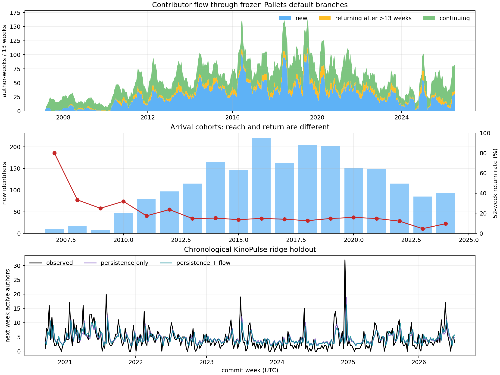

# Lab 40: Contributor flow beneath stable activity

## Question

If two years have nearly the same commit volume, do contributor arrivals,
continuity, and reactivation reveal different underlying dynamics?

## Result in one sentence

Yes: while recent human commits are 2.6% lower, active-author weeks are 21%
higher and continuing-author weeks are 83% higher; however, adding flow counts
improves a chronological next-week KinoPulse model by only 1.0%, so the
decomposition is more informative descriptively than predictively.

## Motivation

[Report 39](39_open_source_commit_ecology.md) found that Pallets' two most
recent complete years contain almost equal default-branch commit volume, but
their largest-author shares are 68.2% and 36.2%. A scalar activity series hides
that redistribution.

This follow-up treats contributors as a weekly flow. For each normalized human
author identifier active in a week:

- **new** means no earlier default-branch commit is observed;
- **continuing** means the identifier was observed in the preceding 13 weeks;
- **returning** means it was seen before, but not for more than 13 weeks.

The categories are mutually exclusive and exhaustive for every active author
week. They describe author identifiers, not verified people.

## Frozen evidence

The lab reuses the 17-repository Pallets snapshot from report 39 and analyzes
complete UTC weeks through `2026-07-12`. The same caveats apply: current
organization membership, frozen default branches, committer time, mailmap-aware
author emails, normalized GitHub aliases, and heuristic bot removal.

No names, email addresses, or identifier-level rows are exported. The JSON
contains only aggregate flow and cohort counts.

## The latest two years

| Weekly-flow total | Previous 52 weeks | Recent 52 weeks | Change |
|---|---:|---:|---:|
| Human commits | 894 | 871 | -2.6% |
| Active-author weeks | 195 | 236 | +21.0% |
| New author arrivals | 87 | 63 | -27.6% |
| Continuing-author weeks | 82 | 150 | +82.9% |
| Returning-author weeks | 26 | 23 | -11.5% |

The almost unchanged commit total is generated by a different ecology. The
recent year has fewer newly observed identifiers but much more repeated weekly
participation. Combined with report 39's lower top-author share, this resembles
a redistribution from one highly prolific identity toward a broader recurring
core.

That is not automatically improvement. Fewer arrivals could indicate weaker
recruitment, or simply fewer drive-by patches; more continuing weeks could
indicate healthy shared maintenance, or a small group carrying sustained load.
Commit history cannot distinguish those interpretations.



## Arrival cohorts

For every newly observed identifier, the lab asks whether another
default-branch commit appears within 13 or 52 weeks. It excludes identifiers
that have not yet had the full observation window from each denominator.

Across the fully observed 2013–2024 cohorts:

- 168 of 1,808 identifiers (`9.3%`) return within 13 weeks;
- 247 of 1,808 (`13.7%`) return within 52 weeks.

The all-history weighted 52-week rate is `15.3%`; it is higher partly because
the small founding-era cohorts returned more often. A one-off contribution is
therefore the dominant default-branch pattern in this cohort. That is not
failure: accepting isolated external patches can itself be a healthy mode.

Annual cohort rates are also affected by project mix, release bursts, and
merge policy. The 2025 cohort is only partially eligible and is retained in the
JSON with explicit numerator and denominator, but omitted from the plotted
return-rate line.

## Dormancy sensitivity

“Returning” depends on a conventional inactivity threshold:

| Dormancy threshold | Recent returning author-weeks | All-history returning author-weeks |
|---|---:|---:|
| 4 weeks | 46 | 747 |
| 13 weeks | 23 | 424 |
| 26 weeks | 16 | 300 |

The count changes substantially but the qualitative fact survives: reactivation
is a smaller channel than new or continuing participation. Any future model
should either treat dormancy continuously or report this sensitivity rather
than presenting 13 weeks as a natural boundary.

## KinoPulse predictive probe

KinoPulse's `RidgeSolver` fits two one-week-ahead models on the first 70% of the
1,010 transitions and evaluates the final 303 weeks chronologically.

Baseline:

\[
A_{t+1}=b+\phi A_t.
\]

Expanded:

\[
A_{t+1}=b+\phi A_t+\beta_N N_t+\beta_R R_t.
\]

Here `A` is active author identifiers, `N` new identifiers, and `R` returning
identifiers.

| Model | Holdout RMSE (authors) |
|---|---:|
| Current activity only | 3.897 |
| Activity + new + returning | 3.856 |

The relative RMSE improvement is only `1.04%`. Conditional coefficients for new
and returning identifiers are negative because both are included within current
activity and, on average, are less persistent into the next week than the
continuing portion. This is a useful bookkeeping interpretation, not a causal
effect of newcomers.

The weak predictive gain is itself evidence. Flow labels clarify how activity
is composed, but simple linear counts do not solve the forecasting problem.

## What I learned

1. **Equal volume can conceal different renewal mechanisms.** The state must be
   multivariate before any regime language is credible.
2. **Continuity and recruitment are not substitutes.** Recent continuity rises
   while arrivals fall.
3. **Most observed contributors are episodic.** That may be an open-source
   participation model, not churn.
4. **A hard dormancy threshold is a measurement choice.** KinoPulse should see
   continuous recency or survival state in a later model.
5. **Interpretation currently outruns prediction.** The expanded linear model
   barely improves holdout error.

## Evidence boundary

This remains commit ecology, not community health. Squash merges can make an
external contributor appear exactly once even after extensive discussion;
maintainers can perform invisible review and support work; a contributor can
change email; and the present-day repository roster omits transferred-away or
deleted projects.

The next high-value data addition is pull-request and review history, because it
can distinguish episodic accepted contributions from repeated collaboration and
measure maintainer response. GitHub's public REST API documents both
[issues/pull requests](https://docs.github.com/en/rest/issues/issues) and their
[event history](https://docs.github.com/en/rest/issues/events), while
[GH Archive](https://www.gharchive.org/) offers the broader public event stream.

## Reproduction

```powershell
.\.venv\Scripts\python.exe fetch_open_source_community.py
.\.venv\Scripts\python.exe contributor_flow_lab.py
.\.venv\Scripts\python.exe -m unittest tests.test_contributor_flow_lab -v
```

The figure is tracked for review. The source snapshot and aggregate JSON are
ignored by default; each records its data vintage and frozen heads.
