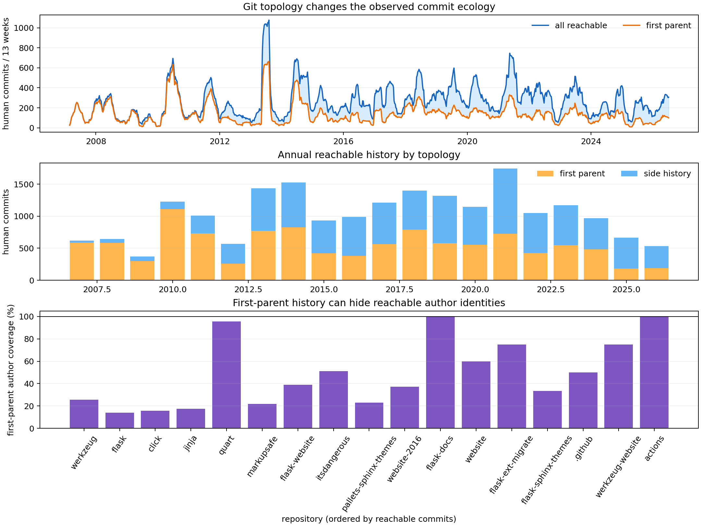

# Lab 41: Merge topology is an observation operator

## Question

How much do apparent open-source activity, contributor reach, and return depend
on whether Git history is measured through every reachable commit or only the
default branch's first-parent path?

## Result in one sentence

Enormously for reach, modestly for conditional return: first-parent history
retains only 22.6% of reachable author identities, while the 2013–2024 52-week
return rate changes from 13.7% to 12.6%.

## Why this audit was necessary

Reports [39](39_open_source_commit_ecology.md) and
[40](40_contributor_flow_dynamics.md) used every commit reachable from the
frozen default-branch heads. That is a reasonable view when the question is
“whose authored work remains in the integrated history?” It is not the only
reasonable view.

Git's [`--first-parent`](https://git-scm.com/docs/rev-list-options#Documentation/rev-list-options.txt---first-parent)
walk follows the mainline side of merges. It better resembles an integration
timeline, but can hide the individual commits and authors on merged topic
branches. GitHub also supports merge commits, squash merging, and rebasing;
those methods preserve or rewrite topology differently, as the official
[merge-method documentation](https://docs.github.com/en/repositories/configuring-branches-and-merges-in-your-repository/configuring-pull-request-merges/about-merge-methods-on-github)
explains.

The choice is therefore not a harmless implementation detail. It defines an
observation operator over collaboration.

## Two frozen views

For each of the 17 Pallets repositories, the lab reads the exact head already
frozen in the cohort manifest and constructs:

1. **Reachable history:** every commit reachable through every parent from the
   default-branch head.
2. **First-parent history:** only commits returned by `git rev-list
   --first-parent` from that head.

“Side history” means reachable minus first-parent. It does not mean abandoned
or unmerged work; in this snapshot it is integrated history reached through a
non-first-parent edge.

The analysis uses human-classified commits through the last complete UTC week,
ending `2026-07-12`.

## Aggregate result

| Quantity | Value |
|---|---:|
| Human reachable commits | 20,530 |
| Human first-parent commits | 11,004 |
| Human side-history commits | 9,526 |
| Side-history share | 46.4% |
| First-parent merge commits | 3,984 |
| Explicit `Merge pull request #…` commits | 2,192 |
| Single-parent subjects ending in `(#number)` | 265 |
| Reachable author identifiers | 2,161 |
| First-parent author identifiers | 488 |
| First-parent author coverage | 22.6% |

Nearly half of human commits and more than three quarters of observed author
identities disappear from the first-parent view. This is not data loss in Git;
it is measurement loss caused by choosing the integration spine.



## Repository heterogeneity

The aggregate hides sharply different repository styles:

| Repository | Reachable authors | First-parent authors | Coverage | Side-history commits |
|---|---:|---:|---:|---:|
| Flask | 868 | 122 | 14.1% | 3,130 |
| Click | 466 | 74 | 15.9% | 1,790 |
| Jinja | 338 | 59 | 17.5% | 1,143 |
| Werkzeug | 518 | 132 | 25.5% | 2,684 |
| Quart | 113 | 108 | 95.6% | 18 |

Quart's nearly linear history makes its first-parent and reachable populations
almost identical. The four older core projects retain many authored commits on
merged side branches, so first-parent author coverage ranges from only 14% to
26%.

This means that a cross-project comparison of “contributors from Git history”
can mostly compare integration policy unless topology is included explicitly.

## Return-rate sensitivity

The newcomer-return calculation from report 40 was repeated for fully observed
2013–2024 arrival cohorts:

| History view | Eligible new identifiers | Returned within 52 weeks | Return rate |
|---|---:|---:|---:|
| All reachable commits | 1,808 | 247 | 13.66% |
| First parent only | 366 | 46 | 12.57% |

The denominator collapses by 80%, but the conditional rate changes by only 1.1
percentage points. This is a valuable robustness result: the claim that most
observed contributors are episodic survives the history view, while the claim
about how many contributors participated absolutely does not.

Rates and reach answer different questions. A stable conditional rate cannot
repair a badly censored population count.

## KinoPulse observation-map probe

KinoPulse's `RidgeSolver` tests whether weekly reachable commit counts can be
reconstructed from contemporaneous first-parent measurements. The model uses:

- first-parent human commits;
- first-parent merge commits;
- single-parent commit subjects ending in a pull-request reference.

It trains on the first 70% of 1,011 weeks and evaluates the final 303 weeks.

| Observation map | Holdout RMSE (commits/week) |
|---|---:|
| Identity assumption: reachable = first parent | 20.28 |
| KinoPulse ridge topology map | 11.90 |

Topology features reduce RMSE by 41.3%, but the remaining error is 57.2% of the
holdout mean (`20.82` commits/week). A stable scalar correction cannot translate
one view into the other. Repository mix, merge size, timing, and policy change
the observation relationship.

This is not a future forecast. It is a chronological transport test for a
measurement map learned in the earlier part of history.

## Implications for the program

1. **Reports 39–40 should keep reachable history.** Their target is authored
   participation preserved in the integrated graph, for which first-parent
   filtering would discard most observed contributors.
2. **Integration-throughput studies should also retain first parent.** Merge
   cadence and mainline state are legitimate but different variables.
3. **Cross-project models need topology covariates or stratification.** Quart
   and Flask cannot be treated as if one commit graph implied one observation
   process.
4. **Contributor counts require a named history view.** “Git contributors” is
   underspecified without the traversal contract.
5. **Neither view measures review work.** A maintainer may review and merge
   extensively without authoring the side-branch commits.

## Limitations

- First-parent is a graph property, not verified organizational mainline intent.
- Commit subjects ending in `(#number)` are suggestive of pull-request
  integration, not a reliable merge-method label.
- Squash and rebase workflows can rewrite commit identities and parentage.
- The current graph cannot recover commits removed by force-pushes or history
  rewrites.
- Merge topology says nothing directly about review quality, discussion,
  contributor experience, or maintainer workload.
- The audit covers one present-day organization roster.

## Next experiment

The next evidence boundary is a small, frozen pull-request validation panel. A
useful design would contrast repositories with low and high first-parent author
coverage, retrieve a bounded chronological set of public pull requests, and
measure author, reviewer, response delay, merge method, and repeat interaction.
That would test whether the topology-derived contrast reflects genuinely
different collaboration processes or only different recording conventions.

## Reproduction

```powershell
.\.venv\Scripts\python.exe merge_topology_audit_lab.py
.\.venv\Scripts\python.exe -m unittest tests.test_merge_topology_audit_lab -v
```

The source snapshot is the ignored frozen cohort from report 39. The aggregate
JSON is ignored by default; the figure and report contain no author identities.
