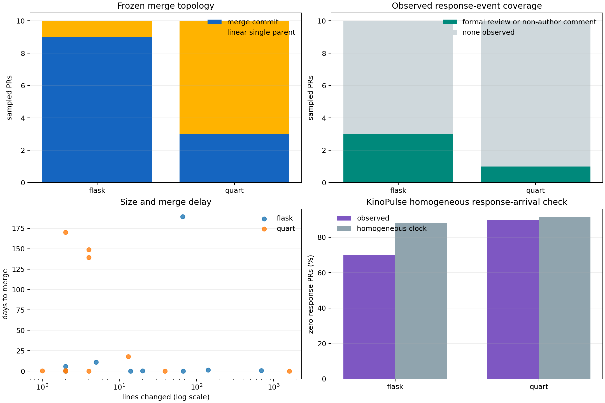

# Lab 42: A pull-request collaboration validation panel

## Question

Does the merge-topology contrast between Flask and Quart correspond to visibly
different pull-request integration and review pathways, or is it merely a Git
traversal artifact?

## Result in one sentence

The topology contrast is real in this panel—9 of 10 Flask PRs use merge commits
versus 7 of 10 Quart PRs using a linear single-parent result—but observable
formal review is nearly absent, making a simple review-arrival process the
wrong model for collaboration.

## Design

This is a bounded validation panel, not a repository-population estimate.

Using GitHub's public
[issue and pull-request search](https://docs.github.com/en/rest/search/search#search-issues-and-pull-requests),
the fetcher enumerated every PR merged during calendar 2024:

- Flask: 58 merged PRs;
- Quart: 22 merged PRs.

Each population was ordered by PR creation time. Ten evenly spaced ranks,
including both endpoints, were selected per repository. The fetcher then froze
PR metadata, formal review events, and issue comments without authentication.
The snapshot was retrieved at `2026-07-17T04:08:39.777300Z`; its ignored source file
has SHA-256
`d4908479db4310fa2f5c9d6a9e4faeea3a7b32fffcfebe82ae20b2e08a3955a2`.

The design intentionally contrasts:

- **Flask**, where report 41 found only 14.1% first-parent author coverage;
- **Quart**, where first-parent coverage is 95.6%.

The panel contains only merged PRs. It says nothing about rejected, closed,
abandoned, or still-open work.

## Topology validation

Each API `merge_commit_sha` was located in the frozen Git graph and classified
by parent count.

| Integration class | Flask sample | Quart sample |
|---|---:|---:|
| Merge commit | 9 | 3 |
| Linear single parent | 1 | 7 |

This supports report 41's interpretation. Flask's low first-parent author
coverage reflects a merge-heavy integration style that preserves side-branch
commits. Quart's almost-linear graph reflects mostly single-parent integration
results in the sample.

The linear category cannot distinguish squash from rebase reliably. GitHub's
[merge-method documentation](https://docs.github.com/en/repositories/configuring-branches-and-merges-in-your-repository/configuring-pull-request-merges/about-merge-methods-on-github)
explains that squash creates one combined commit while rebase adds rewritten
individual commits without a merge commit.



## Observable collaboration channels

A causal response is either:

- a formal review submitted after PR creation and strictly before merge; or
- an issue comment in the same interval by someone other than the PR author.

Bot activity, self-comments, and post-merge events are excluded. Inline review
comment counts were present in the API metadata, but all 20 sampled PRs had
zero.

| Quantity | Flask | Quart |
|---|---:|---:|
| Sampled PRs | 10 | 10 |
| Distinct sampled authors | 6 | 7 |
| Non-internal author association | 5 | 7 |
| PRs with a formal review | 1 | 1 |
| PRs with a non-author issue response | 2 | 0 |
| PRs with any observed response | 3 | 1 |
| Non-internal PRs with observed response | 2 / 5 | 1 / 7 |
| PRs with an approval event | 0 | 1 |

The formal Reviews endpoint is plainly too narrow to represent collaboration
in this panel. Adding issue comments helps Flask only slightly and does not help
Quart. Absence of an observed pre-merge response is not absence of evaluation:
the merge itself is a terminal acceptance action, and discussion can occur in
commit review, linked issues, external channels, or unrecorded maintainer work.

## Time and size

| Quantity | Flask | Quart |
|---|---:|---:|
| Median hours from creation to merge | 16.69 | 14.67 |
| Maximum days from creation to merge | 189.12 | 170.15 |
| Median lines changed | 17 | 4 |
| Median changed files | 2.5 | 1 |

Both panels mix very fast merges with extremely long-lived PRs. This matters
more than the similar medians suggest. Quart's ten PRs contribute 477.4 open
exposure-days even though its median merge time is only 14.7 hours; Flask
contributes 209.5 days with a 16.7-hour median.

## KinoPulse point-process probe

I initially wanted to model human response as a homogeneous temporal point
process during each PR's open interval. KinoPulse's `TemporalPointProcess`
evaluates the fitted constant-rate likelihood, and `poisson_deviance` compares
per-PR event counts with the expected counts implied by exposure.

| Diagnostic | Flask | Quart |
|---|---:|---:|
| Observed causal response events | 3 | 1 |
| Open exposure-days | 209.49 | 477.43 |
| Fitted events/day | 0.0143 | 0.00209 |
| Observed zero-response fraction | 70.0% | 90.0% |
| Homogeneous expected zero fraction | 87.9% | 91.4% |
| Poisson deviance | 21.51 | 13.12 |

The exercise is a negative result. One or three events cannot identify a useful
review process, and the aggregate rate is dominated by a few long-open PRs.
For Flask, the homogeneous clock expects far more zero-event PRs than observed,
despite the tiny event total. For Quart, apparent agreement is vacuous because
there is only one event.

The visible process is better described as competing pathways:

- quick merge with no recorded pre-merge response;
- discussion or formal review followed by merge;
- long inactivity followed by eventual merge;
- and, outside this merged-only panel, close without merge or censoring while
  still open.

A homogeneous unmarked clock collapses those pathways into one rate and should
not be interpreted.

## KinoPulse gap exposed

The required model is a marked temporal process with competing terminal events,
sequence covariates, and censoring. Current `TemporalPointProcess` accepts only
one unmarked event-time stream and cannot express a shared history of comments,
review states, merge, and close.

The requested library contract and analytical oracle are documented in
`kinopulse_gaps/marked_competing_event_processes.md`. This lab deliberately did
not build an ad hoc local substitute.

## What survived

1. **The topology contrast survives API validation.** Flask is merge-heavy and
   Quart is mostly linear in the systematic samples.
2. **Formal review counts do not measure review culture here.** They are almost
   always zero despite successful merges.
3. **Merge latency is strongly heterogeneous.** Similar medians hide multi-month
   tails.
4. **A terminal merge is part of the event process.** Treating it only as the
   observation horizon discards the most universal recorded decision.
5. **The panel remains too small for comparative claims.** It validates a
   mechanism and invalidates a measurement shortcut.

## Next experiment

I would stop expanding the merged-only sample until KinoPulse can represent
competing typed events. Once that exists, the defensible cohort is all PRs
opened in a fixed historical window, with merge, unmerged close, and still-open
censoring preserved. That would make response and terminal hazards comparable
without conditioning on successful merge.

## Reproduction

```powershell
.\.venv\Scripts\python.exe fetch_pull_request_panel.py
.\.venv\Scripts\python.exe pull_request_collaboration_lab.py
.\.venv\Scripts\python.exe -m unittest tests.test_fetch_pull_request_panel -v
.\.venv\Scripts\python.exe -m unittest tests.test_pull_request_collaboration_lab -v
```

The fetch consumes the public unauthenticated API budget and produces a new
data vintage. Raw public logins remain only in ignored source data; the analysis
artifact contains aggregate metrics and PR numbers, not names or logins.
