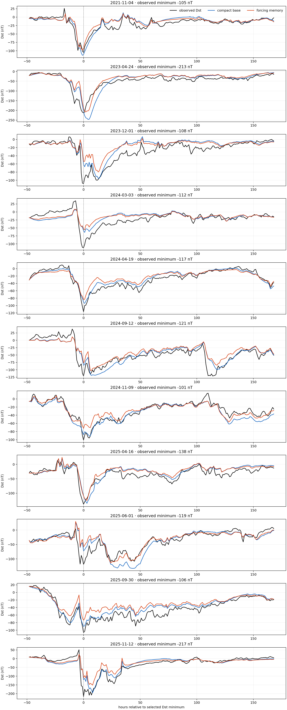

# Lab 43: Chronological transfer across geomagnetic storms

## Question

Does the compact solar-wind-to-Dst response law from the 2015 demonstration
transfer to storms years later, and does an explicit forcing-memory feature
repair the recovery mismatch seen in that first event?

## Result in one sentence

The compact base model transfers: on 11 strictly complete 2019–2025 storms it
achieves `15.55 nT` mean rollout RMSE versus `38.66 nT` persistence and wins all
11 events, while a validation-selected forcing-memory term worsens untouched
test error by `8.0%`.

## Public data and frozen cohort

NASA's [OMNI documentation](https://omniweb.gsfc.nasa.gov/html/ow_data.html)
describes the low-resolution OMNI data as hourly, near-Earth solar-wind magnetic
field and plasma measurements assembled from multiple spacecraft, together with
geomagnetic indices including hourly Dst.

`fetch_omni_population.py` froze every complete annual OMNI2 file from 2010
through 2025:

- 16 annual source files;
- 46,003,968 downloaded bytes;
- 140,256 continuous hourly rows;
- 138,746 rows valid for the model's required electric-field, pressure, and Dst
  channels.

The snapshot was retrieved at `2026-07-17T06:26:58.063358Z`. The ignored
manifest records every URL, byte count, and SHA-256; its own SHA-256 is
`6e393b4c37aca751117c53e5dd8aeace06a9cd217fe8bbc83d73bfa1c50f9e93`.

## Storm-selection contract

Storms are selected from Dst alone, before model errors are computed:

1. Dst must reach `-100 nT` or below.
2. The selected hour must be the minimum within ±120 hours.
3. Selected minima must be at least 14 days apart; when candidates conflict,
   the deeper minimum wins.
4. Evaluation spans 48 hours before through 168 hours after the minimum.
5. The strict primary cohort requires every required forcing observation in
   that 217-hour window.

This produces 43 Dst-selected storms and 29 strict complete-forcing storms.
The chronological partitions contain:

| Period | Role | Dst-selected | Strict complete |
|---|---|---:|---:|
| 2010–2015 | Initial fitting | 18 | 15 |
| 2016–2018 | Memory selection | 5 | 3 |
| 2019–2025 | Untouched test | 20 | 11 |

The strict completeness loss is large and is audited separately in
[report 44](44_storm_forcing_gap_robustness.md).

## Models

Both models predict next-hour Dst change and are freely rolled through each
217-hour event using their own predicted Dst state but observed solar-wind
forcing.

Base features:

- bias;
- current Dst;
- positive solar-wind electric field;
- next-hour dynamic-pressure change.

The memory alternative adds an exponentially weighted history of positive
electric forcing. KinoPulse `RidgeSolver(lambda_=0.01)` fits all standardized
models.

The chronological protocol is fixed:

1. fit candidate models on 2010–2015;
2. select memory half-life from `3, 6, 12, 24, 48` hours using only the three
   complete 2016–2018 storms;
3. refit the base model and selected memory structure through 2018;
4. evaluate once on 2019–2025.

## Validation selection

| Model | Validation mean RMSE (nT) |
|---|---:|
| Base, no memory | 14.88 |
| 3-hour forcing memory | **11.38** |
| 6-hour forcing memory | 13.76 |
| 12-hour forcing memory | 15.63 |
| 24-hour forcing memory | 15.07 |
| 48-hour forcing memory | 13.95 |

The three-hour memory feature appears compelling on validation, improving the
base by 23.6%. It is therefore selected without reference to later outcomes.

## Untouched test result

| Test metric, 11 strict storms | Base | 3-hour memory | Persistence |
|---|---:|---:|---:|
| Mean event rollout RMSE | **15.55 nT** | 16.79 nT | 38.66 nT |
| Mean final-72-hour RMSE | **9.36 nT** | 9.38 nT | — |
| Event wins versus base | — | 5 / 11 | — |
| Event wins versus persistence | 11 / 11 | — | — |

The added state does not transfer. Its mean error is 8.0% worse than the compact
base and it wins only five individual events. The validation advantage was a
small-cohort result, not a stable physical timescale.



## What the base model captures

The base law is imperfect but useful. It responds to storm onset, generally
tracks recovery, and beats a constant-initial-Dst baseline for every strictly
complete future event. Event RMSE ranges from `8.21` to `25.10 nT`.

Its failures are structured:

- it over-deepens the April 2023 storm;
- it strongly underestimates the March and April 2024 minima;
- it smooths multi-stage or renewed forcing episodes;
- recovery bias changes sign across events.

That heterogeneity explains why one fixed exponential forcing memory does not
generalize.

## Interpretation boundary

This is a **response model**, not an autonomous storm forecast. It receives
observed solar-wind electric field and pressure throughout each rollout. It
tests whether a compact dynamical response law transports across time, not
whether future upstream forcing can be predicted.

The event cohort is also complete-case selected. Nine of 20 later Dst storms
are excluded by at least one missing required forcing hour, including the May
2024 `-406 nT` storm. The `15.55 nT` result therefore cannot be presented as
performance on all later severe storms.

## Main lessons

1. The original 2015 compact law was not a one-storm curiosity; its structure
   transfers chronologically.
2. A plausible latent-memory feature can win development convincingly and fail
   later.
3. Event-level chronological splits are much more informative than random
   hourly holdouts.
4. Completeness is coupled to difficulty and must be treated as an observation
   process, not housekeeping.
5. The next useful model should explain multi-stage forcing or event-varying
   coupling, not add another fixed global decay constant.

## Reproduction

```powershell
.\.venv\Scripts\python.exe fetch_omni_population.py
.\.venv\Scripts\python.exe multi_storm_transfer_lab.py
.\.venv\Scripts\python.exe -m unittest tests.test_fetch_omni_population -v
.\.venv\Scripts\python.exe -m unittest tests.test_multi_storm_transfer_lab -v
```

The source population and JSON evidence are ignored by default. The tracked
figure contains only aggregate geophysical time series.
