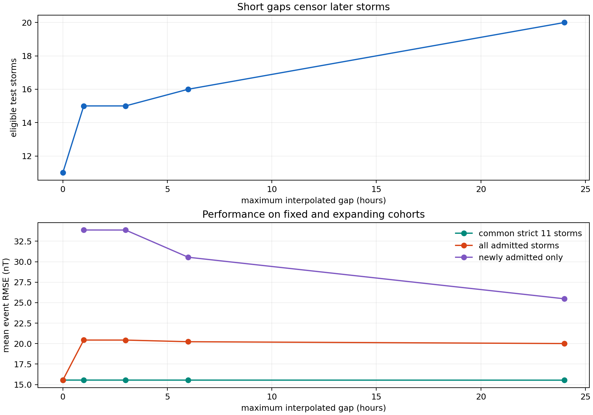

# Lab 44: Short forcing gaps censor the hardest storms

## Question

Does strict complete-case selection make the chronological geomagnetic-storm
transfer result look easier than it is?

## Result in one sentence

Yes: filling only bounded interior forcing gaps expands the later cohort from
11 to 20 storms and raises mean base-model RMSE from `15.55` to `20.01 nT`,
although the compact model still beats persistence on all 20 events.

## Why this follow-up was required

[Report 43](43_chronological_multi_storm_transfer.md) selected 20 independent
Dst minima from 2019–2025 but retained only 11 whose entire 217-hour windows had
electric-field, pressure, and Dst observations.

The excluded set was not innocuous. It included:

- 11 May 2024, Dst `-406 nT`, with one missing pressure/electric-field hour;
- 11 October 2024, Dst `-333 nT`, with one missing hour;
- 1 January 2025, Dst `-212 nT`, with one missing hour;
- 12 August 2024, Dst `-188 nT`, with six missing hours.

Strict completeness therefore removed several of the strongest later storms.

## Sensitivity contract

The audit applies linear interpolation separately to required solar-wind
electric field and dynamic pressure under five predeclared maximum interior-gap
lengths:

`0, 1, 3, 6, 24 hours`.

Boundary gaps and gaps longer than the policy remain missing. Dst is never
interpolated. For every policy, the compact base model is refit on 2010–2018 and
tested on the Dst-selected 2019–2025 events admitted by that policy.

Two scores are always kept separate:

- the original strict 11-storm cohort, testing whether imputation changes the
  fitted model on fixed evidence;
- the expanding admitted cohort, testing selection bias.

Interpolation is a sensitivity device, not a claim that the reconstructed
forcing is correct.

## Result

| Maximum gap | Eligible storms | Deepest Dst | Common-11 RMSE | All-cohort RMSE | Newly admitted RMSE |
|---:|---:|---:|---:|---:|---:|
| 0 h | 11 | -217 nT | 15.547 | 15.547 | — |
| 1 h | 15 | -406 nT | 15.546 | 20.432 | 33.870 |
| 3 h | 15 | -406 nT | 15.545 | 20.430 | 33.865 |
| 6 h | 16 | -406 nT | 15.543 | 20.230 | 30.543 |
| 24 h | 20 | -406 nT | 15.536 | 20.006 | 25.470 |



The common-cohort score moves by only `0.011 nT` across the entire sensitivity.
Short-gap interpolation does not materially alter the model fit for storms that
were already complete.

The cohort expansion changes the scientific result. Admitting four one-hour-gap
storms raises overall RMSE by 31%; the newly admitted storms average `33.87 nT`,
more than twice the common-cohort error.

## Extreme-event anatomy

Under the one-hour policy:

| Newly admitted storm | Observed minimum | Predicted minimum | Model RMSE | Persistence RMSE |
|---|---:|---:|---:|---:|
| 24 Mar 2023 | -163 | -140.0 | 14.23 | 46.59 |
| 11 May 2024 | -406 | -381.2 | 55.27 | 131.89 |
| 11 Oct 2024 | -333 | -390.1 | 44.78 | 72.57 |
| 1 Jan 2025 | -212 | -170.6 | 21.20 | 59.15 |

The compact model remains useful on these events, but its absolute error is
much larger. It under-deepens the May storm, over-deepens the October storm, and
misses important shape and recovery structure even when the minimum is close.

With the 24-hour policy, all 20 later Dst-selected storms are evaluable:

| Metric | Result |
|---|---:|
| Mean compact-model RMSE | 20.01 nT |
| Mean persistence RMSE | 47.61 nT |
| Compact-model event wins | 20 / 20 |
| Mean final-72-hour RMSE | 11.45 nT |

This is a stronger but less flattering result than strict complete-case
evaluation: the model transfers broadly and beats a weak baseline consistently,
while the true error scale is roughly 29% higher than the strict cohort implied.

## Interpretation

Missingness is not random with respect to event difficulty in this sample.
Requiring perfect 217-hour forcing windows disproportionately removes major
storms, precisely where robustness matters most.

The experiment does not prove why observations are missing. It also does not
establish that linear interpolation preserves fast solar-wind structure. A
one-hour gap around an abrupt pressure pulse can matter more than its duration
suggests. The correct conclusion is a bracket:

- `15.55 nT` describes strict complete windows;
- approximately `20.01 nT` describes all selected later storms under a
  transparent bounded-gap sensitivity;
- neither is a prospective autonomous forecast score.

## Software lesson

Scientific fitting code should make observation support part of the result.
Reporting only the retained count would have hidden that the strongest events
were missing. The lab therefore preserves every Dst-selected storm, every
channel-specific missing-hour count, every interpolation policy, and separate
fixed-versus-expanding cohort scores.

No new KinoPulse primitive was implemented locally. Gap interpolation and
storm-support auditing belong to the data contract; KinoPulse continues to
provide the fitted response law through `RidgeSolver`.

## Reproduction

```powershell
.\.venv\Scripts\python.exe storm_forcing_gap_robustness_lab.py
.\.venv\Scripts\python.exe -m unittest tests.test_storm_forcing_gap_robustness_lab -v
```

The lab reuses the ignored, hash-frozen OMNI population from report 43.
